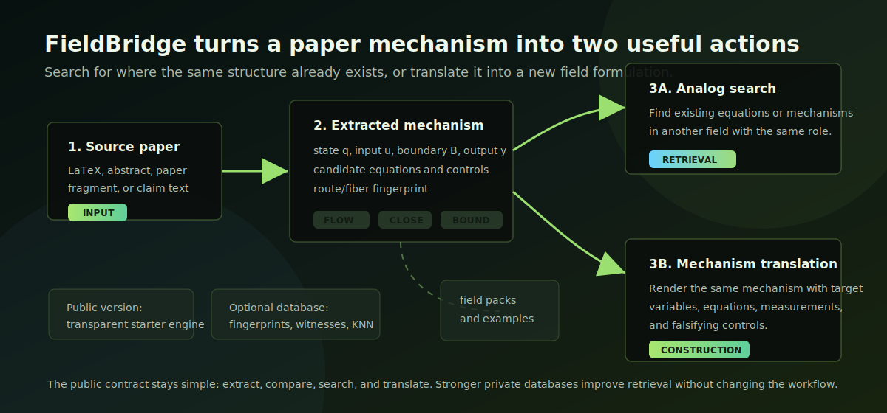

# FieldBridge

FieldBridge is a public companion to the Hyperion project at
[Synthetix Institute](https://synthetix.institute). It is motivated by the
Hyperion atlas result: mathematical-scientific texts are extremely diverse in
their objects and terminology, but their mechanisms collapse to a small
operational grammar of transport, closure, spectral/operator structure, boundary
realization, incompatibility, and discrete protocol. In that view, field-specific
nouns are often the dressing; the portable unit is the mechanism.

**The invariant is the transformation; discovery is a successful translation.**

FieldBridge does not look for papers that talk about similar topics. It converts
a paper into an operational mechanism language first, and only then asks whether
another field contains the same route of action.

That changes the comparison. A bioelectric memory, a material hysteresis, and a
collective trace may use unrelated words. They become comparable only after they
are written as a mechanism: a state is written, constrained by a boundary or
context, transported or transformed, and tested by a later output and a residual
control.

The important question is not *which papers sound similar?* It is:

> Do these systems implement the same operational route, and how would that route
> be rendered in a new field?



The public version exposes one main route, with one supporting route:

```text
main route:       paper A -> extracted mechanism -> translated mechanism in field B
support route:    paper A -> extracted mechanism -> analog search in field B
```

The first public version is intentionally transparent. It does not require a trained
model or a private database. It ships with three starter field packs:

- material intelligence
- biological intelligence
- collective intelligence

FieldBridge can be used as:

- a mechanism extractor for one paper or LaTeX fragment;
- a paper-to-paper analogy checker;
- an equation analogy finder that retrieves existing cross-field examples;
- a mechanism translator that renders a source mechanism in a new field's
  variables, equations, measurements, and falsifying controls;
- a field-pack format for community contributions;
- a small public workbench that can later connect to a larger private or
  institutional fingerprint database.

## The Hyperion Result Behind It

The website atlas makes the central point visible: scientific knowledge does not
only organize around nouns such as *cell*, *droplet*, *agent*, *field*, or
*particle*. Those nouns are local embodiments. The reusable structure is the
route by which a system transports, closes, constrains, resolves spectra, meets a
boundary, fails to commute, or updates by protocol.

That is the reason translation is the main product. If the route is universal,
then a mechanism can be moved into a new substrate. Analogy search is useful, but
it is secondary: it tells us where the route has already appeared. Translation
asks where the route could appear next.

## The New Language

FieldBridge uses a small public version of the Hyperion language. The private
atlas has richer symbols and fingerprints; the public workbench keeps the core
idea inspectable:

```text
mechanism := state q + input u + boundary/context B + output y
route     := transport + closure + spectral/operator + boundary
test      := measurement + residual + falsifying control
```

In ordinary language, the nouns dominate: cell, droplet, particle, robot,
network, patent claim. In the operational language, those nouns become
realization choices. The central object is the route by which the mechanism acts.

This is why cross-field translation is possible at all. FieldBridge is not
claiming that two topics are similar. It is asking whether two different
scientific descriptions can be expressed by the same operational route, and then
rendering that route in a target field's variables, equations, measurements, and
controls.

## Why This Is Different

This is not another semantic-search app, RAG demo, or LLM prompt wrapper.

Most tools ask whether two papers use similar words. FieldBridge asks whether two
systems implement the same mechanism under different names, geometries, and
experimental cultures.

```text
ordinary search:       "find papers about regeneration"
LLM rewriting:         "explain regeneration in material language"
FieldBridge:           "extract the route, then build its material form"
```

The output is not a poetic analogy. A useful translation must name:

- the state variable that carries memory or structure;
- the input that writes or perturbs it;
- the boundary or context that makes the mechanism admissible;
- the equation or equation skeleton;
- the measurement that would reveal it;
- the control experiment that would make the claim fail.

## Hyperion Philosophy

Hyperion treats scientific knowledge as a system of transformations rather than a
taxonomy of objects. The same mechanism can appear as a bioelectric state, a
hydrogel memory, a collective trace, an interface law, or a patentable technical
state. The surface nouns change; the operational form may persist.

FieldBridge exposes a small public version of that idea. It does not try to
reproduce the full private Hyperion parser, atlas, or high-dimensional
fingerprint database. Instead, it provides a minimal open workflow that others can
inspect, extend, and test.

## How It Works

1. Extract a mechanism sheet from a paper or LaTeX fragment.
2. Score a transparent route/fiber fingerprint.
3. Search field packs for already-known analogues.
4. Translate the mechanism into a selected field language.
5. Return variables, equations, measurements, and falsifying controls.

The public engine is deterministic and does not require an LLM. A larger
installation can attach high-dimensional fingerprints, arXiv witnesses, vector
indexes, patent corpora, or private field packs, while keeping the same public
commands.

## Install

```bash
python -m pip install -e .
```

## Quick Start

```bash
fieldbridge fields
fieldbridge extract examples/bioelectric_regeneration.txt
fieldbridge compare examples/bioelectric_regeneration.txt examples/material_memory.tex
fieldbridge fingerprint examples/bioelectric_regeneration.txt
fieldbridge search examples/bioelectric_regeneration.txt --target-field material_intelligence
fieldbridge translate examples/bioelectric_regeneration.txt --to material_intelligence
```

## Main Route

### Mechanism translation

`fieldbridge translate` asks: if the same mechanism were constructed in a new
field, what would the target-field version look like?

It does not merely rename keywords. It produces a target formulation containing:

- the conserved invariant;
- target-field state, input, boundary, and output variables;
- candidate equations or equation skeletons;
- measurements that would make the mechanism observable;
- falsifying controls that would kill the translation.

This mode is the more constructive workflow. It is meant for designing new
experiments, inventions, and theory candidates, while keeping the evidence
boundary explicit.

The intended outcome is concrete: not "biology is like materials," but a proposed
state variable, a candidate equation, a measurement, and the control experiment
that would make the translation fail.

## Supporting Route

### Analog search

`fieldbridge search` asks: where has this mechanism already appeared? It returns
records from the field packs whose route/fiber profile, equations, variables,
measurements, and controls match the source mechanism.

This mode is useful for literature navigation, paper-to-paper comparison, and
finding equations in another field that play the same operational role.

## What It Does

FieldBridge reads a text or LaTeX fragment and returns a mechanism sheet:

- state;
- input or writing condition;
- boundary, interface, or context;
- output;
- candidate equations;
- measurements;
- falsifying controls;
- active route/fiber structure.

It can then compare that mechanism with another paper, search a field pack for
analogous mechanisms, or translate the mechanism into a new target field.

Example:

```text
Source field: biological intelligence
Target field: material intelligence

Invariant:
An input writes an internal state; after the input is removed, the state changes
a later response through a closure law and a boundary condition.

Material analogue:
A thermal, electrical, chemical, optical, or mechanical writing step imprints a
retained material state. Later transport, conductance, release, shape, or motion
must be predicted by that state and fail after erasure or shuffled-history controls.
```

## What It Does Not Claim

FieldBridge is not a proof engine and does not validate a physical claim by itself.
The public starter version produces testable hypotheses. A mechanism becomes real
only when its state variable, equations, measurements, and falsifying controls are
confirmed in the target system.

FieldBridge also does not expose a full private parser or a full large-corpus
embedding system. The starter repository uses a deterministic, inspectable
fingerprint so the community can understand, test, and extend the method without
needing private data.

## Optional Full Database

The public repo is deliberately small. Larger installations can attach:

- high-dimensional fingerprints;
- vector indexes over equations or patents;
- paper-level witnesses and references;
- validated analogy records;
- private field packs.

The command-line interface should remain the same. A stronger database should make
the results better, not change the public contract.

## Community Field Packs

A field pack adds the vocabulary, variables, observables, controls, and example
mechanism records for a field. See `docs/DATA_MODEL.md`.

Useful starter contributions:

- neuroscience and bioelectricity;
- synthetic biology;
- soft robotics;
- chemical reaction networks;
- active matter;
- swarm robotics;
- economics and institutions;
- patents and invention claims.

## License

MIT.
