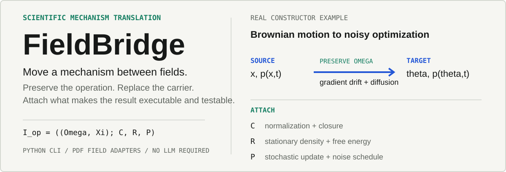

<p align="center">
  
</p>

<p align="center">
  <a href="./docs/tutorial/index.md"><strong>Guided tutorial</strong></a> &nbsp;|&nbsp;
  <a href="./docs/FIELD_ADAPTERS.md">PDF field adapters</a> &nbsp;|&nbsp;
  <a href="./docs/DATA_MODEL.md">Data model</a> &nbsp;|&nbsp;
  <a href="https://synthetix.institute">Synthetix Institute</a>
</p>

FieldBridge is a deterministic Python workbench for translating a scientific
mechanism into another field. It extracts an operational identity from a paper
or equation, retrieves field-native evidence, and states what a proposed
transfer must preserve, replace, attach, and test.

It compares mechanisms rather than topics. A particle diffusing in an energy
landscape and noisy model parameters descending a loss landscape use different
nouns, but both can realize gradient drift plus diffusion. FieldBridge makes
that shared operation explicit before changing the carrier.

## See One Transfer

```bash
python3 -m pip install -e .

fieldbridge construct examples/brownian_probability_flow.tex \
  --to stochastic_optimization \
  --no-hyperion
```

The command produces a reviewable construction:

```text
preserve Omega    gradient drift + diffusion
replace Xi        particle position -> model-parameter space
attach C          normalization and zero-current closure
attach R          occupancy, stationary density, free-energy trajectory
attach P          stochastic-gradient and noise schedule
falsify           reverse drift, remove diffusion, shuffle gradients
```

The resulting equations are not obtained by renaming variables. They are tied
to a target carrier, closure, measurable consequences, execution protocol, and
controls:

```text
d theta = -grad L(theta) dt + sqrt(2T) dW
partial_t p = div(p grad L) + T Laplacian p
```

## The Operational Identity

FieldBridge organizes a mechanism in four nested levels:

```text
factors              (Omega, Xi)
mechanism core       M = (Omega, Xi)
operational identity I_op = (M; C, R, P)
realized model       I_real = (I_op; A)
```

- `Omega` is the transformation apparatus.
- `Xi` is the carrier or substrate on which it acts.
- `C` specifies closure and admissibility.
- `R` specifies the observable readout.
- `P` specifies the intervention or computational protocol.
- `A` binds the mechanism to objects, parameters, units, and field vocabulary.

This modular form supports six constructor operations: preserve, replace or
attach a carrier, close, observe, execute, and falsify. A proposed transfer is
useful only when the retained operation survives the new attachments.

## How The Code Moves

<p align="center">
  
</p>

1. `read_document` accepts PDF, TeX, Markdown, or plain text.
2. `fingerprint_text` scores six operational routes and five evidence fibers.
3. `extract_mechanism` resolves state, input, boundary, output, equations,
   measurements, and controls.
4. `find_analogs` retrieves mechanisms by route and fiber, while
   `translate_mechanism` renders them in a target field.
5. `construct_transfer` separates the preserved contract from the required
   `Xi`, `C`, `R`, `P`, and realization attachments.
6. Complete-paper and future-state evaluators test retrieval and continuation
   without fitting on the query papers.

The [guided codebase tutorial](./docs/tutorial/index.md) follows these
abstractions in dependency order and points to the implementing files and
symbols.

## Commands

| Command | Scientific object produced |
| --- | --- |
| `fieldbridge fingerprint INPUT` | Route-and-fiber fingerprint |
| `fieldbridge extract INPUT` | Mechanism sheet |
| `fieldbridge compare A B` | Preserved and changed operational clauses |
| `fieldbridge search INPUT --target-field FIELD` | Existing cross-field receptors |
| `fieldbridge translate INPUT --to FIELD` | Target-field formulation |
| `fieldbridge construct INPUT --to FIELD` | Typed constructor transfer and controls |
| `fieldbridge build-field-adapter FOLDER ...` | Field pack, evidence index, adapter, and mechanism graph |
| `fieldbridge validate-zero-shot MANIFEST` | Complete-paper retrieval evaluation |
| `fieldbridge validate-continuation MANIFEST` | Next-move and future-state evaluation |

Four inspectable starter packs are included:

- material intelligence;
- biological intelligence;
- collective intelligence;
- stochastic optimization.

## Build A Field Adapter From Papers

Install optional PDF support and point FieldBridge at a folder:

```bash
python3 -m pip install -e '.[pdf]'

fieldbridge build-field-adapter /path/to/papers \
  --field-id active_matter \
  --label "Active Matter" \
  --out-dir build/active_matter
```

Traversal is recursive. Text-layer PDFs, `.tex`, `.md`, and `.txt` files are
accepted; scanned PDFs require OCR. The export contains:

```text
field_packs/active_matter.json
field_adapters/active_matter.json
field_pack_evidence/active_matter.json
kg/active_matter_knowledge_graph.json
index/core_examples.json
reports/active_matter_adapter.md
```

The adapter records which carriers, operations, closures, readouts, protocols,
and falsifiers are supported by the folder. It can then serve as the target side
of `translate` and `construct`. See [Field adapters](./docs/FIELD_ADAPTERS.md)
for the complete schema and workflow.

## Evaluate The Representation

FieldBridge keeps retrieval and mechanism continuation as separate questions.

### Complete-paper retrieval

```bash
fieldbridge validate-zero-shot benchmark/papers.jsonl \
  --top-k 10 \
  --out-json build/full_paper_zero_shot.json \
  --out-md build/full_paper_zero_shot.md
```

Each query paper is removed from the gallery. The report compares operational
retrieval with a TF-IDF baseline and reports top-1 accuracy, mean reciprocal
rank, precision, recall, and a paired bootstrap interval.

### Future mechanism state

```bash
fieldbridge validate-continuation benchmark/transitions.jsonl \
  --out-json build/future_state_validation.json \
  --out-md build/future_state_validation.md
```

This asks which move and mechanism state an unseen later equation occupies; it
does not reclassify the current equation. See
[Future-state validation](./docs/FUTURE_STATE_VALIDATION.md) for the transition
schema and interpretation.

## Repository Map

```text
fieldbridge/
  routes.py              route and fiber evidence
  extract.py             mechanism-sheet extraction
  search.py              retrieval and target-field translation
  constructor.py         typed mechanism construction
  pdf_sparse_builder.py  corpus adapter and mechanism graph
  zero_shot.py           complete-paper retrieval evaluation
  continuation.py        future-state evaluation
  models.py              public data contracts
data/
  field_packs/           field vocabularies and receptors
  field_pack_evidence/   source evidence for each pack
  index/                 public mechanism anchors
docs/tutorial/           implementation-guided walkthrough
```

## Scientific Scope

FieldBridge proposes mechanisms and the tests they require. It does not establish
physical equivalence from a fingerprint, prove a generated equation, or replace
derivation and experiment. The public route-and-fiber representation is an
inspectable proxy for the richer Hyperion language; field packs are evidence
indexes, not accepted models of a field.

A construction becomes a scientific result only after its equations, dimensions,
closure, residuals, controls, and target-system behavior have been checked.

## Contributing

The most useful contributions are field packs with traceable equations,
variables, observables, protocols, controls, and references. Start with the
[data model](./docs/DATA_MODEL.md) and verify changes with:

```bash
python3 -m pytest -q
```

## License

MIT.
