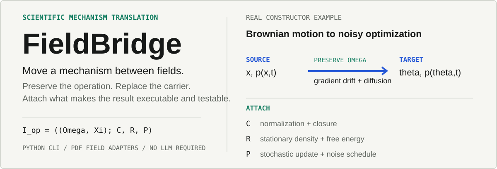
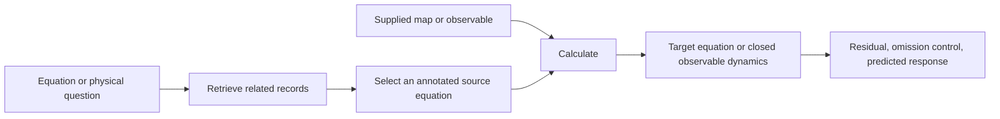

# FieldBridge

**A computational workbench for discovering and deriving physical mechanisms across scientific fields.**

[Demonstration](#demonstration) · [Tutorial](docs/tutorial/index.md) · [Catalog of materials](docs/materials.md) · [Contributing](CONTRIBUTING.md) · [Data model](docs/DATA_MODEL.md)



Different fields often study the same physical mechanism in different notation. A single-mode laser at threshold in quantum optics, a genetic toggle switch and a ring of four repressing genes in synthetic biology all reduce to the same pitchfork normal form; oscillators from electronics, neuroscience and superconductivity reduce to the same equation of phase locking.

FieldBridge automates this cross-field translation:
1. **Derivation Chains:** Derives one target mechanism in models from different fields as a sequence of verified transformations, and tests with field-independent invariants whether the end points agree.
2. **Obstruction Identification:** When two models fail to reach the same behavior, FieldBridge identifies the exact mathematical obstruction (such as a broken symmetry, a Hopf bifurcation, or missing feedback).
3. **Material Memory Cards:** For a system of governing equations, it computes a memory card: the stable states, write thresholds, writing protocols, and the law by which a stored state is lost.

The calculations require no API key, GPU, cluster, or archive download; every derivation step is checked by symbolic or numerical calculation.

## Installation

Python 3.10 or newer. From a clone of the repository:

```bash
python3 -m venv .venv
source .venv/bin/activate
python3 -m pip install -e '.[memory]'
```

The calculations need no API key, GPU, cluster or archive download.

## Demonstration

```bash
python3 -B -m fieldbridge demo --out-dir build/demo
```

The command runs in about a minute on a laptop and writes
`build/demo/index.html`, an offline, modular constructor studio. The full
Python calculations and their figures remain in the generated folders and
the [tutorial](docs/tutorial/index.md). `--law` also measures the locking law of each oscillator
(about ten minutes).

The [live constructor](https://synthetix-institute.github.io/fieldbridge/)
shows how a mechanism is assembled and what changes when a part is removed:

- **Memory:** attach feedback, saturation and a writing field. Every edit
  immediately updates the equation, stable states and writing response.
  Vary pulse strength and duration to compare switching with retention.
  Removing the writing
  field prevents switching; removing feedback removes bistability.
  [Equations and predictions](docs/tutorial/18_memory_writing_and_retention.md#scalar-constructor-demonstration).
- **[Material gallery](https://synthetix-institute.github.io/fieldbridge/#gallery):**
  browse all twelve saved model calculations: capillary rotors, dipoles,
  compartments, laser dynamics, gene circuits, a chemical reactor and flow
  networks. Each realization includes its calculated figure, physical
  components, source model and downloadable calculation record.
  [Gallery recipe](docs/tutorial/21_memory_new_material.md#3-the-gallery-of-realizations).
- **[Spins and carriers](https://synthetix-institute.github.io/fieldbridge/#spins):**
  change the interaction and transverse field of two spins, calculate the
  magnetization, detach the rotation and attach it to one of seven carriers.
  The constructor supplies the target Hamiltonian, including the exchange
  couplings of a four-spin chain. Removing the source interaction makes its
  transverse magnetization constant.
  [Derivation](docs/tutorial/24_spin_language.md) · [Browser/matrix tests](tests/test_web_demo.py).
- **Stochastic transport:** construct the generator after `Y = X²` or
  `Y = log X`. Detaching the required drift separates the predicted mean
  from the source mean. Both generator coefficients are verified in Python;
  the logarithmic prediction is also tested against independent source
  integrators. [Derivation](docs/tutorial/10_stochastic_construction.md) ·
  [Tests](tests/test_stochastic_conventions.py).

The equation, controls and predicted response occupy the same workspace.
The nested graph can be expanded to detach or reattach its terms directly.
The [application and discovery recipes](docs/tutorial/12_reproduction_and_discovery.md)
describe how to take these calculations into a physical test.

For the website alone, no material sweep or oscillator calculation is needed:

```bash
python3 -B -m fieldbridge demo --studio-only --out-dir build/demo
```

Open `build/demo/index.html`, not the source template in `fieldbridge/web/`.
The build verifies the three stochastic examples symbolically and saves
`verified_examples.json`; it also computes seven quantum attachments and
saves their matrix-evolution checks in `quantum_examples.json`. The material
gallery reuses the saved calculations in `examples/gallery/`. Browser controls
use closed-form relations and a small drift integrator; there is no model API
or GPU computation. Original
papers, exact tutorial chapters and executable tests are linked in each module.

| Section | Calculated result |
| --- | --- |
| Memory card of the genetic toggle switch | 2 stable states; a supercritical pitchfork at promoter strength 2.00; a uniform field of 0.213 removes the stored state; every structural prediction agrees with the calculation |
| Phase locking in eight oscillator models | 7 models reach the Adler equation; in the Lotka–Volterra model the derivation stops, because a family of neutral cycles has no isolated phase |
| The Bloch rotation on ten quantum carriers | 6 carriers reach the Rabi law; in the other 4 the Hamiltonian and the observable generate a larger algebra than su(2) |

## Materials and contributions

The [catalog of materials](docs/materials.md) lists every material
specification in the repository with its calculated memory. A material is
added as one JSON file with its equations, parameters, control parameter,
closure, observable, assumptions and source:

```bash
python3 -B -m fieldbridge memory new my_material --carrier orthant
python3 -B -m fieldbridge memory check examples/memory/my_material.json
python3 -B -m fieldbridge memory card examples/memory/my_material.json --out-dir build/my_material
```

`memory new` writes a template that loads and runs; `memory check` reports
which required fields are still placeholders, whether the structural
predictions agree with a quick calculation, and which materials of the catalog
are written by the same mechanism; `memory card` writes the card and its
figure. In a pull request the same check and card appear in the summary of the
"material card" check, so a contributor sees what the material stores and which
materials from other fields it connects to. The
[list of wanted materials](docs/wanted_materials.md) names classic models from
fields the catalog does not cover yet. [CONTRIBUTING.md](CONTRIBUTING.md) describes each field and the
pull request. A material can also be proposed through the
[material proposal form](https://github.com/synthetix-institute/fieldbridge/issues/new?template=material.yml)
with the source of its equations.

## Commands

| Task | Command | Result |
| --- | --- | --- |
| Demonstration | `demo` | Three calculations and their figures on one page |
| Memory in a material | `memory predict`, `memory card`, `memory attach`, `memory design`, `memory phase` | What the structure excludes or allows before simulation; stable states, write points, the law of loss and writing protocols; the properties a known memory keeps on another carrier ([tutorial](docs/tutorial/15_memory_first_card.md)) |
| One mechanism in models from different fields | `memory codiscover` | For a symmetric write, a threshold write or phase locking: the derivation in each model, the step at which a derivation stops, and field-independent invariants of the end point ([tutorial](docs/tutorial/23_memory_codiscovery.md)) |
| Adding a material | `memory new`, `memory check`, `memory catalog` | A template specification, the checks it must pass, and the catalog of materials |
| Quantum mechanisms on different carriers | `quantum detach`, `quantum attach`, `quantum codiscover` | The Bloch rotation on spins, atoms in two wells, exchange chains and Cooper pairs, or the term that obstructs it ([tutorial](docs/tutorial/24_spin_language.md)) |
| Derivation from supplied equations | `verify-construction` | An exact local stochastic transformation or a finite quantum closure |
| Interaction design | `design-spin-cancellation` | Coupling constraints, the predicted polarization and the comparison with a restricted interaction |
| Calculation from a retrieved record | `construct --calculate` | A source-bound specification and its calculated consequence |
| Retrieval | `fingerprint`, `extract`, `search`, `compare`, `translate`, `construct` | Rule-based mechanism descriptions, ranked candidates and proposed conditions to test |
| Field pack from a paper collection | `build-field-adapter` | Source passages, field records and a relation graph |
| Evaluation of retrieval and continuation | `validate-zero-shot`, `validate-continuation` | Held-out-paper comparisons with baselines |

`construct` proposes a correspondence from stored target examples;
`construct --calculate` and `verify-construction` verify a stated
correspondence by calculation; `design-spin-cancellation` solves for an
interaction that meets a requirement.

## Calculation from supplied equations

```bash
python3 -m pip install -e '.[construction]'
python3 -B -m fieldbridge verify-construction \
  examples/construction/ito_square.json --out-dir build/ito_square
```

`build/ito_square/calculation.md` contains the result. The input supplies a
stochastic equation for a positive coordinate and the map $Y=X^2$. The
program derives

$$
dX_t=\left[\frac{\theta+1/2}{X_t}-\alpha X_t\right]dt+dW_t
\quad\longrightarrow\quad
dY_t=(2\theta+2-2\alpha Y_t)dt+2\sqrt{Y_t}\,dW_t .
$$

Brownian quadratic variation contributes one unit of drift. The program checks
both coefficients of the transformed generator and tests an incomplete
candidate that omits that unit:

| Saved result | Expected value | Physical meaning |
| --- | --- | --- |
| `residual_coefficients` | `["0", "0"]` | Corrected drift and variance satisfy the local generator identity |
| `candidate.passes_local_identity` | `false` | The incomplete equation fails |
| `omission_control.residual_d_phi` | `"1"` | The missing drift changes the predicted mean |

[The derivation step by step](docs/tutorial/10_stochastic_construction.md).

## Retrieval and calculation

The bundled demonstration index contains an authored radial-diffusion record.
This command retrieves it, binds the supplied map to that record, and
calculates the squared-coordinate dynamics:

```bash
python3 -B -m fieldbridge --data-dir examples/calculated_transfer/data \
  construct 'radial Brownian Ito diffusion' --to stochastic_dynamics \
  --no-hyperion --calculate \
  --correspondence examples/calculated_transfer/squared_signal.json \
  --out-dir build/calculated_transfer
```

`transfer.md` explains the result. `construction_spec.json` contains the source
equation and correspondence actually used; `calculation.json` contains the
derived coefficients and tests. [The source binding](docs/tutorial/13_retrieval_to_calculation.md).


```mermaid
flowchart LR
    Q["Equation or physical question"] --> R["Retrieve related records"]
    R --> S["Select an annotated source equation"]
    M["Supplied map or observable"] --> C["Calculate"]
    S --> C
    C --> E["Target equation or closed observable dynamics"]
    E --> T["Residual, omission control, predicted response"]
```

The calculation supports scalar Itô transformations and finite closed-system
Hamiltonian dynamics. The first checks interior generator expressions;
boundary behavior is an additional physical question. The second derives an
invariant linear span of observables.

## Interaction design

This example solves for the Ising couplings that preserve collective phase
evolution when exchange bonds vary independently, predicts an end-spin
cancellation time, and compares the result with direct Hamiltonian evolution
and a nearest-neighbour restriction:

```bash
python3 -B -m fieldbridge design-spin-cancellation \
  examples/construction/spin_cancellation_design.json \
  --out-dir build/spin_cancellation
```

For three spins it derives `q_01 = q_02 = q_12`. With collective coupling
5/4, the first collective zero occurs at `pi/5` in units with hbar=1, even
when the exchange bonds change. Restricting the Ising interaction to neighbours
leaves no nonzero solution within this commuting construction.
[Chapter 14](docs/tutorial/14_inverse_construction.md) gives the equations,
controls, expected output and open questions. The example uses known physics
to demonstrate inverse construction; it does not assert a new law.

## Field packs from paper collections

```bash
python3 -m pip install -e '.[pdf]'
python3 -B -m fieldbridge build-field-adapter /path/to/papers \
  --field-id active_matter --label "Active Matter" \
  --out-dir build/active_matter

python3 -B -m fieldbridge --data-dir build/active_matter \
  construct examples/brownian_probability_flow.tex \
  --to active_matter --no-hyperion
```

The folder may contain text-layer PDFs, TeX, Markdown or plain text. Scanned
PDFs need OCR. The generated passages supply evidence for retrieval; source
annotations for exact calculation are checked and added separately.
[Folder walkthrough](docs/tutorial/07_pdf_field_adapter.md) · [Adding a field](docs/NEW_FIELD.md)

An optional public atlas snapshot can be downloaded with
`python3 scripts/fetch_atlas.py`. It is unnecessary for the tutorial
calculations. The small route-and-fiber fingerprint used here is not the
192-feature V2.1 representation or its learned codebooks.

## Tutorial

The [tutorial](docs/tutorial/index.md) has a reading path for each purpose:
the physical construction (an Itô correction, an interacting spin), memory in
materials (nine modules, from a first memory card to one mechanism derived in
models from different fields), the language of mechanisms on quantum carriers,
paper collections, and the evaluation of the code. Worked calculations include
an input, the expected output, a change to try, and the functions and tests
responsible for the result.

## Repositories and implementation

[MorphWiki](https://github.com/synthetix-institute/morphwiki) organizes a
field's explanations, equations and source evidence, and packages these
calculations as a companion to its quantum book. Both repositories are
standalone.

| Code | Responsibility |
| --- | --- |
| [memory/](fieldbridge/memory/) | Material specifications, structural predictions, memory cards, transfer, co-discovery and the contribution checks |
| [quantum/](fieldbridge/quantum/) | The language of mechanisms on quantum carriers: detachment, attachment and co-discovery |
| [demo.py](fieldbridge/demo.py) | The demonstration page |
| [routes.py](fieldbridge/routes.py), [extract.py](fieldbridge/extract.py) | Textual cues and heuristic mechanism descriptions |
| [search.py](fieldbridge/search.py), [database.py](fieldbridge/database.py) | Loading and ranking records; target examples |
| [constructor.py](fieldbridge/constructor.py) | Proposals, or the calculation adapter |
| [calculation_adapter.py](fieldbridge/calculation_adapter.py) | Binding a retrieved source to a correspondence |
| [verification.py](fieldbridge/verification.py) | Coefficients, residuals and quantum closure |
| [pdf_sparse_builder.py](fieldbridge/pdf_sparse_builder.py) | Source-indexed field packs |
| [zero_shot.py](fieldbridge/zero_shot.py), [continuation.py](fieldbridge/continuation.py) | Evaluation of retrieval and written-sequence prediction |

## Tests

```bash
python3 -m pip install -e '.[construction,memory]' pytest
python3 -B -m pytest -q -p no:cacheprovider
```

The tests also run `memory check` on every material specification, so a
specification with placeholders or without a source does not pass.

MIT license. Developed within the [Synthetix Institute](https://synthetix.institute).
