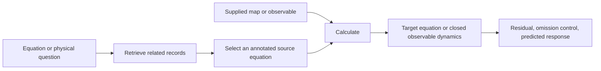

# FieldBridge

**Find related equations, specify a physical correspondence, and calculate its consequences.**

[Start the tutorial](docs/tutorial/index.md) · [Run a calculation](docs/tutorial/08_end_to_end_walkthrough.md) · [Add your papers](docs/tutorial/07_pdf_field_adapter.md) · [Data model](docs/DATA_MODEL.md)

A detector measuring the square of a fluctuating coordinate does not obey the
equation for the coordinate itself. A spin interacting with another spin may
require a correlation, as well as its own magnetization, to predict its motion.
FieldBridge makes these construction problems executable: supply the governing
equation and the proposed observable or change of variables, then derive the
additional term or variable required for the prediction.

The repository combines **mechanism retrieval** with **symbolic calculation**.
Retrieval finds records with related operations and physical conditions.
Calculation acts on explicitly specified equations. The two can be used
separately or joined through an annotated source record.

## First calculation

Use Python 3.10 or newer for this walkthrough. From a clone of the repository:

```bash
python3 -m venv .venv
source .venv/bin/activate
python3 -m pip install -e '.[construction]'
python3 -B -m fieldbridge verify-construction \
  examples/construction/ito_square.json --out-dir build/ito_square
```

Open `build/ito_square/calculation.md`. The input supplies a stochastic
equation for a positive coordinate and the map $Y=X^2$. The program derives:

```math
dX_t=\left[\frac{\theta+1/2}{X_t}-\alpha X_t\right]dt+dW_t
\quad\longrightarrow\quad
dY_t=(2\theta+2-2\alpha Y_t)dt+2\sqrt{Y_t}\,dW_t .
```

Brownian quadratic variation contributes one unit of drift. The program checks
both coefficients of the transformed generator and tests an intentionally
incomplete candidate that omits that unit:

| Saved result | Expected value | Physical meaning |
| --- | --- | --- |
| `residual_coefficients` | `["0", "0"]` | Corrected drift and variance satisfy the local generator identity |
| `candidate.passes_local_identity` | `false` | The supplied incomplete equation fails |
| `omission_control.residual_d_phi` | `"1"` | The missing drift changes the predicted mean |

No LLM, GPU, archive download or API key is needed after installation.
[Derive the result step by step](docs/tutorial/10_stochastic_construction.md).

## What can I do?

| Task | Command | What is obtained |
| --- | --- | --- |
| Inspect equation and context cues | `fingerprint`, `extract` | A rule-based mechanism description |
| Find a related record | `search`, `compare` | Ranked candidates and shared evidence |
| Explore another field | `translate`, `construct` | Target examples and proposed conditions to test |
| Derive from supplied equations | `verify-construction` | An exact local stochastic transformation or finite quantum closure |
| Solve for allowed interactions | `design-spin-cancellation` | Exact coupling constraints, polarization prediction and restricted-interaction comparison |
| Calculate from a retrieved record | `construct --calculate` | A source-bound specification and calculated consequence |
| Index a paper folder | `build-field-adapter` | Source passages, field records and a relation graph |
| Evaluate retrieval or continuation | `validate-zero-shot`, `validate-continuation` | Held-out-paper comparisons with baselines |
| Build memory in a material | `memory predict`, `memory card`, `memory attach`, `memory design`, `memory phase` | What the structure implies before simulation; stored states, write points, loss law and the cost of a rewrite; what a known memory keeps on a new carrier ([tutorial](docs/tutorial/15_memory_first_card.md)) |
| Derive one mechanism in models from different fields | `memory codiscover` | For a symmetric write, a threshold write or phase locking to a periodic drive: the derivation in each model as a word of verified transformations, the step at which a derivation stops, and field-independent invariants of the end point ([tutorial](docs/tutorial/23_memory_codiscovery.md)) |
| Detach a quantum mechanism, attach it to another carrier, co-discover it | `quantum detach`, `quantum attach`, `quantum codiscover` | The Bloch rotation on spins, atoms in two wells, exchange chains and Cooper pairs: what the mechanism keeps, what its carrier changes, and the term that obstructs it ([tutorial](docs/tutorial/24_spin_language.md)) |

Ordinary `construct` proposes a correspondence using stored target examples.
The `--calculate` path instead requires a supported mathematical source
annotation and an explicit map or observable. This distinction is visible in
the saved result, not inferred from a similarity score.

## From retrieval to a derived equation

The bundled demonstration index contains an authored radial-diffusion record.
This command retrieves it, binds the supplied map to that record, and calculates
the squared-coordinate dynamics:

```bash
python3 -B -m fieldbridge --data-dir examples/calculated_transfer/data \
  construct 'radial Brownian Ito diffusion' --to stochastic_dynamics \
  --no-hyperion --calculate \
  --correspondence examples/calculated_transfer/squared_signal.json \
  --out-dir build/calculated_transfer
```

`transfer.md` explains the result. `construction_spec.json` contains the source
equation and correspondence actually used; `calculation.json` contains the
derived coefficients and tests. [Follow the source binding](docs/tutorial/13_retrieval_to_calculation.md).


```mermaid
flowchart LR
    Q["Equation or physical question"] --> R["Retrieve related records"]
    R --> S["Select an annotated source equation"]
    M["Supplied map or observable"] --> C["Calculate"]
    S --> C
    C --> E["Target equation or closed observable dynamics"]
    E --> T["Residual, omission control, predicted response"]
```

The calculation supports scalar Itô transformations and finite closed-system
Hamiltonian dynamics. The first checks interior generator expressions;
boundary behavior is an additional physical question. The second derives an
invariant linear span of observables. The examples reproduce known mathematics
and provide tests for extending the constructor.

## Learn through physical problems

### Construct an interaction instead of scanning parameters

Which Ising couplings preserve collective phase evolution when exchange bonds
vary independently? This runnable example solves for the couplings, predicts
an end-spin cancellation time, and compares the result with direct Hamiltonian
evolution and a nearest-neighbour restriction:

```bash
python3 -B -m fieldbridge design-spin-cancellation \
  examples/construction/spin_cancellation_design.json \
  --out-dir build/spin_cancellation
```

For three spins it derives `q_01 = q_02 = q_12`. With collective coupling
5/4, the first collective zero occurs at `pi/5` in units with hbar=1, even
when the exchange bonds change. Restricting the Ising interaction to neighbours
leaves no nonzero solution within this commuting construction.
[How to use this example for discovery](docs/tutorial/14_inverse_construction.md)
explains the equations, controls, expected output and remaining research
questions. It uses known physics to demonstrate inverse construction, not
to assert a new law.

The [tutorial](docs/tutorial/index.md) gives a short runnable route followed by
the derivations and implementation:

- **A squared stochastic signal:** why nonlinear coordinates require an Itô
  drift, how its omission biases the mean, and why an affine map needs no
  correction.
- **An interacting spin:** how a Hamiltonian identifies the correlation needed
  to predict a measured magnetization, even for unentangled preparations.
- **A new paper collection:** how to recover candidate passages, annotate an
  equation, and distinguish a proposed relation from a calculated one.
- **An interaction-design problem:** how commutation equations determine
  coupling coefficients and expose a restriction on a proposed realization.

Worked calculations include an input, expected output, a change to try, and
links to the functions and tests responsible for the result.

## Use your own papers

```bash
python3 -m pip install -e '.[pdf]'
python3 -B -m fieldbridge build-field-adapter /path/to/papers \
  --field-id active_matter --label "Active Matter" \
  --out-dir build/active_matter

python3 -B -m fieldbridge --data-dir build/active_matter \
  construct examples/brownian_probability_flow.tex \
  --to active_matter --no-hyperion
```

The folder may contain text-layer PDFs, TeX, Markdown or plain text. Scanned
PDFs need OCR. The generated passages supply evidence for retrieval; source
annotations for exact calculation must be checked and added separately.
[Folder walkthrough](docs/tutorial/07_pdf_field_adapter.md) · [Add a field](docs/NEW_FIELD.md)

An optional public atlas snapshot can be downloaded with
`python3 scripts/fetch_atlas.py`. It is unnecessary for all tutorial
calculations. The small route-and-fiber fingerprint used here is not the
192-feature V2.1 representation or its learned codebooks.

## Repositories and implementation

FieldBridge contains the retrieval and calculation code.
[MorphWiki](https://github.com/synthetix-institute/morphwiki) organizes a field's
explanations, equations and source evidence, and can package these calculations
as a companion to its quantum book. Both repositories are standalone; neither
requires a running Hyperion cluster for these examples.

| Code | Responsibility |
| --- | --- |
| [routes.py](fieldbridge/routes.py), [extract.py](fieldbridge/extract.py) | Recognize textual cues and construct a heuristic description |
| [search.py](fieldbridge/search.py), [database.py](fieldbridge/database.py) | Load and rank records; select target examples |
| [constructor.py](fieldbridge/constructor.py) | Assemble a proposal or invoke the calculation adapter |
| [calculation_adapter.py](fieldbridge/calculation_adapter.py) | Bind a retrieved source to a correspondence |
| [verification.py](fieldbridge/verification.py) | Derive coefficients, residuals and quantum closure |
| [pdf_sparse_builder.py](fieldbridge/pdf_sparse_builder.py) | Build source-indexed field packs |
| [zero_shot.py](fieldbridge/zero_shot.py), [continuation.py](fieldbridge/continuation.py) | Evaluate retrieval and written-sequence prediction |

## Contribute

Start with a source equation, a clearly posed transformation, and a measurable
consequence. Keep the assumptions and the comparison that exposes a missing
term with the example. The [extension guide](docs/tutorial/12_reproduction_and_discovery.md)
explains how a calculation becomes a discovery candidate.

```bash
python3 -m pip install pytest
python3 -B -m pytest -q -p no:cacheprovider
```

MIT license. Developed within the [Synthetix Institute](https://synthetix.institute).
