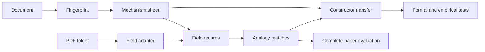

# Chapter 0: System Map

FieldBridge has one central data flow: read a scientific document, describe its
operational mechanism, place that mechanism against field-native evidence, and
produce either a retrieval result or a typed construction.



## Core Abstractions

| Abstraction | Data contract | Main implementation |
| --- | --- | --- |
| Document input | text | `fieldbridge.cli.read_input`, `fieldbridge.pdf_sparse_builder.read_document` |
| Operational fingerprint | `Fingerprint` | `fieldbridge.routes.fingerprint_text` |
| Mechanism identity | `MechanismSheet` | `fieldbridge.extract.extract_mechanism` |
| Field evidence | `FieldPack`, `MechanismRecord` | `fieldbridge.database.load_all` |
| Cross-field retrieval | `AnalogyMatch` | `fieldbridge.search.find_analogs` |
| Target rendering | `Translation` | `fieldbridge.search.translate_mechanism` |
| Typed construction | `ConstructorTransfer` | `fieldbridge.constructor.construct_transfer` |
| Corpus adapter | JSON field pack and graph | `fieldbridge.pdf_sparse_builder.build_pdf_field_pack` |
| Evaluation | JSON and Markdown reports | `fieldbridge.zero_shot`, `fieldbridge.continuation` |

The public representation is deliberately small. It uses six route scores and
five evidence fibers to make every match inspectable. FieldBridge therefore
separates three questions that are easy to conflate:

1. **Representation:** which operation and completion clauses are present?
2. **Retrieval:** where has a compatible mechanism already appeared?
3. **Construction:** what must change or be attached in the target field?

## Runtime Sequence

The `construct` command is the most complete path through the repository:

```text
cli.read_input
  -> extract.extract_mechanism
     -> routes.fingerprint_text
  -> search.translate_mechanism
     -> database.load_all
     -> search.find_analogs
  -> constructor.construct_transfer
  -> render.render_constructor
```

The following chapters unpack this sequence in dependency order. Start with
[operational fingerprints](01_operational_fingerprints.md).
