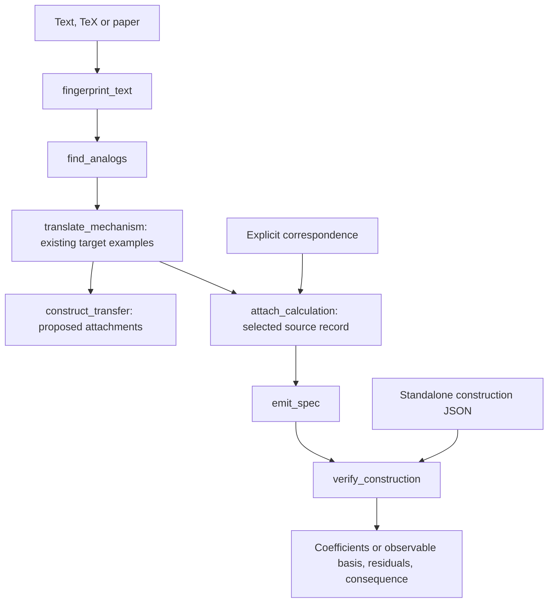

# How a question reaches a calculation

The same command-line program handles two kinds of input. A paper or a sentence
is enough to search for related records. A symbolic calculation needs more:
an explicit equation, its assumptions, and the transformation or measurement
whose consequence is sought. Understanding where that extra information enters
makes the repository much easier to navigate.

## Follow the squared-coordinate example

In the [first run](08_end_to_end_walkthrough.md), the mathematical input goes
straight to the verifier. In the [retrieved-source version](13_retrieval_to_calculation.md),
a query first selects a record containing the source drift and noise. A
separate file supplies the map $Y=X^2$. Both paths reach the same calculation.

```mermaid
flowchart TD
    Q["Text, TeX or paper"] --> F["fingerprint_text"]
    F --> R["find_analogs"]
    R --> T["translate_mechanism: existing target examples"]
    T --> P["construct_transfer: proposed attachments"]
    T --> A["attach_calculation: selected source record"]
    M["Explicit correspondence"] --> A
    A --> S["emit_spec"]
    S --> V["verify_construction"]
    I["Standalone construction JSON"] --> V
    V --> O["Coefficients or observable basis, residuals, consequence"]
```

The proposal branch can operate on incomplete prose. The calculation branch
requires a supported source model; it refuses a record that lacks one. The
ordinary target example is not secretly used as the derived answer.

## Read the source in dependency order

| Object | What it contains | Implementation |
| --- | --- | --- |
| `Fingerprint` | Six route scores and five evidence-fiber scores | [routes.py](../../fieldbridge/routes.py), [models.py](../../fieldbridge/models.py) |
| `MechanismSheet` | Heuristic state, equation, boundary and measurement description | [extract.py](../../fieldbridge/extract.py) |
| `MechanismRecord` | Stored example, field, references and optional mathematical annotation | [models.py](../../fieldbridge/models.py), [database.py](../../fieldbridge/database.py) |
| `AnalogyMatch` | Record plus score and matched evidence | [search.py](../../fieldbridge/search.py) |
| `ConstructorTransfer` | Proposed attachments, or an attached exact calculation | [constructor.py](../../fieldbridge/constructor.py) |
| Construction specification | Declared symbols, source law and map or observable | [calculation_adapter.py](../../fieldbridge/calculation_adapter.py) |
| Calculation report | Derived relations, controls, assumptions and input identity | [verification.py](../../fieldbridge/verification.py) |

The representation used for retrieval is a small rule-based vector. It does
not load the large V2.1 learned language. A corpus-derived atlas snapshot is an
optional source of witnesses, not a prerequisite for running these examples.

## Where to extend the program

A new paper collection normally needs a new field pack, not a new numerical
solver. A new mathematical problem may need a verifier. For example, adding
words about an absorbing boundary to a pack does not make the scalar Itô
handler solve a boundary-value problem.

Keep that distinction in the tests: retrieval tests ask which record was
returned; calculation tests ask whether the derived relation holds. The
[extension chapter](12_reproduction_and_discovery.md) shows how to connect them.

[Next: recognize operational cues](01_operational_fingerprints.md) · [Tutorial](index.md)
