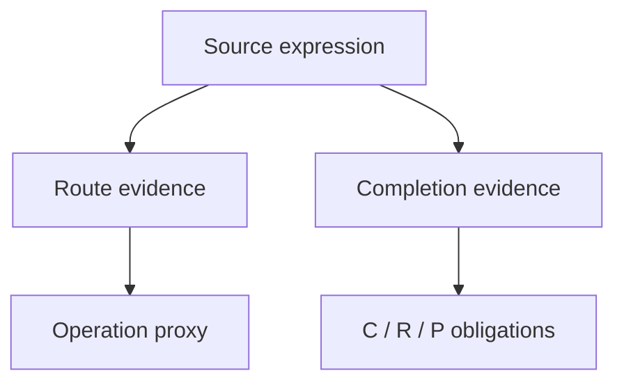

# Chapter 1: Operational Fingerprints

## The Question

Consider two expressions:

```text
partial_t p = div(p grad U) + T Laplacian p
dtheta = -grad L(theta) dt + sqrt(2T) dW
```

Their nouns differ: one concerns probability density, the other model
parameters. Their operational structure nevertheless contains gradient-driven
motion, diffusion and evolution. FieldBridge records that structure as a small
route-and-fiber vector.

```bash
fieldbridge fingerprint examples/brownian_probability_flow.tex
```

The output contains six route scores:

- `transport_flow_route`
- `spectral_operator_route`
- `constraint_closure_route`
- `boundary_weak_form_route`
- `discrete_protocol_route`
- `commutator_incompatibility_route`

It also records completion evidence. Closure asks what makes the mathematical
problem admissible; readout asks what is observed; protocol asks what is done.



The fingerprint is not a semantic embedding and does not certify physical
equivalence. It is an interpretable public proxy for the operational evidence
used by the larger Hyperion representation.

## Try Your Own Equation

```bash
fieldbridge fingerprint \
  'partial_t q + nabla dot J = 0; J dot n = 0 on the boundary; integral q is measured'
```

Look for transport, boundary and readout activation. Then remove the boundary
clause and run the command again. The changed fingerprint identifies the
obligation removed from the mechanism.

Next: [Extract a mechanism sheet](02_mechanism_sheets.md).
