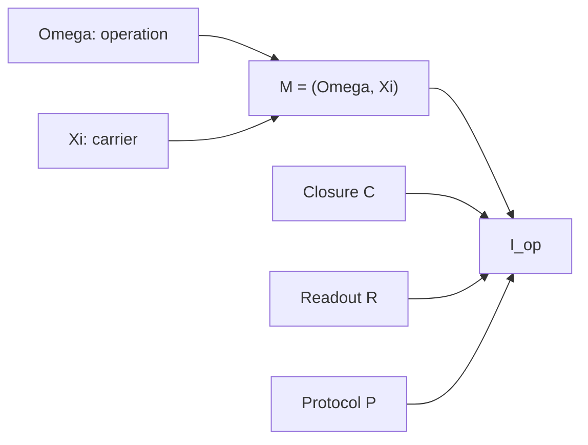

# Chapter 2: Mechanism Sheets

An equation becomes useful only inside a larger contract. FieldBridge writes
that contract as

```text
I_op = (M; C, R, P),    M = (Omega, Xi)
```

`Omega` describes the operation, `Xi` its carrier, and `C`, `R`, and `P`
record closure, readout and protocol. The public implementation uses
interpretable proxies rather than private corpus codebook identifiers.

```bash
fieldbridge extract examples/brownian_probability_flow.tex \
  --title 'Brownian probability flow'
```

The mechanism sheet preserves the source equations while separating:

1. state and carrier;
2. operator or update rule;
3. closure and boundary assumptions;
4. observable consequences;
5. controls capable of breaking the proposed interpretation.



This decomposition matters because a constructor can edit one clause while
retaining the others. It does not imply that the clauses are independent: a
new carrier may require a different domain, closure, observable or protocol.

## Compare Two Mechanisms

```bash
fieldbridge compare \
  examples/brownian_probability_flow.tex \
  examples/material_memory.tex
```

The comparison reports preserved routes and completion differences. Treat the
score as a navigation aid, not as evidence that the systems are physically
equivalent.

Next: [Cross-field retrieval](03_cross_field_retrieval.md).
