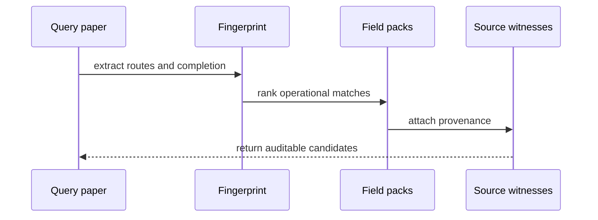

# Chapter 3: Cross-Field Retrieval

FieldBridge retrieval asks whether a mechanism has an operational counterpart
in another field. This is different from predicting what comes next in a
derivation; that prospective task appears in Chapter 6.

```bash
fieldbridge search examples/brownian_probability_flow.tex \
  --target-field material_intelligence \
  --top-k 5
```

The search pipeline is:



The important output is not merely a similarity score. Inspect which routes
are preserved, which carrier changes, which obligations are missing, and which
source equation supports the match.

## Translate Into a Target Vocabulary

```bash
fieldbridge translate examples/brownian_probability_flow.tex \
  --to stochastic_optimization \
  --no-hyperion
```

Translation changes the realization vocabulary. It does not yet prove that
the transferred mechanism is admissible. The constructor in the next chapter
adds the missing compatibility and falsification clauses.

Next: [Constructor transfers](04_constructor_transfers.md).
