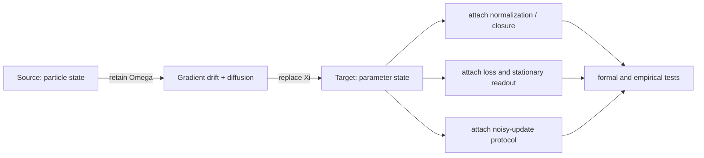

# Chapter 4: Constructor Transfers

The constructor performs a typed edit of a mechanism identity. For the
Brownian-motion example, it retains gradient drift plus diffusion, replaces
particle position by a parameter-space carrier, and asks which closure,
readout and protocol the new realization requires.

```bash
fieldbridge construct examples/brownian_probability_flow.tex \
  --to stochastic_optimization \
  --no-hyperion
```



Read the result in this order:

1. **Preserved contract:** the operation claimed to survive the transfer.
2. **Changed carrier:** the source and target substrates.
3. **Required attachments:** closure, readout and protocol obligations.
4. **Falsifiers:** consequences that would reject the transfer.
5. **Evidence status:** whether the target realization has been independently
   tested.

## In the Code

- `fieldbridge.constructor.construct_transfer` calls extraction and translation,
  then creates source and target identities.
- Its `constructor_moves` field records which clause each edit acts on.
- Its `required_attachments` field keeps closure, readout, protocol,
  realization, and falsifier evidence separate.
- `fieldbridge.render.render_constructor` presents the complete transfer without
  discarding unresolved validation gates.

The output is a constructor proposal. It becomes scientific evidence only
after its source equations, dimensions, closure, residuals and observations
have been checked.

Next: [Complete-paper validation](05_complete_paper_validation.md).
