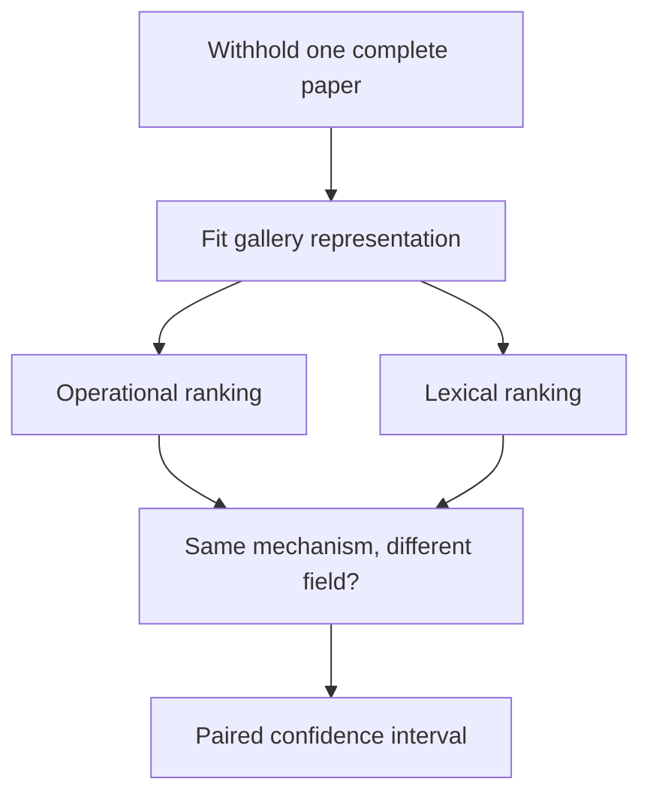

# Chapter 5: Complete-Paper Retrieval Validation

Chunk-level evaluation can leak information: fragments from the query paper
may appear in both fitting and retrieval. FieldBridge therefore provides a
complete-paper holdout benchmark.

Build the small tutorial manifest:

```bash
python3 examples/build_tutorial_validation_data.py
```

The generated JSON manifest follows this schema:

```json
{"paper_id":"paper-001","path":"papers/a.pdf","mechanism_id":"conservative_diffusion","field_id":"continuum_physics"}
```

Then run:

```bash
fieldbridge validate-zero-shot build/tutorial_data/papers.json \
  --top-k 10 \
  --min-eligible-queries 4 \
  --out-json build/full_paper_zero_shot.json \
  --out-md build/full_paper_zero_shot.md
```

A retrieved paper is relevant only when it has the same independently supplied
mechanism label and belongs to another field. The report compares operational
retrieval with a gallery-fitted lexical baseline and gives a paired bootstrap
interval for the precision gain.

## In the Code

- `fieldbridge.zero_shot._load_manifest` validates the paper-level data contract.
- `fieldbridge.zero_shot._paper_fingerprint` builds the operational query vector.
- `fieldbridge.zero_shot.validate_full_paper_zero_shot` removes each query paper,
  fits the gallery baselines, ranks candidates, and computes paired metrics.
- `fieldbridge.zero_shot.render_markdown` writes the human-readable report.



This benchmark tests recurrence across fields. It does not ask whether the
model can predict the next mathematical move. That requires ordered equation
transitions.

The tutorial corpus is deliberately tiny and tests software behavior only. A
scientific performance claim requires an independently labelled corpus and the
prespecified minimum of 100 eligible queries.

Next: [Future-state prediction](06_future_state_prediction.md).
