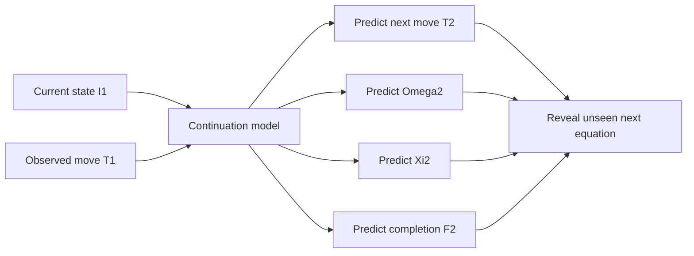

# Chapter 6: Predicting the Next Move

This is the prospective FieldBridge test. The input is the current mechanism
state (I_1) and an observed move (T_1). The targets are the next move
(T_2) and the state occupied by the unseen next equation:

```text
(I1, T1) -> (T2, Omega2, Xi2, F2)
```

**Destination means the future equation state. It is not classification of the
current equation.**

The corpus-scale Hyperion reference result is:

| Withheld future target | Top-1 accuracy |
|---|---:|
| Next move `T2` | 57.4% |
| Operator state `Omega2` | 74.4% |
| Substrate state `Xi2` | 71.7% |
| Completion state `F2` | 73.4% |

The next-move prediction gained 0.210 bits per transition over
`P(T2 | T1)`. That gain is the important control: it shows that the current
mechanism state contributes information beyond repeating the usual successor
of the first move.

## Reproduce the Protocol

Generate the tutorial records:

```bash
python3 examples/build_tutorial_validation_data.py
```

Each transition record contains a complete-paper identifier, the current
state, the first move, and the withheld future targets:

```json
{
  "paper_id": "paper-001",
  "current_omega": "Omega05",
  "current_xi": "Xi03",
  "current_completion": "C+R",
  "first_move": "T05",
  "next_move": "T02",
  "destination_omega": "Omega05",
  "destination_xi": "Xi07",
  "destination_completion": "C+R+P"
}
```

Run:

```bash
fieldbridge validate-continuation build/tutorial_data/transitions.jsonl \
  --min-evaluation-transitions 12 \
  --out-json build/future_state_validation.json \
  --out-md build/future_state_validation.md
```

Complete papers are assigned to fitting or evaluation as indivisible groups.
For each target, the report provides top-1, top-three and code-length gain over
a first-move-only baseline.

## In the Code

- `fieldbridge.continuation._paper_fold` assigns complete papers to stable folds.
- `fieldbridge.continuation._context` defines the current-state and first-move
  conditioning variables.
- `fieldbridge.continuation.validate_future_state` fits counts on training
  papers and scores each unseen target independently.
- `fieldbridge.continuation.render_markdown` separates next-move and destination
  results in the report.



The evaluation establishes symbolic continuation only. Exact equation
generation and physical validity remain separate tests.

The generated data are synthetic and test the command, split and report. They
do not reproduce the corpus-scale percentages in the table.

Next: [Build a field adapter from PDFs](07_pdf_field_adapter.md).
