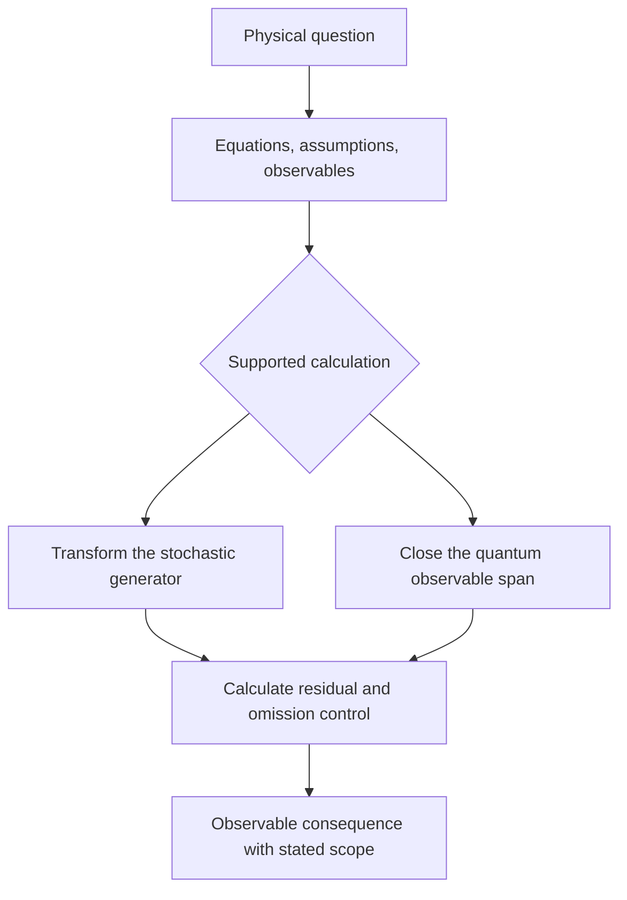

# From a retrieved mechanism to a calculation

A search for an equation can identify two papers that may describe related
dynamics. To calculate the relation, the state variables, the equations that
evolve them and the proposed correspondence must be recovered. A similarity
score does not specify any of these mathematical choices. This chapter starts
at that point: the researcher has a proposed connection and wants to determine
its physical consequence.

The existing `construct` command calls
[`construct_transfer`](../../fieldbridge/constructor.py), which obtains a
candidate target formulation from
[`translate_mechanism`](../../fieldbridge/search.py). Its target equations are
prepared field-pack examples. The new `verify-construction` command takes an
explicit mathematical problem instead. It derives an equation or an observable
closure from that problem without fitting a retrieved target answer.

With `construct --calculate`, these paths are now connected. The
[adapter walkthrough](13_retrieval_to_calculation.md) shows how a chosen record
in the actual retrieval results supplies the source coefficients or Hamiltonian.
An explicit correspondence supplies the target map or measured operator. The
emitted specification then passes through the same verification engine.

## The objects needed by the calculation

The operation class, denoted by Omega, identifies the kind of action under
consideration. The carrier Xi specifies the states on which it acts. These
two roles help identify possible transfers, but evolution requires the full
generator, including its domain. For example, the same bulk Laplacian with
reflecting and absorbing boundary conditions gives different evolutions and
different conservation properties.

Constitutive relations and admissibility conditions C determine how an
operation becomes a physical law on that carrier. An observable R determines
which consequence is predicted. Preparation and the ordered operations P
determine the experiment. A realization A supplies a particular system and
parameter values. These descriptions are nested because a later choice must
respect the objects already specified. Changing a boundary can require
changing the generator's domain, not merely the name of the realization.

These roles are supplied as a modelling convention. The recurrent families
and transitions learned within a representation are a separate empirical
result; the roles themselves are not inferred by this calculation.

## A record that can be calculated

Each JSON input declares `schema`, `kind`, a physical `question`, `assumptions`
and `provenance`. The mathematical fields depend on the calculation:

| Kind | Supplied mathematics | Calculated result |
| --- | --- | --- |
| `ito_transfer` | source drift and noise, explicit Ito/Stratonovich convention, state map, inverse map, source and target domains | Ito-form target drift, quadratic variation rate and local generator residual |
| `quantum_closure` | finite Hermitian Hamiltonian and observable | smallest invariant linear span generated by repeated commutators |

The input parser in [`verification.py`](../../fieldbridge/verification.py)
accepts arithmetic in declared symbols and a few elementary functions.
It rejects Python attribute access, undeclared names and expressions such as
`0=1`. A target candidate is checked against the derived coefficients, not
accepted because a field contains a nonempty string. A JSON assumption is
still an assumption: recording units or a boundary condition does not verify it.

The relation in the graph is computational, not an analogy. An equation is
changed by differentiation or a commutator, and the resulting expression is
checked. Unsupported problems require a new mathematical handler and tests;
the program does not substitute a generic target equation.

Continue with [the stochastic construction](10_stochastic_construction.md).

The separate [inverse spin construction](14_inverse_construction.md) starts
from unknown interaction coefficients rather than a complete Hamiltonian.
Its `fieldbridge-spin-design/1` input and `design-spin-cancellation` command
solve exact commutation constraints, then check the selected family by direct
Hamiltonian evolution.

## Distinguish the two kinds of repair

In the stochastic example the target coordinate is already sufficient: the
generator on that coordinate needs an additional drift. In the spin example
the chosen expectation alone is insufficient: the Hamiltonian introduces a
second expectation whose initial value cannot be inferred from the first.
One repair changes an equation on fixed coordinates; the other enlarges the
predictive description. The supplied equations determine which is required.

This distinction guides a new construction. First ask whether the discrepancy
can be expressed as a term acting on the existing target variables. If different
allowed preparations share those variables but lead to different futures,
additional state information or an explicitly history-dependent description
is needed. A large retrieval distance or a small matching score cannot make
that decision.

[First run](08_end_to_end_walkthrough.md) · [Tutorial](index.md)
