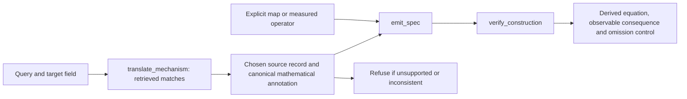

# Calculate a consequence from a retrieved source

The standalone squared-coordinate calculation supplies its source equation
and map in one file. To apply the same calculation to a retrieved source, the
constructor needs to identify which equation was selected and how it is to
be transformed. A correspondence file chooses a record from the retrieval
results and supplies the map. The selected record supplies the source law;
the verifier derives the target equation from these two inputs.

## Follow the executed path



[`construct_transfer`](../../fieldbridge/constructor.py) performs the existing
retrieval first. When `calculation_request` is supplied, it calls
[`attach_calculation`](../../fieldbridge/calculation_adapter.py). That adapter
requires the selected identifier to occur exactly once in the returned matches.
It does not load a convenient example after retrieval fails.

A `fieldbridge-source-model/1` annotation on the selected record contains the
source parameters, assumptions and either scalar stochastic coefficients or a
finite Hamiltonian. Stochastic annotations require `convention` explicitly:
`ito` or `stratonovich`. The `scalar_sde` family supports either; the legacy
`scalar_ito` family requires `ito`. Its canonical equation must agree with the selected entry in
the record's `equations` list. This is a narrow transcription format, not a
general parser for LaTeX or proof that a paper contains the equation.

The `fieldbridge-correspondence/1` file supplies the physical question, selected
record identifier, target field, calculation family and additional assumptions.
For a stochastic map it supplies `state_map`, `inverse_map` and `target_domain`; for a quantum
calculation it supplies `observable`. Source drift, noise and Hamiltonian
cannot be overwritten through the correspondence. A proposed target drift
and variance may be supplied as a `candidate` to test, but they do not determine
the derived target coefficients.

## Stochastic example

From the FieldBridge root:

```bash
python3 -m pip install -e '.[construction]'
python3 -B -m fieldbridge --data-dir examples/calculated_transfer/data \
  construct 'radial Brownian Ito diffusion' --to stochastic_dynamics \
  --no-hyperion --calculate \
  --correspondence examples/calculated_transfer/squared_signal.json \
  --out-dir build/calculated_transfer
```

The source record supplies the radial drift and unit noise. The correspondence
supplies Y=X squared. The emitted specification combines them, and the
calculation derives drift 2 theta + 2 - 2 alpha y and quadratic variation rate 4y. The supplied
candidate omits one unit of drift and leaves the expected generator residual
1. The report also gives the conditional mean response. Changing the record's
restoring coefficient changes that predicted mean; changing the map to an
affine rescaling removes the additional Ito drift.

The tests make both changes independently. They also alter the annotation
without changing the stored equation and confirm refusal. The new result
therefore depends on the selected source and correspondence, rather than on
the name of a fixed target example.

## Quantum example

```bash
python3 -B -m fieldbridge --data-dir examples/calculated_transfer/data \
  construct 'quantum spin Hamiltonian commutator' --to quantum_dynamics \
  --no-hyperion --calculate \
  --correspondence examples/calculated_transfer/quantum_signal.json \
  --out-dir build/calculated_quantum
```

Here the retrieved record supplies H=g Z tensor Z and the correspondence asks
for the transverse magnetization of the first spin. Repeated commutators
produce the required two-observable closure described in
[Chapter 11](11_quantum_closure.md). This is construction of a reduced
observable description, not by itself a transfer between two physical systems.

## What the saved records establish

| Output | Meaning |
| --- | --- |
| `transfer.json` | Retrieved records, proposal, calculated consequences and scoped checks |
| `construction_spec.json` | The exact specification emitted from the selected source and correspondence |
| `calculation.json` | Derived coefficients or observable basis, residuals and controls |
| `transfer.md` | Readable account of this calculated construction |
| `run_status.json` | Whether this run calculated, refused or failed |

`source_record_linked` reports agreement with the local retrieved equation.
`local_generator_identity` reports the two stochastic coefficient identities.
`finite_quantum_closure` reports the Hamiltonian commutator identities.
`omission_control_detected` reports whether removing the specified contribution
changes the calculated relation; it is correctly false for an affine Ito map.

The field-blind retrieval, independent target validation and prospective
prediction gates stay false. The command filters by a target field, evaluates
supplied models and performs no experiment or held-out target test. The
query text and other retrieved equations are not verified by the selected
calculation. The output labels this scope explicitly.

If the record has no supported annotation, the equation differs from that
annotation, or the map cannot be verified, the command returns status
`calculation_refused` and exit code 2. On a refused rerun, old calculation
artifacts are replaced with a refusal and a null specification. The ordinary
`construct` command without `--calculate` retains its previous proposal behavior.

The two records in the demonstration index are authored benchmarks. Applying
this path to recovered literature requires independently checked source
annotations and exact source-equation links. Measuring the discovery advantage
then requires an unseen target consequence, rather than successful execution
of these known examples.

## Measuring source extraction separately

A paper-level test must preserve the original display, neighbouring definitions,
paper identifier and location. Independently prepared annotations on held-out
papers then determine whether the extracted model agrees with the source.
Agreement between two generated representations cannot establish this.

Report accepted papers divided by all evaluated papers as coverage, correct
accepted models divided by accepted models as conditional correctness, and
incorrect accepted models divided by all evaluated papers as the unconditional
silent-error rate. Also report incorrect accepted models divided by accepted
models; with complete reference judgements this is exactly one minus
conditional correctness. Missing reference judgements need their own count.
Separate unreadable displays, missing definitions, unstated conventions and
unsupported families rather than combining them into a single failure rate.

The current canonical-equation comparison remains deliberately narrow.
An equivalence-aware extension must preserve domains and singularities:
simplification makes $(x^2-1)/(x-1)$ equal to $x+1$, but does not establish the
original expression at $x=1$. Symbolic simplification alone therefore cannot
replace a source and domain check. This extension and a held-out paper benchmark
remain separate work; the examples here measure neither extraction coverage
nor correctness on papers.

## Exercise: change the question without changing the source

Replace the squared signal by $Y=2X$. The source record should remain the
same, while the derived correction disappears because the new map is affine.

```bash
python3 - <<'PY'
import json
from pathlib import Path

request = json.loads(Path('examples/calculated_transfer/squared_signal.json').read_text(encoding='utf-8'))
request['question'] = 'What equation governs twice the retrieved radial coordinate?'
request['state_map'] = '2*x'
request['inverse_map'] = 'y/2'
request['assumptions'][0] = 'Y=2X is the target signal on the positive domain.'
request.pop('candidate')
out = Path('build/tutorial_affine_correspondence.json')
out.parent.mkdir(parents=True, exist_ok=True)
out.write_text(json.dumps(request, indent=2), encoding='utf-8')
PY
python3 -B -m fieldbridge --data-dir examples/calculated_transfer/data \
  construct 'radial Brownian Ito diffusion' --to stochastic_dynamics \
  --no-hyperion --calculate \
  --correspondence build/tutorial_affine_correspondence.json \
  --out-dir build/tutorial_affine_correspondence
```

The target drift is $(4\theta+2)/y-\alpha y$ and the quadratic variation rate is 4.
The omission residual is zero. Compare the two `construction_spec.json`
files: the drift and noise in the source are unchanged, and only the
correspondence changed. In the provenance, the source-record hash remains
the same while the correspondence hash changes.

This is the elementary unit of a reproducible construction search: hold the
source fixed, change a stated mathematical choice, and calculate what follows.

[Tutorial](index.md)
