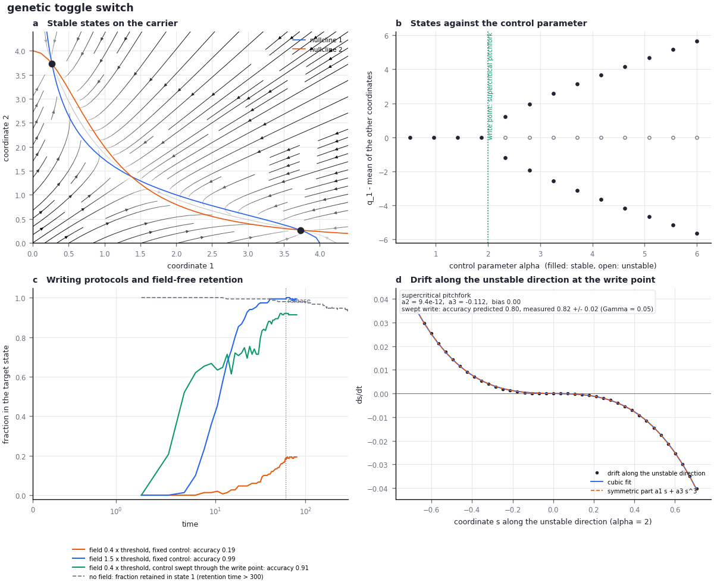

# Module 1. A first memory card: the genetic toggle switch

**Learning objectives.** After this module you can

1. run the memory analysis of a model material with one command;
2. identify its stable states, its write point and the law by which a stored state is lost;
3. explain why a weak field writes a state when the control parameter is swept through the write point, but not
   at a fixed control;
4. use a control calculation to test a structural prediction.

**Prerequisites.** Python 3.10 or later. Terms are defined in the [glossary](memory_glossary.md).
**Time.** About 30 minutes.

```bash
python3 -m pip install -e '.[memory]'
python3 -B -m fieldbridge memory --help
```

## 1. The question

Two genes that repress each other can sustain one of two states: the first gene expressed and the second
repressed, or the reverse (Gardner, Cantor and Collins, 2000). This module answers four questions for this
genetic toggle switch. At which promoter strength does the second state appear? How is a state written? How long
is it retained in the presence of noise? Which of these answers follow from the symmetry of the circuit alone?

## 2. The model

The input is [toggle.json](../../examples/memory/toggle.json):

```json
{
  "kind": "equations",
  "carrier": {"kind": "orthant", "name": "repressor concentrations", "variables": ["u", "v"], "scale": 4},
  "parameters": {"alpha": 4.0, "n": 2.0},
  "drift": {"u": "alpha/(1 + v**n) - u", "v": "alpha/(1 + u**n) - v"},
  "control": {"name": "alpha", "range": [0.5, 6.0]},
  "noise": 0.05,
  "observable": "which repressor is high"
}
```

The carrier is the pair of non-negative concentrations $(u, v)$. The promoter strength $\alpha$ is the control
parameter, the quantity an experiment would vary. The file also states the question, the assumptions and the
source. It does not state whether the circuit stores a bit or how a bit would be written; the program derives both.

## 3. Worked example

```bash
python3 -B -m fieldbridge memory card examples/memory/toggle.json --out-dir build/toggle
```

The command writes `card.json` (all numbers), `card.md` (a readable summary) and `card.png` (the figure below).
The summary separates what the structure of the equations implies before any simulation from what the
calculation finds.



*(a) Flow of the noise-free dynamics with the two nullclines; the two stable states are marked. (b) Stable
(filled) and unstable (open) states against the promoter strength $\alpha$; the symmetric state loses stability
at the write point $\alpha = 2$. (c) Fraction of trajectories in the target state for three writing protocols,
and the fraction retained without a field. (d) The drift along the unstable direction at the write point, fitted
by a cubic; the quadratic term vanishes, as for a symmetric pitchfork.*

## 4. Results

| Quantity (key in `card.json`) | Value | Interpretation |
| --- | --- | --- |
| Structural prediction (`structure.predictions.write`) | "a symmetric state that loses stability along a mode the symmetry reverses does so at a pitchfork" | The exchange $u \leftrightarrow v$ is a symmetry of the equations and reverses the mode $u - v$; the structure does not say whether such a loss of stability occurs |
| Number of stable states (`card.states.count`) | 2 | At $\alpha = 4$ the circuit is bistable |
| Write point (`card.construct.events[0].value`) | $\alpha = 2.00$, supercritical pitchfork | The symmetric state loses stability; a weak bias selects one of two mirror states |
| Unstable direction (`...events[0].mode`) | $(0.707, -0.707)$ | Writing raises one concentration and lowers the other |
| Rate of change of $\kappa$ (`...events[0].kappa_slope`) | $-0.25$ per unit $\alpha$ | The instability develops linearly in $\alpha$ beyond the write point |
| Swept write (`...events[0].write_law`) | measured $0.82 \pm 0.02$, predicted $0.80$ | The accuracy law of the symmetric pitchfork applies to the toggle |
| Retention law (`card.loss_law`) | activated escape between stable states (Law 3) | A barrier separates the states; noise causes rare transitions |
| Writing protocols (`card.writes`) | field $0.4\times$ threshold at fixed $\alpha$: 0.19; field $1.5\times$ threshold: 0.99; field $0.4\times$ threshold while $\alpha$ is swept: 0.91 | See Section 5 |
| Agreement (`comparison.all_consistent`) | `true` | Every structural prediction agrees with the calculation |

## 5. Interpretation

A field below the threshold that removes the stored state cannot write it at fixed $\alpha$: the state would have
to cross the barrier by a rare thermal fluctuation. The same weak field writes with accuracy 0.91 when $\alpha$ is
swept upward through the write point, because at the write point there is no barrier; the field only has to bias
an instability. Module 4 shows that this difference is general. For a field of bounded strength acting on a state
protected by a barrier, the ratio of retention time to writing time is fixed by the work of the field, and only a
change of the landscape during writing avoids this limit.

## 6. Control calculation

A structural prediction is useful only if a changed structure changes it. Make the promoter of $v$ 25% stronger
([toggle_unequal.json](../../examples/memory/toggle_unequal.json), factor `gamma = 1.25`):

```bash
python3 -B -m fieldbridge memory card examples/memory/toggle_unequal.json --quick --out-dir build/toggle_unequal
```

| Quantity | Value | Interpretation |
| --- | --- | --- |
| Structural prediction | "one-sided writes at folds; a symmetric write needs one tuned parameter" | The exchange symmetry is broken |
| Write point | $\alpha = 3.27$, saddle-node (fold) | A state appears at a threshold; it is written by a one-sided pulse |
| Number of stable states | 2 | The circuit is still bistable |
| Agreement | `true` | The changed prediction is confirmed |

A fold is a property of the asymmetric circuit, not a failure of the calculation: the circuit is bistable, but a
weak bias cannot select between its states symmetrically. Module 5 finds the parameter setting that restores a
symmetric write.

## 7. Exercises

1. Raise the Hill exponent $n$ from 2 to 3 in a copy of `toggle.json`. Before running, state which properties are
   determined by the symmetry and which must be calculated.
2. In `card.json`, find the threshold field that removes the stored state and compare it with the field used in
   the weak writing protocol.
3. Why does the accuracy of the swept write depend on the sweep rate?

<details><summary>Answers</summary>

1. The symmetry is unchanged, so a write point at the symmetric state along $u - v$ remains a pitchfork. Whether
   it exists in the range of $\alpha$, its position and the barrier height must be calculated.
2. `card.threshold` is 0.213; the weak protocol uses $0.4 \times 0.213 = 0.085$, below the threshold.
3. The field acts only while the state is near the instability. A slower sweep gives the bias more time to act
   before the barrier grows; for a pitchfork the accuracy is $\Phi(\pi^{1/4} h_s/(D_s^{1/2} r^{1/4}))$ with sweep
   rate $r$ (Module 4).

</details>

## Summary

- A memory card reports the stable states, the write point, the normal form at the write point and the loss law.
- Before any simulation, the exchange symmetry of the toggle predicts that a loss of stability of the symmetric
  state along $u - v$ is a pitchfork (a symmetric write); the calculation finds this write point at $\alpha = 2$.
- A weak field writes when the control is swept through the write point, not at a fixed control.
- Breaking the symmetry changes the write to a fold, as predicted.

## Reference

| Result | Function | Test |
| --- | --- | --- |
| Parsing | [`spec.load`](../../fieldbridge/memory/spec.py) | `test_every_example_loads_with_its_provenance` |
| Structural predictions | [`predict.predict`](../../fieldbridge/memory/predict.py) | `test_symmetry_decides_the_kind_of_write_before_any_calculation` |
| Write points and normal forms | [`analysis.locate_writes`](../../fieldbridge/memory/analysis.py), `normal_form` | `test_toggle_pitchfork_and_transferred_write_law` |
| Card | [`discovery.evaluate`](../../fieldbridge/memory/discovery.py) | `test_structural_predictions_agree_with_the_calculation` |

[Next: Module 2, describing a material](16_memory_specification.md) · [Tutorial index](index.md) · [Glossary](memory_glossary.md)
