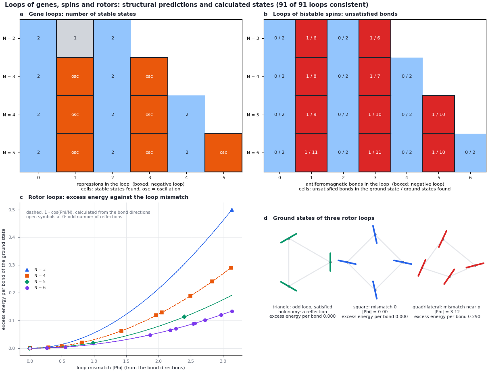

# Module 3. Predictions from structure

**Learning objectives.** After this module you can

1. state which properties of a memory follow from the structure of the couplings alone;
2. predict, before any simulation, whether a network can be multistable, oscillate or be frustrated;
3. test such predictions against calculations on single loops and on random networks.

**Prerequisites.** Modules 1 and 2. **Time.** About 40 minutes.

## 1. Concepts

Several classical results restrict the existence and the kind of a memory from structure alone: the signs of the
feedback loops, the symmetries of the equations, the reciprocity of the couplings and the composition of the bond
transports around a loop. They give necessary conditions and the generic kind of a loss of stability, not numbers
such as thresholds or retention times, and not whether a write point lies within the range of the control.
Each prediction in a report names its rule, the structural input it used, and the result that would falsify it.

| Structural input | Prediction | Rule |
| --- | --- | --- |
| Signs of the feedback loops (off-diagonal Jacobian entries of constant sign) | Without a positive loop, at most one steady state; without a negative loop, no sustained oscillation | Thomas; Soulé (2003) |
| Every undirected cycle positive (a monotone network) | Trajectories converge; no oscillation | Hirsch; Smith (1995) |
| A symmetric Jacobian everywhere (reciprocal couplings) | A gradient flow, which cannot oscillate | |
| A symmetry that reverses a mode (an involution, or a cyclic symmetry of even order) | A symmetric state that loses stability along a reversed mode does so at a pitchfork, without a second tuned parameter; a weak bias selects the written state | Equivariant bifurcation theory |
| No symmetry | One-sided writes at folds; a symmetric write requires one additional tuned parameter (a cusp) | Codimension counting |
| A cyclic symmetry of odd order only | No pitchfork of the symmetric state; it loses stability in a Hopf bifurcation or at a fold | |
| A continuous symmetry (a direction along which the drift does not change) | A family of states along a zero mode: Law 2; retention not protected by a barrier | Goldstone |
| Rotor bonds that are pure reflections, on a network whose loops are all even | A staggered rotation of the two sublattices is a zero mode | Holonomy of the transports |
| The control multiplies the whole drift | The control changes no state, only the depth of the landscape relative to the noise | |
| Bond transports around a loop | The loop can satisfy all bonds only if the composition has a fixed point; for $N$ equal rotor bonds with mismatch $\Phi$, excess energy per bond $1 - \cos(\Phi/N)$ | Toulouse; Harary; loop mismatch |

## 2. Worked example: two rings of repressors

A ring of three repressing genes (the repressilator) and a ring of four have the same kind of coupling but
different loop signs and symmetries.

```bash
python3 -B -m fieldbridge memory predict examples/memory/repressilator.json --out-dir build/ring3
python3 -B -m fieldbridge memory predict examples/memory/repressor_ring4.json --out-dir build/ring4
```

| Quantity | Three genes | Four genes |
| --- | --- | --- |
| Symmetry orders (`structure.symmetries`) | 3, 3 | 4, 2, 4 |
| Multistability | impossible: at most one steady state | possible (a positive loop) |
| Oscillation | possible (a negative loop) | not expected (no negative loop) |
| Write | no symmetric pitchfork; a Hopf bifurcation or a fold | a pitchfork if the symmetric state loses stability along a reversed mode |

The calculation (`memory card`) confirms each entry: the three-gene ring has a Hopf bifurcation at $\alpha = 2$
with frequency $\sqrt3$ and no stable state; the four-gene ring has a pitchfork at $\alpha = 1.013$ and stores two
alternating patterns.

## 3. Control calculation: one activation in the ring of four

Replacing one repression by an activation makes the loop negative and removes the ring symmetry:

```bash
python3 - <<'PY'
import json
from pathlib import Path
spec = json.loads(Path('examples/memory/repressor_ring4.json').read_text(encoding='utf-8'))
spec['drift']['u0'] = 'alpha*u3**n/(1 + u3**n) - u0'
spec['question'] = 'What does a ring of four genes store when one repression becomes an activation?'
Path('build').mkdir(exist_ok=True)
Path('build/ring4_one_activation.json').write_text(json.dumps(spec, indent=2), encoding='utf-8')
PY
python3 -B -m fieldbridge memory card build/ring4_one_activation.json --quick --out-dir build/ring4_flip
```

Predicted: multistability impossible, oscillation possible, no symmetric pitchfork, and a phase that can retain
the timing of a pulse. Calculated: no stable state and a Hopf bifurcation. `comparison.all_consistent` is `true`.

## 4. Tests on many loops and networks

```bash
python3 -B -m fieldbridge memory loops --out-dir build/loops
python3 -B -m fieldbridge memory networks --count 60 --out-dir build/networks
```



*(a) Gene loops: numbers of stable states found; negative loops (boxed) oscillate or have one state. (b) Loops of
bistable spins: bonds left unsatisfied in the ground state; loops with an odd number of antiferromagnetic bonds are
frustrated. (c) Rotor loops: minimum excess energy per bond against the loop mismatch, with the prediction
$1-\cos(\Phi/N)$ (dashed). (d) Ground states of three rotor loops.*

| Run | Result | What it establishes |
| --- | --- | --- |
| `loops.json`: consistent / total | 91 / 91 | Gene loops (Thomas), spin loops (Toulouse) and rotor loops (mismatch) behave as predicted; rotor frustration agrees with $1-\cos(\Phi/N)$ to $3\times10^{-12}$ |
| `networks.json`: gene | 60 / 60 | No network without a positive loop had two stable states; no monotone network oscillated |
| `networks.json`: spin | 60 / 60 | Balanced networks satisfied every bond; unbalanced ones left bonds unsatisfied |
| `networks.json`: rotor | 60 / 60 | Satisfiability and the presence of a zero mode were predicted exactly from the transports |

The rules for gene networks are necessary conditions: a positive loop allows two states but does not guarantee
them. A consistent result means that no prediction was violated; the counts of each case are in `networks.json`.

## 5. Scope

A structural prediction is a statement about a model: that it cannot oscillate, that its write is symmetric, that
a loop is frustrated. It does not establish that the model describes a material, and it does not give thresholds
or retention times; these are calculated in Module 4.

## 6. Exercises

1. A network of four genes has loop signs $(+, +, -)$. Which of multistability and oscillation are possible?
2. Why can a triangle of antiferromagnetic spins not satisfy its bonds, while a triangle of rotors with pure
   reflection bonds always can?
3. Rotors on a square lattice are coupled only by reflection bonds. What does Module 3 predict for the retention of
   a written orientation, and which additional coupling changes the prediction?

<details><summary>Answers</summary>

1. Both: a positive loop allows multistability and a negative loop allows oscillation.
2. For spins the loop is satisfiable if the product of the bond signs is $+1$; three negative bonds give $-1$. For
   rotors, a loop with an odd number of reflections always has a fixed point, whatever the bond directions.
3. The square lattice has only even loops, so the staggered rotation is a zero mode: the orientation is not
   protected by a barrier and is lost by diffusion (Law 2). A relative-angle (alignment) term removes the zero mode.

</details>

## Summary

- Loop signs, symmetries, reciprocity and bond transports predict the existence and class of a memory.
- The predictions were confirmed on 91 of 91 loops and on 180 of 180 random networks.
- Structural predictions give no numbers; thresholds and retention times require calculation.

## Reference

Code: [`predict.py`](../../fieldbridge/memory/predict.py), [`networks.py`](../../fieldbridge/memory/networks.py),
[`compose.py`](../../fieldbridge/memory/compose.py). Tests: `test_loop_signs_decide_storage_and_oscillation`,
`test_random_networks_follow_their_structure`, `test_holonomy_predicts_loops_in_three_fields`.

[Previous: Module 2](16_memory_specification.md) · [Next: Module 4, writing and retention](18_memory_writing_and_retention.md) · [Tutorial index](index.md) · [Glossary](memory_glossary.md)
