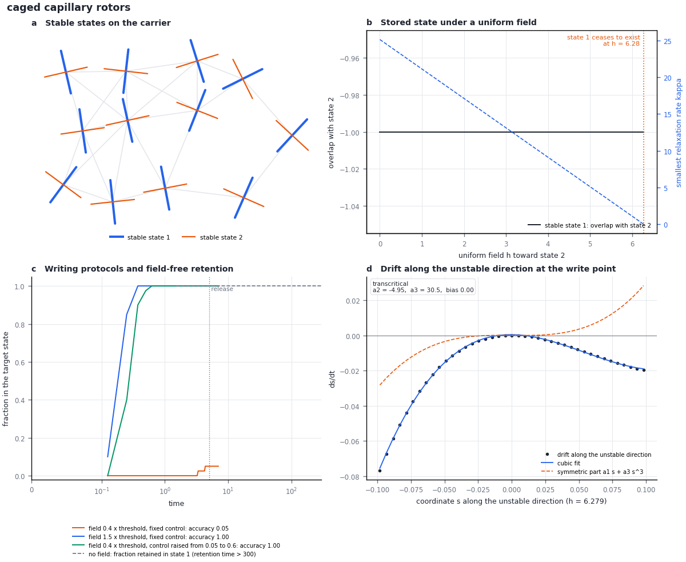

# Module 4. Writing and retention

**Learning objectives.** After this module you can

1. locate a write point and classify it by the normal form of the drift along the unstable direction;
2. predict the accuracy of a write made while the control parameter is swept through a pitchfork;
3. identify the law by which a stored state is lost once the writing field is removed;
4. state the relation between retention and writing times for a field of bounded strength, and name the
   protocols to which it does not apply.

**Prerequisites.** Modules 1–3. **Time.** About 45 minutes.

## 1. Concepts

### 1.1 Write points and normal forms

A stored state is written where the landscape offers no resistance. The program follows every stable state along
the control parameter until one local relaxation rate $\kappa$ reaches zero. At that write point it reduces the
drift to the unstable direction $s$, after the other directions have relaxed:

$$
\dot s = a_0 + a_1 s + a_2 s^2 + a_3 s^3 .
$$

The supercritical pitchfork, $a_0 = a_2 = 0$ and $a_3 < 0$, is the reference write: one state splits into two
symmetric states, and a bias comparable to the noise selects one of them. The obstruction of a write point is the
set of terms by which its normal form differs from the reference.

| Normal form | Kind | Consequence for writing |
| --- | --- | --- |
| $a_0 = a_2 = 0$, $a_3 < 0$ | supercritical pitchfork | A weak bias selects one of two symmetric states |
| $a_2 = 0$, $a_3 > 0$ | subcritical pitchfork | The state moves to a distant branch; a saturating term is needed for a local write |
| $a_2 \neq 0$ | fold (saddle-node) | A state appears or vanishes at a threshold; the write is one-sided |
| complex pair of eigenvalues | Hopf bifurcation | The state oscillates and no stable state is selected (Module 6) |

### Scalar constructor demonstration

The [visual constructor](https://synthetix-institute.github.io/fieldbridge/#memory)
uses a one-coordinate model to display what each attached term supplies:

$$
dx = (\epsilon x-\gamma x^3+h)\,dt+\sqrt{2D}\,dW,
\qquad V(x)=-\frac{\epsilon x^2}{2}+\frac{\gamma x^4}{4}-hx .
$$

Time, the coordinate and the mobility are dimensionless. At zero field,
positive $\epsilon$ and $\gamma$ give stable states
$x_\pm=\pm\sqrt{\epsilon/\gamma}$ and barrier
$\Delta V=\epsilon^2/(4\gamma)$. Solving both $V'=0$ and $V''=0$ gives the
field that removes a minimum:

$$
|h_c|=\frac{2\epsilon^{3/2}}{3\sqrt{3\gamma}}.
$$

At $\epsilon=\gamma=1$, a pulse $h=0.8$ between $t=1$ and $t=3$ switches
the initial negative state to the positive state. The positive state persists
after the field returns to zero. Detaching the writing field leaves the
negative preparation unchanged. Detaching feedback leaves one attracting
state; detaching saturation leaves no finite attracting state for positive
$\epsilon$.

[The website calculation tests](../../tests/test_web_demo.py) compare the
equilibrium relations and switching trajectory with an independent Python
ODE integrator. In weak noise the overdamped escape-time approximation is
$\tau\simeq 2\pi\exp(\Delta V/D)/(\sqrt{2}\epsilon)$; the website reports
it only when $D/\Delta V\leq0.2$. This is an approximation criterion, not a
measured error bound. Its physical basis is activated escape
([Kramers, 1940](https://doi.org/10.1016/S0031-8914(40)90098-2)).

The final realization node permits $q=q_0x$. The same dynamics then gives
$\dot q=\epsilon q-\gamma q^3/q_0^2+q_0h$ and noise amplitude
$q_0\sqrt{2D}$. This changes the coordinate scale, not the number or stability
of the states. Applying the model to a material additionally requires deriving
or measuring its force law and coefficients.

### 1.2 Swept writes

Let the control cross a supercritical pitchfork at rate $r$, so that $a_1 = r t$, while a bias $h_s$ acts along
the unstable direction and the noise along it has intensity $D_s$. The probability that the state favoured by the
bias is selected is

$$
P = \Phi\!\left(\frac{\pi^{1/4}\, h_s}{D_s^{1/2}\, r^{1/4}}\right),
$$

where $\Phi$ is the standard normal distribution function. The choice is made within a time of order $r^{-1/2}$
around the write point, where the dynamics is linear. The law requires that the barrier behind the choice grows
faster than the noise can act: $\Gamma = D_s |a_3| / r$ must be small (below about 0.4 for the toggle switch).
The card compares this prediction with a simulation (`write_law`).

<details><summary>Derivation</summary>

In the linear stage $\dot s = r t\, s + h_s + (2D_s)^{1/2}\xi(t)$. The solution is
$s(t) = e^{r t^2/2} \int_{-\infty}^{t} e^{-r t'^2/2}\,[h_s\,dt' + (2D_s)^{1/2}\,dW(t')]$. At late times the sign of
$s$ is the sign of the integral over all $t'$. The integral is Gaussian, with mean $h_s (2\pi/r)^{1/2}$ and
variance $2 D_s (\pi/r)^{1/2}$. The ratio of the mean to the standard deviation is $\pi^{1/4} h_s /
(D_s^{1/2} r^{1/4})$.

</details>

### 1.3 Retention

After the field is removed, the form of the landscape at the stored state determines how information about the
write is lost:

| Form of the landscape at the stored state | Law | Information about the write |
| --- | --- | --- |
| a curved minimum, $\kappa > 0$ | Law 1, relaxation | decreases as $e^{-2\kappa t}$ |
| a direction with $\kappa = 0$ (a zero mode) | Law 2, diffusion | decreases as $1/t$ |
| two or more minima separated by a barrier $\Delta V$ | Law 3, activation | lost at the Kramers rate, proportional to $e^{-\Delta V/k_BT}$ |

The card names the law (`loss_law`) and gives the retention time at the noise of the realization (`hold`).
Module 8 derives Laws 1 and 2 from one expression.

### 1.4 Relation between retention and writing times

In a fixed landscape with a thermal bath, the same landscape and the same mobility determine how fast a field of
bounded strength writes a new state and how fast the noise erases it. The ratio of the retention time to the
writing time therefore depends only on the work $E_w$ that the field does on the stored coordinate. It grows
logarithmically with $E_w$ in a curved minimum, linearly along a zero mode, and as $e^{E_w/k_BT}$ behind a
barrier. The barrier height and the mobility cancel. A change of mobility alone, for example of the solvent
viscosity, rescales both times by the same factor.

Three kinds of protocol are not subject to this relation:

1. writing at an instability, where no barrier opposes the field (Section 1.2);
2. changing the landscape between writing and retention, for example by raising a coupling or lowering the
   temperature after the write;
3. writing through a channel that the thermal noise does not use, for example a photochemical reaction.

## 2. Worked example: anisotropic colloids at a fluid interface

[colloid_patch.json](../../examples/memory/colloid_patch.json) describes twelve anisotropic colloids at a fluid
interface. Each is confined to its position by its neighbours and rotates by Brownian motion. A bond combines an
alignment term of strength 4 and a capillary term of strength $5\,(r_0/r)^4$, both in units of
$\lambda k_BT$. The control parameter $\lambda$ multiplies every coupling; its operating value is 0.6. The rods
are apolar, so their angles have period $\pi$. Time is in units of the rotational diffusion time.

```bash
python3 -B -m fieldbridge memory card examples/memory/colloid_patch.json --quick --out-dir build/colloid
```



*(a) Two of the four stable states, shown as rod orientations at the twelve sites (grey lines: bonds). (b) Stable
state 1 under a uniform field toward state 2: its overlap with state 2 (black) and its smallest relaxation rate
$\kappa$ (blue, dashed) against the field. State 1 ceases to exist at $h = 6.28$. (c) Fraction of trajectories in
state 2 during three writing protocols and after the field is removed (dotted line); dashed: fraction retained in
state 1 without a field. (d) Drift along the unstable direction at the threshold field, with its cubic fit. The
quadratic term is non-zero, so a state written by the threshold field leaves state 1 on one side only.*

| Quantity (key in `card.json`) | Value | Interpretation |
| --- | --- | --- |
| Role of the control (`structure.control_role`) | $\lambda$ multiplies the whole drift | $\lambda$ changes no state, only the depth of the landscape relative to $k_BT$; it acts as an inverse temperature |
| Stable states (`card.states.count`) | 4 | Two pairs; turning every rod by $\pi/2$ maps a state onto its partner (`structure.symmetries`) |
| Write point along $\lambda$ | none | A control that only scales the landscape cannot create or remove a state |
| Threshold field (`card.threshold`) | $h = 6.28$ | A uniform field toward state 2 removes state 1 |
| Retention (`card.loss_law`, `card.hold`) | Law 3; no loss within 300 time units | Activated escape between stored states; the retention time exceeds the simulated interval |
| Field $0.4\times$ threshold at $\lambda = 0.6$ | accuracy 0.05 | Below the threshold the field must wait for an activated crossing |
| Field $1.5\times$ threshold at $\lambda = 0.6$ | accuracy 1.00; rewriting time 0.37; ratio of retention to rewriting time $> 800$ | Above the threshold the field removes the barrier; the ratio is a lower bound because the retention time is censored |
| Field $0.4\times$ threshold while $\lambda$ rises from 0.05 to 0.6 | accuracy 1.00 | The weak field acts while the barriers are low |

## 3. Interpretation

At a fixed coupling a weak field fails for the same reason that the stored state is retained: both require an
activated crossing of the same barrier. A strong field writes quickly because it removes the barrier, and the
work it must supply grows with the barrier. The third protocol writes with the same weak field because the field
acts while $\lambda$ is small and the barriers are low; the stored state is then retained at the final, larger
$\lambda$. The relation of Section 1.4 holds within each landscape, but the protocol changes the landscape
between writing and retention. In an experiment any change that deepens the couplings relative to $k_BT$ after
the write has this effect, for example cooling or an increase of the capillary coupling.

## 4. Control calculation: a change of mobility

Doubling the mobility doubles the drift and, by the Einstein relation, the noise intensity. Predict before
running: the write point does not move, the threshold field doubles, every time halves, and every ratio of times
is unchanged. The time step is halved as well, so that each integration step of the new model equals a step of
the original one.

```bash
python3 - <<'PY'
import json
from pathlib import Path
spec = json.loads(Path('examples/memory/toggle.json').read_text(encoding='utf-8'))
spec['drift'] = {k: f'2*({v})' for k, v in spec['drift'].items()}
spec['noise'] = 2 * spec['noise']
spec['dt'] = spec['dt'] / 2
spec['question'] = 'What changes when the mobility of the toggle switch is doubled?'
Path('build').mkdir(exist_ok=True)
Path('build/toggle_fast.json').write_text(json.dumps(spec, indent=2), encoding='utf-8')
PY
python3 -B -m fieldbridge memory card examples/memory/toggle.json --quick --out-dir build/toggle_quick
python3 -B -m fieldbridge memory card build/toggle_fast.json --quick --out-dir build/toggle_fast
```

| Quantity | Original mobility | Doubled mobility |
| --- | --- | --- |
| Write point | $\alpha = 2.00$, supercritical pitchfork | $\alpha = 2.00$, supercritical pitchfork |
| Threshold field (`card.threshold`) | 0.213 | 0.427 |
| Field $1.5\times$ threshold: accuracy; rewriting time | 1.00; 22.5 | 1.00; 11.25 |
| Field $0.4\times$ threshold while $\alpha$ is swept: accuracy; rewriting time | 0.883; 43.5 | 0.883; 21.75 |
| Retention without a field | no loss within 300 | no loss within 150 |
| Ratio of retention to rewriting time | $> 13.3$ and $> 6.90$ | $> 13.3$ and $> 6.90$ |

The two runs are the same stochastic process on a clock that runs twice as fast: every accuracy is identical and
every time is halved. A change of mobility alone therefore cannot change the ratio of retention to writing time;
only a change of the landscape can. (The quick mode uses fewer trajectories than Module 1, so its accuracies differ
from those of the full run within their sampling error.)

## 5. Exercises

1. The swept write of the toggle switch has accuracy $0.82 \pm 0.02$ against the prediction 0.80. By what
   factor must the sweep rate $r$ change to double the argument of $\Phi$?
2. Why is the retention of a state stored along a zero mode not protected by a barrier, and which law applies?
3. A colloidal monolayer is written and retained at the same temperature. The solvent viscosity is doubled. How
   do the writing time, the retention time and their ratio change?
4. Why is the ratio for the threshold write of the colloid network reported as a lower bound?

<details><summary>Answers</summary>

1. The argument is proportional to $r^{-1/4}$; doubling it requires a sweep sixteen times slower, provided that
   $\Gamma = D_s |a_3| / r$, which grows sixteen-fold, stays small.
2. Along a zero mode the energy does not change, so there is no restoring force and no barrier. The stored
   coordinate diffuses and the information decreases as $1/t$ (Law 2).
3. Both times double and the ratio is unchanged: the viscosity changes the mobility, not the landscape.
4. No loss was observed in the simulated 300 time units. The retention time is therefore censored, and the ratio
   is at least $300/0.37 \approx 800$.

</details>

## Summary

- Write points are located where a relaxation rate $\kappa$ reaches zero and are classified by the normal form of
  the drift along the unstable direction.
- A write made while the control is swept through a pitchfork has the accuracy
  $\Phi(\pi^{1/4} h_s / (D_s^{1/2} r^{1/4}))$.
- Retention follows one of three laws, set by the form of the landscape at the stored state.
- For a field of bounded strength in a fixed landscape, the ratio of retention to writing time depends only on
  the work of the field. Writing at an instability, changing the landscape after the write, or writing through a
  separate channel is not subject to this relation.

## Reference

| Result | Function | Test |
| --- | --- | --- |
| Write points and normal forms | [`analysis.locate_writes`](../../fieldbridge/memory/analysis.py), `normal_form` | `test_pitchfork_write_point_and_barrier` |
| Obstruction and swept-write law | [`construct.obstruction`](../../fieldbridge/memory/construct.py), `swept_write_check` | `test_toggle_pitchfork_and_transferred_write_law` |
| Retention and writing protocols | [`analysis.hold_time`](../../fieldbridge/memory/analysis.py), `write_test` | `test_structural_predictions_agree_with_the_calculation` |

[Previous: Module 3](17_memory_predictions.md) · [Next: Module 5, transfer and design](19_memory_transfer_and_design.md) · [Tutorial index](index.md) · [Glossary](memory_glossary.md)
