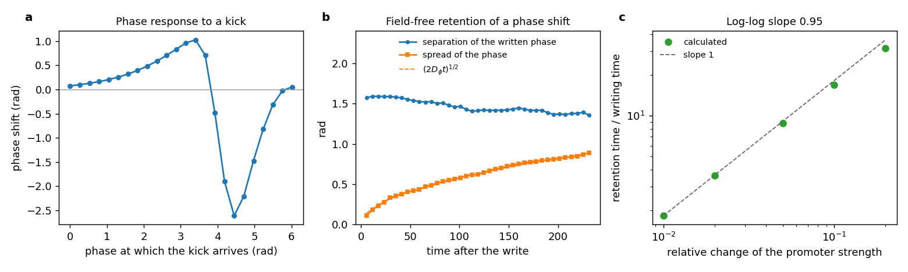

# Module 6. Memory in the phase of an oscillator

**Learning objectives.** After this module you can

1. explain why a limit cycle retains information in its phase although it has no stable state;
2. measure a phase response curve and a phase diffusion constant;
3. state how the ratio of retention to writing time depends on the strength of a write along a zero mode, and
   verify it for a write that changes the frequency.

**Prerequisites.** Modules 1–4. **Time.** About 30 minutes.

## 1. Concepts

A ring of three repressing genes (the repressilator; Elowitz and Leibler, 2000) has no stable state. Its only
attractor is a limit cycle, so by the definition of Modules 1–4 it stores nothing. It can nevertheless retain the
time at which a pulse arrived.

The equations of an autonomous oscillator do not depend on time explicitly. Every time-shifted copy of a periodic
solution is therefore also a solution, and the phase $\phi$ along the cycle is a zero mode. A pulse shifts the
phase, and no restoring force returns it. Noise moves the phase by diffusion,

$$
\langle \delta\phi^2 \rangle = 2 D_\phi\, t ,
$$

so a written phase shift is lost by [Law 2](18_memory_writing_and_retention.md#13-retention), as $1/t$, and not exponentially.

A phase can be written in two ways:

| Write | Result | Measured by |
| --- | --- | --- |
| a short kick | a shift that depends on the phase at which the kick arrives | the phase response curve |
| a temporary change of frequency $\Delta\omega$ for a time $T_w$ | a shift $\Delta\omega\, T_w$ | the phase rate under the change |

For the second write the relation between retention and writing times takes its zero-mode form. The retention
time of a shift $\Delta$ does not depend on the write, $T_h = \Delta^2/(2D_\phi)$, the time at which the spread of
the phase equals the shift. The writing time is $T_w = \Delta/\Delta\omega$. If $\Delta\omega$ is proportional to
the strength $h$ of the write, the ratio $T_h/T_w$ grows linearly with $h$, not exponentially as behind a barrier.

A sustained oscillation requires a drive: under detailed balance a system relaxes to equilibrium and does not
oscillate. The phase diffusion constant, and with it the retention time, is limited by the free energy dissipated
per period (Cao et al., 2015; Barato and Seifert, 2016).

## 2. Worked example: the repressilator

```bash
python3 -B -m fieldbridge memory phase examples/memory/repressilator.json --out-dir build/phase
```

The command finds the limit cycle, applies a kick at 24 phases of the cycle, follows an ensemble with a written
shift and an unwritten ensemble under noise, and measures the writing time for five frequency-changing writes.



*(a) Phase shift produced by a kick of size 2 on the first protein, against the phase at which it arrives (the
phase response curve). (b) Separation between a written and an unwritten ensemble (blue) and the spread of the
phase (orange) after a write of $\pi/2$; dashed: $(2 D_\phi t)^{1/2}$. (c) Ratio of retention to writing time
against the relative change of the promoter strength during the write; dashed: slope 1.*

| Quantity (key in `phase.json`) | Value | Interpretation |
| --- | --- | --- |
| Period (`cycle.period`) | 5.93 | In units of the protein lifetime |
| Phase response (`response_curve.shift`) | from $-2.61$ to $+1.03$ rad | A kick delays or advances the phase, depending on when it arrives |
| Written shift after 231 time units (`hold.separation`) | 1.36 rad of the written 1.57 rad | No restoring force: the shift persists over 39 periods |
| Phase diffusion (`hold.phase_diffusion`) | $D_\phi = 0.0017$ | The phase variance grows linearly in time (Law 2) |
| Retention time of a shift of $\pi/2$ (`lock.T_hold`) | 687 | $\Delta^2/(2D_\phi)$ |
| Writing by a change of the promoter strength by 1% to 20% (`lock.writes`) | phase rate 0.0042 to 0.072 rad per unit time; writing time 378 to 22 | The phase rate is proportional to the change |
| Log-log slope of $T_h/T_w$ against the strength (`lock.log_log_slope`) | 0.95 | Linear, as expected along a zero mode |

## 3. Control calculation: a ring that settles

The ring of four repressors has two stable states and no limit cycle (Module 3):

```bash
python3 -B -m fieldbridge memory phase examples/memory/repressor_ring4.json --out-dir build/phase_ring4
```

The command stops with the message "no sustained oscillation: the realization settles, and its memory is not a
phase". This is the expected result: the memory of this ring is in its two states, which are written as in
Module 1.

## 4. Phase memory in materials

Chemical oscillators such as the Belousov–Zhabotinsky reaction, self-oscillating gels and circadian clocks retain
the timing of a stimulus in their phase; a light pulse, for example, shifts a circadian clock, and the shift
persists over many periods. The analysis above applies to any realization whose only attractor is a limit cycle:
information is retained in the phase, lost by phase diffusion as $1/t$, and the ratio of retention to writing
time grows linearly with the strength of a frequency-changing write.

## 5. Exercises

1. With $D_\phi = 0.0018$, after how many periods does the spread of the phase reach a written shift of $\pi/2$?
2. Why does the ratio $T_h/T_w$ grow linearly and not exponentially with the strength of the write?
3. Why can a system in thermodynamic equilibrium not retain information in a phase?

<details><summary>Answers</summary>

1. $T_h = (\pi/2)^2 / (2 \times 0.0018) \approx 690$ time units, about 115 periods of 5.93.
2. Along a zero mode there is no barrier. The retention time does not depend on the write, and the writing time is
   inversely proportional to the change of frequency, which is proportional to the strength.
3. Under detailed balance there is no sustained oscillation, so there is no limit cycle and no phase. A limit
   cycle requires a drive that dissipates free energy.

</details>

## Summary

- The phase of a limit cycle is a zero mode created by the time-translation symmetry of an autonomous system.
- A written phase shift is retained without a restoring force and lost by phase diffusion (Law 2).
- For a frequency-changing write, the ratio of retention to writing time grows linearly with the strength of the
  write (measured slope 0.95).
- A realization that settles to stable states has no phase memory; the command refuses it.

## Reference

Code: [`phase.py`](../../fieldbridge/memory/phase.py) (`response_curve`, `hold`, `lock`). Test:
`test_an_oscillator_remembers_a_pulse_in_its_phase`. Sources: M. B. Elowitz and S. Leibler, Nature 403, 335
(2000); Y. Cao, H. Wang, Q. Ouyang and Y. Tu, Nat. Phys. 11, 772 (2015); A. C. Barato and U. Seifert, Phys. Rev.
X 6, 041053 (2016).

[Previous: Module 5](19_memory_transfer_and_design.md) · [Next: Module 7, a material from your own field](21_memory_new_material.md) · [Tutorial index](index.md) · [Glossary](memory_glossary.md)
