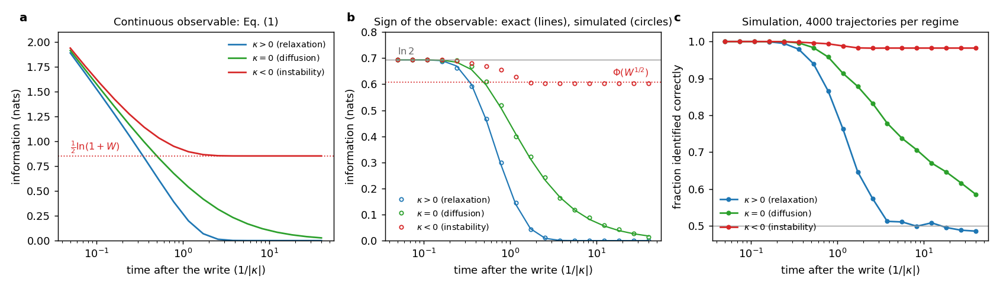
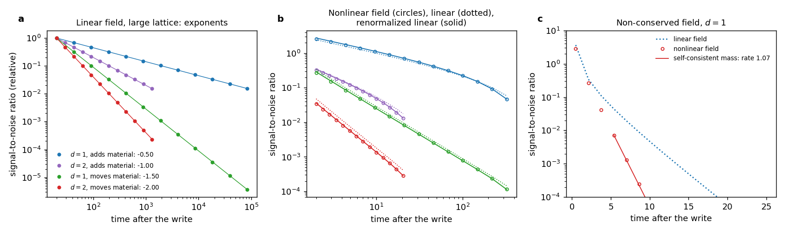

# Module 8. Time in a memory realization

**Learning objectives.** After this module you can

1. name the three roles of time in a realization and the component of the realization that supplies each;
2. obtain the information retained about a write in the three regimes of $\kappa$ from one expression;
3. predict the power law by which a conserved field loses a written profile, from conservation, dimension and
   the shape of the write;
4. test such a prediction against an exact linear calculation and a nonlinear simulation.

**Prerequisites.** Modules 1–4 and 6. **Time.** About 60 minutes.

## 1. Three roles of time

Time enters a realization $I_{\mathrm{real}} = ((\Omega,\Xi);\,C,\,R,\,P;\,A)$ in three distinct ways.

| Role | Supplied by | Consequence | Module |
| --- | --- | --- | --- |
| Order of the evolution | the closure $C$ | Information about a write can only decrease; the loss laws | 4, 8 |
| Order of the operations of a protocol | the protocol $P$ | Operations that do not commute leave a result that depends on their order | — |
| A phase coordinate | a limit cycle of $\Omega$ | Information stored in the phase is retained along a zero mode ([Law 2](18_memory_writing_and_retention.md#13-retention)) | 6 |

The direction of the first role does not come from the equations of motion. A magnetic field breaks
time-reversal symmetry, and a closed system in a magnetic field still conserves information. Information about a
write decreases because the closure discards a continuum of degrees of freedom, internal or external, and these
enter the retained variables as noise that is uncorrelated with the write. Under such a Markovian closure the
information about the write cannot increase with time. A bath with memory of its own can return information to the
retained variables for a time.

The second role concerns the order in which a protocol applies its operations. If two writes do not commute, the
final state records their order. Non-commutation is necessary for such a record but not sufficient: the order must
also be retained after the field is removed. This tutorial does not calculate it.

The third role was the subject of Module 6: an autonomous oscillator selects a phase, and the phase is a zero mode.
A sustained oscillation requires a drive.

## 2. One expression for the three regimes of $\kappa$

Near a state, the linear stage of the dynamics along one direction is $ds = -\kappa s\, dt + (2D)^{1/2} dW$. A
Gaussian write of variance $s_0^2$ leaves, at time $t$, the information

$$
I(t) = \tfrac12 \ln\!\left[1 + \frac{\kappa s_0^2/D}{e^{2\kappa t} - 1}\right] \qquad (1)
$$

| Regime | Late-time form of Eq. (1) | Law |
| --- | --- | --- |
| $\kappa > 0$ | $I \approx \tfrac12 (\kappa s_0^2/D)\, e^{-2\kappa t}$ | Law 1, relaxation |
| $\kappa = 0$ | $I = \tfrac12 \ln\bigl(1 + s_0^2/(2Dt)\bigr) \approx s_0^2/(4Dt)$ | Law 2, diffusion |
| $\kappa < 0$ | $I \to \tfrac12 \ln(1 + W)$, $W = \lvert\kappa\rvert s_0^2/D$ | no further loss |

For $\kappa < 0$ the expansion outruns the noise. Only the noise that acts during the first $1/\lvert\kappa\rvert$,
while the state is near the unstable point, competes with the write; what survives it is retained. $W$ is the same
ratio of drift to noise that sets the accuracy of a write at an instability (Module 4). If the write is binary,
$\pm s_0$, and the observable is the sign of $s$, the sign is kept with probability $\Phi(W^{1/2})$. The regime
$\kappa < 0$ therefore writes: after the first few amplification times it loses no further information. Activation over a barrier between wells (Law 3) is not a regime of
Eq. (1): it needs a landscape that is not linear, in which the state is held in a well and lost only by rare
transitions over the barrier.

<details><summary>Derivation of Eq. (1)</summary>

The solution is $s(t) = s_0 e^{-\kappa t} + \eta(t)$, where $\eta$ is Gaussian with variance
$D(1 - e^{-2\kappa t})/\kappa$ and independent of the write. For a Gaussian signal in independent Gaussian noise
the mutual information is $\tfrac12\ln(1 + \text{signal variance}/\text{noise variance})$, which gives Eq. (1). For
$\kappa < 0$ the same variance is $D(e^{2\lvert\kappa\rvert t} - 1)/\lvert\kappa\rvert$, and
$s\, e^{-\lvert\kappa\rvert t}$ tends to $s_0$ plus a Gaussian of variance $D/\lvert\kappa\rvert$. The sign is then
kept with probability $\Phi(s_0 (\lvert\kappa\rvert/D)^{1/2}) = \Phi(W^{1/2})$.

</details>

```bash
python3 -B -m fieldbridge memory regimes --n 4000 --out-dir build/regimes
```



*Information about a write with $s_0 = 0.3$ and $D = 0.02$, for $\kappa = 1, 0, -1$. (a) Eq. (1) for a continuous
observable; dotted: the limit $\tfrac12\ln(1+W)$ for $\kappa < 0$. (b) Information carried by the sign of $s$
after a binary write: exact for the linear dynamics (lines, $\kappa \geq 0$) and simulated (circles); for $\kappa
< 0$ the simulation uses the saturating pitchfork $\dot s = \lvert\kappa\rvert s - s^3$, and the dotted line is
the limit set by $\Phi(W^{1/2})$. (c) Simulated fraction of trajectories whose sign identifies the write, from
4000 trajectories per regime.*

| Quantity (key in `regimes.json`) | Value | Interpretation |
| --- | --- | --- |
| $W = \lvert\kappa\rvert s_0^2/D$ (`W`) | 4.5 | Ratio of the expansion to the noise |
| Information at $t = 40$, $\kappa = 1, 0, -1$ | $4\times10^{-35}$, 0.027, 0.852 nats | Exponential loss, $1/t$ loss, no further loss |
| Limit for $\kappa < 0$ (`plateau_gaussian`) | $\tfrac12\ln(1 + 4.5) = 0.852$ nats | Reached within a few $1/\lvert\kappa\rvert$ |
| Sign kept for $\kappa < 0$ (`binary_plateau.accuracy`) | predicted $\Phi(4.5^{1/2}) = 0.983$; simulated 0.982 | The sign is decided during the linear stage |

## 3. Fields: conservation, dimension and the shape of the write

In a field $\phi(\mathbf x, t)$ each Fourier mode $\mathbf k$ relaxes at its own rate $\kappa(k)$, and the
information about a written profile is a sum over modes. The examples use two lattice models.

| Dynamics | Free energy per site | Rates of the linear field | Loss of a written profile |
| --- | --- | --- | --- |
| conserved (Model B): $\partial_t\phi = M\nabla^2\,\delta F/\delta\phi + \text{conserved noise}$ | $\tfrac12\phi^2 + \tfrac14 g\phi^4$ | $\kappa(k) = M k^2 \to 0$ as $k \to 0$ | a power law, $\mathrm{SNR} \propto t^{-(d+2n)/z}$ with $z = 2$ |
| non-conserved (Model A): $\partial_t\phi = -M\,\delta F/\delta\phi + \text{noise}$ | $\tfrac12\kappa_0\phi^2 + \tfrac12 D_\nabla(\nabla\phi)^2 + \tfrac14 g\phi^4$ | $\kappa(k) = M(\kappa_0 + D_\nabla k^2) \geq M\kappa_0$ | exponential; the signal-to-noise ratio falls at least at the rate $2M\kappa_0$ |

These are the laws of Section 2, mode by mode: every mode with $\kappa(k) > 0$ relaxes by Law 1, and the density
of slow modes near $k = 0$ decides the form of the total loss. The exponent follows from the modes near $k = 0$. A
write whose spectral weight near $k = 0$ grows as $k^{2n}$
gives $\mathrm{SNR} \propto \int d^dk\, k^{2n} e^{-2Mk^2 t} \propto t^{-(d+2n)/2}$. A write that adds material to
one site has $n = 0$. A write that moves material between two neighbouring sites leaves the total unchanged and
has $n = 1$. In a finite conserved system the total itself never relaxes, so a write that adds material is
retained in the total for ever. The information it carries, $\tfrac12\ln(1 + A^2/(N\langle\phi^2\rangle))$ for a
write of amplitude $A$ on $N$ sites, is set by the fluctuations of the total between independently prepared
samples.

```bash
python3 -B -m fieldbridge memory field examples/memory/fields/conserved_1d_charge.json --out-dir build/field_1d_charge
python3 -B -m fieldbridge memory field examples/memory/fields/conserved_1d_dipole.json --out-dir build/field_1d_dipole
python3 -B -m fieldbridge memory field examples/memory/fields/conserved_2d_charge.json --out-dir build/field_2d_charge
python3 -B -m fieldbridge memory field examples/memory/fields/conserved_2d_dipole.json --out-dir build/field_2d_dipole
python3 -B -m fieldbridge memory field examples/memory/fields/nonconserved_1d.json --out-dir build/field_nonconserved
```

Each command reports three results for the same model: the predicted law; the exact linear field, computed mode by
mode on a large lattice to obtain the exponent; and a stochastic simulation of the nonlinear field on the lattice
of the specification ($L = 128$ in $d = 1$, $32 \times 32$ in $d = 2$; $M = 1$, $T = 0.5$, $g = 0.3$, write
amplitude $A = 3$; for the non-conserved field $\kappa_0 = 0.2$ and $D_\nabla = 1$).



*(a) Exact linear field on a large lattice: signal-to-noise ratio of the written profile relative to its value at
$t = 20$ (points) and the predicted power laws (lines). (b) Nonlinear conserved field (circles) against the bare
linear prediction (dotted) and the linear prediction with noise and clock renormalized by the site variance
(solid). (c) Non-conserved field in $d = 1$: linear field (dotted) and nonlinear simulation (circles), with the
decay at the rate given by the self-consistent mass (line).*

| Field (`field.json`) | Predicted | Exact linear field | Nonlinear field |
| --- | --- | --- | --- |
| conserved, $d = 1$, adds material | $t^{-1/2}$ | exponent $-0.500$ | rms log residual 0.008 (bare linear curve: 0.10) |
| conserved, $d = 1$, moves material | $t^{-3/2}$ | exponent $-1.500$ | 0.011 (bare: 0.14) |
| conserved, $d = 2$, adds material | $t^{-1}$ | exponent $-1.001$ | 0.013 (bare: 0.21) |
| conserved, $d = 2$, moves material | $t^{-2}$ | exponent $-2.001$ | 0.012 (bare: 0.32) |
| non-conserved, $d = 1$ | exponential, rate $\geq 0.4$ | rate 0.477 over $t = 5.4$–11.9 | rate 1.01; the self-consistent mass gives 1.07 |

The exponents of the linear field (`exponent_check.exponent`) are computed on lattices of 4096 sites in $d = 1$
and $512 \times 512$ in $d = 2$, which approximate the infinite system over the times shown.

Two results need interpretation. First, the nonlinear conserved field follows the linear law once the noise and
the clock are rescaled by $r = T/\langle\phi^2\rangle = 1.31$, where $\langle\phi^2\rangle$ is the equilibrium site
variance: $\mathrm{SNR}(t) = r\,\mathrm{SNR}_{\mathrm{lin}}(r t)$. The quartic term lowers the static
susceptibility $\langle\phi^2\rangle/T$, which speeds collective diffusion by the factor $r$ and reduces the
equilibrium noise against which the write is measured. No parameter is fitted. The residuals fall from
10–32% for the bare linear curve to about 1% (`renormalized.rms_log_residual`, for $t \geq 10$). Second, the
non-conserved nonlinear field loses the write faster than the linear one. The quartic term adds $3g\langle\phi^2\rangle$
to $\kappa_0$, so the self-consistent mass is $m^2 = 0.5$ and the late-time rate approaches $2m^2 = 1.0$. The
linear rate over the same window, 0.477, exceeds the bound 0.4 because a local write also excites faster modes,
and the gapped field decays as $t^{-d/2}e^{-2\kappa_0 t}$.

## 4. Scope

The exponent $-(d+2n)/z$ assumes diffusive relaxation, $z = 2$. At a critical point the relaxation slows down and
$z$ changes (for Model B, $z = 4 - \eta$); coupling to another conserved quantity, for example momentum in a
fluid, also changes $z$. Below a symmetry-breaking transition, a field with a discrete symmetry forms domains that
are retained by activation (Law 3), while a continuous symmetry leaves zero modes (Law 2). The derivations above
assume a bath without memory. A bath with memory is described by additional variables of the realization, which give
the observed variables a memory kernel, or by a field for the bath.

## 5. Exercises

1. Show from Eq. (1) that for $\kappa = 0$ the information decreases as $1/t$ at late times.
2. A conserved density in $d = 3$ is written by moving material between two neighbouring sites. Predict the
   exponent of the signal-to-noise ratio.
3. Why does the total of a finite conserved system retain a write that adds material, but not one that moves
   material?
4. In Section 3 the non-conserved nonlinear field loses the write at rate 1.01, twice as fast as the linear field.
   Would a larger temperature increase or decrease this rate?

<details><summary>Answers</summary>

1. For $s_0^2 \ll 2Dt$, $\tfrac12\ln(1 + s_0^2/(2Dt)) \approx s_0^2/(4Dt)$.
2. $n = 1$, $d = 3$, $z = 2$: $\mathrm{SNR} \propto t^{-5/2}$.
3. The total is exactly conserved, so a change of the total cannot relax. Moving material between sites leaves the
   total unchanged, and the written dipole spreads and is lost as $t^{-(d+2)/2}$.
4. Increase it: the site variance $\langle\phi^2\rangle$ grows with $T$, which raises the self-consistent mass
   $m^2 = \kappa_0 + 3g\langle\phi^2\rangle$ and with it the rate $2m^2$.

</details>

## Summary

- Time has three roles in a realization: the order of the evolution (from the closure), the order of the
  operations of a protocol, and the phase of a limit cycle.
- One expression, Eq. (1), gives exponential loss for $\kappa > 0$, $1/t$ loss for $\kappa = 0$, and a limit
  $\tfrac12\ln(1+W)$ for $\kappa < 0$.
- A conserved field loses a written profile as $t^{-(d+2n)/2}$; the exponents were confirmed to $\pm 0.001$, and the
  nonlinear field follows the renormalized linear law without a fitted parameter.
- Without conservation the loss is exponential, and a quartic term only makes it faster.

## Reference

| Result | Function | Test |
| --- | --- | --- |
| Eq. (1) and the binary limit | [`regimes.gaussian_information`](../../fieldbridge/memory/regimes.py), `binary_plateau`, `simulate` | `test_one_formula_covers_the_three_regimes_of_kappa`, `test_an_expanding_direction_freezes_the_write`, `test_regimes_command_writes_a_report` |
| Predicted laws | [`fields.predicted_law`](../../fieldbridge/memory/fields.py) | `test_conservation_and_dimension_set_the_power_law` |
| Exact linear field | `fields.spectral_snr`, `exponent_check` | `test_conservation_and_dimension_set_the_power_law` |
| Total of a finite system | `fields.run` | `test_the_finite_total_keeps_a_charge_write` |
| Nonlinear field and renormalization | `fields.simulate`, `renormalized_snr` | `test_a_nonlinear_conserved_field_follows_the_renormalized_linear_law` |
| Non-conserved field | `fields.hartree_mass` | `test_without_conservation_the_loss_is_exponential_and_the_quartic_term_only_speeds_it` |

[Previous: Module 7](21_memory_new_material.md) · [Next: Module 9, one mechanism from different fields](23_memory_codiscovery.md) · [Tutorial index](index.md) · [Glossary](memory_glossary.md)
