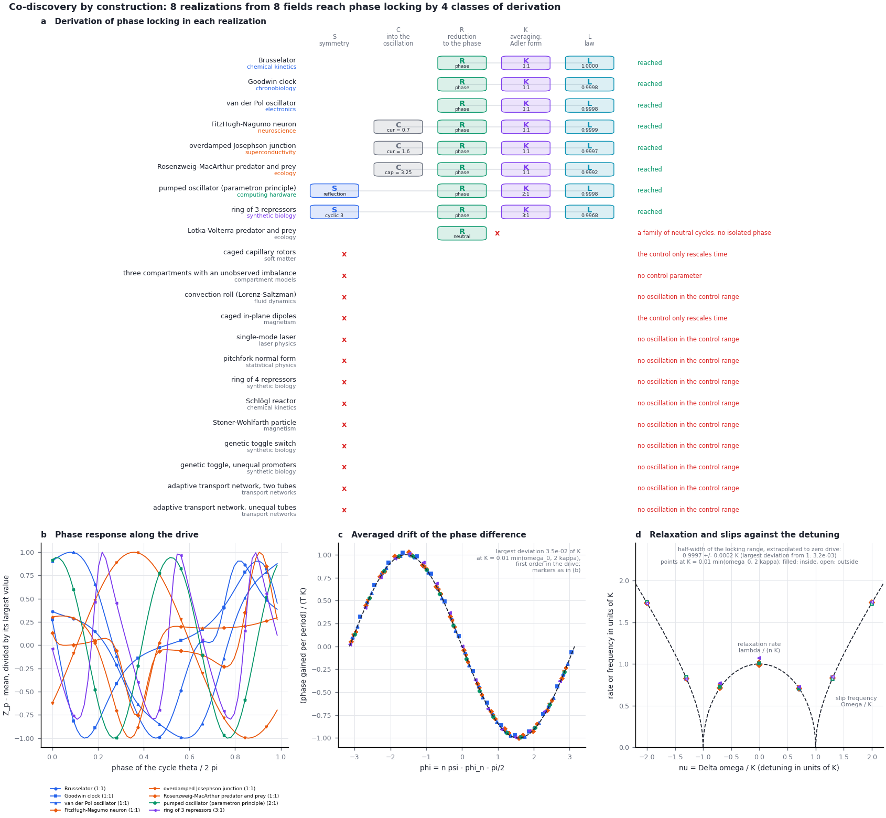

# Module 9. One mechanism derived in models from different fields

**Learning objectives.** After this module you can

1. describe the derivation of a mechanism as a chain of transformations, each acting on named components of a
   realization;
2. run `memory codiscover` and read the derivations of three targets, a symmetric write, a threshold write and
   phase locking, in models from up to eight fields;
3. identify the step at which a model fails to reach the mechanism, and the property of the model responsible;
4. test whether two derivations end on the same mechanism with two invariants that do not depend on the field;
5. explain why a threshold write is reached in more models than a symmetric write, and how a symmetry sets the
   ratio at which an oscillator locks to a drive.

**Prerequisites.** Modules 1–6. **Time.** About 90 minutes.

## 1. Convergent derivations

The same mechanism is often derived independently in different fields. A standard example is the threshold of a
laser and a second-order phase transition. Both reduce to one equation for an order parameter,
$\dot s = \varepsilon s - s^3 + h$ (Graham and Haken, 1970; DeGiorgio and Scully, 1970), but the two derivations
have little in common. In the laser, the population inversion is eliminated and the field amplitude remains. In
Landau theory, the equation is the lowest-order expansion of a free energy that is even in the order parameter.
Such convergence is not directed: neither derivation was aimed at the other.

> **Note.** How often such convergence occurs was measured outside FieldBridge. An analysis of derivation chains
> extracted from arXiv papers with the V2.1 language compared pairs of chains from different fields that end on the
> same class of mechanism. In 98.6% of these pairs the derivations differ, and their number equals the number
> obtained when the field labels are permuted among papers of the same year: which derivation reaches a class does
> not depend on the field label. The permutation does not test whether the end points are one mechanism; that is
> established by the normal form and its field-independent invariants, as in this module.

The constructor makes the convergence deliberate; the command is `memory codiscover` (co-discovery by
construction). It fixes a target mechanism and derives it in every model with transformations that it can verify.
For each model it records the derivation, names the step at which the derivation stops if it does, and tests two
invariants of the end point that do not depend on the field. This module uses three targets: the symmetric write
of Module 4 (Sections 3–6), the threshold write, a fold (Section 7), and phase locking of an oscillator to a periodic
drive (Section 8).

## 2. The transformations

A derivation is a word in seven letters. Each letter acts on named components of the realization
$I_{\mathrm{real}} = ((\Omega,\Xi);\,C,\,R,\,P;\,A)$. The table describes the letters for the symmetric write; W
and the forms of K and L for the threshold write are given in Section 7.

| Letter | Transformation | Acts on | What is computed | The derivation stops if |
| --- | --- | --- | --- | --- |
| S | symmetry | $\Xi$, $\Omega$ | a permutation with signs $g$ that leaves the drift unchanged, $F(gq) = gF(q)$, and reverses the critical mode, $gv = -v$; it forbids even terms along $v$ | (not required; without S the target can still be reached through U) |
| C | continuation | $A$ | the value of the control at which the relaxation rate $\kappa$ of a stable state reaches zero | there is no control, or the control only rescales the drift |
| R | reduction | $\Xi$, $\Omega$ | the drift on the slow manifold along $v$, $a_0 + a_1 s + a_2 s^2 + a_3 s^3$; the other directions are eliminated | a complex pair crosses (Hopf), or $a_3 > 0$ (subcritical) |
| U | unfolding | $A$, $P$ | a second material parameter is set to the cusp, where $a_2 = 0$; the protocol sweeps through the cusp without a bias; R is applied again | no material parameter reaches a cusp with $a_3 < 0$ |
| W | write field | $P$ | a bounded field toward another stored state is raised until the occupied state disappears (used for the threshold write) | the field leaves the occupied state an equilibrium, or there is no second state |
| K | canonical form | $\Xi$ | the coordinate is rescaled, $x = \lvert a_3\rvert^{1/2} s$, so that $\dot x = \varepsilon x - x^3 + h$ | — |
| L | write law | $P$, $R$ | a swept write of the full model is simulated, and the constant of the write law is estimated | — |

The class of a derivation keeps the letters, the kind of symmetry and the kind of the first reduction, and drops
the names of the variables. Two models from different fields that reach the target by the same kind of step have
the same class.

## 3. Running the constructor

```bash
python3 -B -m fieldbridge memory codiscover --trajectories 2000 --out-dir build/tut/m9_codiscover
```

Without arguments the command reads every specification in `examples/memory`; given files, it reads only those.
It writes `codiscover.json`, `codiscover.md` and `codiscover.png` and takes about 45 s on a laptop. With
`--no-law` it omits the simulation and takes about 20 s.

| Realization | Field | Derivation | Result | Write point | Law constant |
| --- | --- | --- | --- | --- | --- |
| single-mode laser | laser physics | SCRKL | reached | $P = 1$ | 1.371 ± 0.051 |
| pitchfork normal form | statistical physics | SCRKL | reached | $\varepsilon = 0$ | 1.265 ± 0.050 |
| ring of 4 repressors | synthetic biology | SCRKL | reached | $\alpha = 1.013$ | 1.329 ± 0.051 |
| genetic toggle switch | synthetic biology | SCRKL | reached | $\alpha = 2$ | 1.389 ± 0.051 |
| Schlögl reactor | chemical kinetics | CRURKL | reached after unfolding | cusp $a = 4.153$, $b = 2.654$ | 1.343 ± 0.051 |
| toggle, unequal promoters | synthetic biology | CRURKL | reached after unfolding | cusp $\gamma = 1.000$, $\alpha = 2.000$ | 1.383 ± 0.051 |
| ring of 3 repressors | synthetic biology | CR | stops at R: Hopf | — | — |
| two equal tubes | transport networks | SCR | stops at R: subcritical | — | — |
| two unequal tubes | transport networks | CR | stops at U: no supercritical cusp | — | — |
| caged capillary rotors | soft matter | — | stops at C: the control rescales the drift | — | — |
| caged in-plane dipoles | magnetism | — | stops at C: the control rescales the drift | — | — |
| three compartments | compartment models | — | stops at C: no control | — | — |

Six models from four fields reach the target by four classes of derivation. `codiscover.md` also lists every
derivation with its steps, for example for the laser

```text
S[reflection amp -> -amp] > C[P] > R[supercritical pitchfork; 1 direction eliminated] > K > L
```


*Figure 1. The symmetric write. (a) The derivation in each model: letters on the slots of a common chain. A thin line joins the steps
of one derivation; a red cross marks the step at which it stops, with the reason on the right. (b) The reduced
drift at the write point in the canonical coordinate, for the six models that reach the target, against $-x^3$.
(c) The constant of the swept-write law estimated from the simulation of each model, against $\pi^{1/4}$; the grey
band is the weighted mean ± one standard error.*

## 4. Four classes of derivation

**By a reflection: the laser and Landau theory.** The laser model has a field amplitude $E$ (`amp`) and an
inversion $N$ (`inv`):

```math
\dot E = \tfrac12 (gN - \kappa)\,E, \qquad \dot N = P - \gamma N - g N E^2 . \tag{1}
```

The reflection $E \to -E$ leaves Eq. (1) unchanged; it exchanges the two optical phases $0$ and $\pi$. The field
becomes unstable at the pump $P = \gamma\kappa/g$, which is 1 in the example. The inversion relaxes and is
eliminated, $N = P/(\gamma + gE^2)$, so that

```math
\dot E = \tfrac12\Bigl(\frac{gP}{\gamma} - \kappa\Bigr) E - \frac{g^2 P}{2\gamma^2}\, E^3 + O(E^5). \tag{2}
```

At threshold the cubic coefficient is $a_3 = -g\kappa/(2\gamma) = -0.5$; the constructor finds $-0.499$. The
pitchfork normal form has the same class: the class is fixed by the kind of symmetry, not by the field.

**By an exchange: the toggle switch.** Exchanging the two repressors, $u \leftrightarrow v$, leaves the equations
of Module 1 unchanged and reverses the antisymmetric mode $(1, -1)$. With $n = 2$ the symmetric state $u = v = 1$
loses stability along this mode at $\alpha = 2$, and the symmetric combination $u + v$ is eliminated.

**By a cyclic permutation: the ring of four repressors.** Shifting every gene by one position leaves the ring
unchanged and maps the alternating mode $(1, -1, 1, -1)$ to its negative. Around the ring the Jacobian is
$-1 + c\,\omega$ with $\omega^4 = 1$ and $c < 0$; the alternating mode, $\omega = -1$, becomes unstable when
$\lvert c\rvert = 1$. For $n = 4$ this gives $u^4 = 1/3$ and $\alpha = \tfrac43\, 3^{-1/4} = 1.0131$. Three
directions are eliminated.

**By unfolding: the Schlögl reactor and the toggle with unequal promoters.** Neither model has a symmetry, and
the write along the control is a fold. The unfolding sets a second parameter to the cusp. For the Schlögl drift
$-x^3 + ax^2 - k_3 x + b$ the cusp is a triple root, $a = 3x_0$ and $b = x_0^3$ with $x_0 = (k_3/3)^{1/2}$; for
$k_3 = 5.75$ this is $a = 4.153$ and $b = 2.654$, the values found by the constructor. For the toggle with unequal
promoters the cusp lies at $\gamma = 1.000$: the unfolding recovers equal promoters. There the symmetry is a
result of the derivation, not an assumption.

## 5. Where a derivation stops

A derivation that stops is a result: it names the property of the model that differs from the target.

| Model | Stops at | Reason |
| --- | --- | --- |
| ring of 3 repressors | R | A complex pair crosses (Hopf). A cyclic symmetry of order 3 cannot reverse a real mode: if $gv = -v$, then $v = g^3 v = -v$. The model stores a phase instead (Module 6). |
| two equal tubes | R | The exchange symmetry forces a pitchfork, but not the sign of its cubic term. Here $a_3 > 0$, and the written state jumps to a distant branch. |
| two unequal tubes | U | The write is a fold, and its cusp, at equal lengths, is the subcritical pitchfork of the equal tubes. |
| capillary rotors, dipoles | C | The control multiplies the whole drift. It changes the depth of the landscape and not its shape, so a state is written by a field (Module 4). |
| three compartments | C | There is no control parameter. |

## 6. Two invariants of the end point

**The canonical form.** In the coordinate $x$ the reduced drift at the write point is $\sum_n c_n x^n$. The cubic
coefficient $c_3 = -1$ by the choice of units, so the check lies in the other coefficients. In every model that
reaches the target, the even part is below $7 \times 10^{-10}$ of the cubic term at the edge of the fitted window,
and $c_3 < 0$. The fifth-order coefficient differs between the models: $c_5 = 1.8$ for the laser (2 from Eq. (2);
the remainder comes from seventh-order terms within the window), 1.26 for the toggle, 0.76 for the ring and 0 for
the Schlögl reactor and Landau theory. It sets how far from the write point the models remain equivalent. It does
not enter the write law, because the choice is made in the linear stage.

**The constant of the write law.** For each model the constructor simulates the swept write of the full model
(Module 4). The control is swept through the write point so that $\varepsilon$ grows at the rate $r$, the noise
is set by $\Gamma = D_s\lvert a_3\rvert/r = 0.05$, and a bias $h_s$ is chosen for which the law predicts an
accuracy of 0.8. The measured accuracy $P$ gives the constant

```math
\pi^{1/4} \approx \frac{\Phi^{-1}(P)\, D_s^{1/2}\, r^{1/4}}{h_s} . \tag{3}
```

With 2000 trajectories per model, the six estimates have a weighted mean of $1.346 \pm 0.021$, against
$\pi^{1/4} = 1.331$, with $\chi^2 = 4.7$ for 6 values. The constant depends only on the canonical form. A
derivation that ended on another mechanism, such as a fold, would give an accuracy that does not follow Eq. (3).

## 7. A second target: the threshold write

The second target is the fold,

```math
\dot s = \mu + s^2 , \tag{4}
```

at which the occupied state meets an unstable state and disappears, and the material switches to another stored
state. A threshold write needs no symmetry, and a symmetry is its obstruction: a symmetry that reverses the critical
mode forbids the quadratic term. The constructor therefore first follows the control (C, R). If the write point
along the control is a pitchfork or a Hopf bifurcation, or if the control only rescales the drift, it applies a
bounded field toward another stored state (W, acting on the protocol $P$) and raises it until the occupied state
disappears; this value is the coercive field. In the coordinate $x = a_2 s$, with $\mu = a_2 b\,(p - p_f)$ and $b$
the push of the parameter $p$ along the critical mode, the reduced drift is $\mu + x^2$ (K).

```bash
python3 -B -m fieldbridge memory codiscover --target threshold-write --out-dir build/tut/m9_threshold
```

The command takes about one minute.

| Realization | Field | Derivation | Threshold | $c_3$ | Delay constant |
| --- | --- | --- | --- | --- | --- |
| Schlögl reactor | chemical kinetics | CRKL | $b = 1.4901$ | −0.333 | 1.018793 |
| toggle, unequal promoters | synthetic biology | CRKL | $\alpha = 3.2731$ | −0.006 | 1.01880 ± 0.00012 |
| two unequal tubes | transport networks | CRKL | $\mu = 1.2128$ | −0.535 | 1.01874 ± 0.00018 |
| single-mode laser | laser physics | SCRWRKL | $h = 0.05877$ | 0.889 | 1.01879 ± 0.00005 |
| pitchfork normal form | statistical physics | SCRWRKL | $h = 0.3849$ | −0.333 | 1.018793 |
| genetic toggle switch | synthetic biology | SCRWRKL | $h = 0.2134$ | 0.437 | 1.01879 ± 0.00003 |
| ring of 4 repressors | synthetic biology | SCRWRKL | $h = 1.5988$ | 2.975 | 1.01880 ± 0.00006 |
| two equal tubes | transport networks | SCRWRKL | $h = 0.06396$ | 0.163 | 1.01879 ± 0.00002 |
| caged capillary rotors | soft matter | WRKL | $h = 1.6335$ | 0.037 | 1.018793 |
| caged in-plane dipoles | magnetism | WRKL | $h = 0.06189$ | 0.016 | 1.01879 ± 0.00003 |
| ring of 3 repressors | synthetic biology | CR | stops: no stable state | — | — |
| three compartments | compartment models | — | stops: a single stable state | — | — |

Ten models from seven fields reach the target by three classes of derivation: by the control, C R(fold) K L; by a
field after a symmetric write point, S C R(pitchfork) W R(fold) K L; and by a field where the control only rescales
the drift, W R(fold) K L. In the second class the symmetry that forces a pitchfork along the control also forbids a
threshold there. A field toward one of the two states breaks the symmetry, and the occupied state disappears at the
coercive field; for the Landau model, $\dot x = x - x^3 - h$, this is $h_c = 2/(3\sqrt3) = 0.3849$. The cubic
coefficient $c_3$ of the canonical form, the leading correction to Eq. (4), differs between the models.


*Figure 2. The threshold write. (a) The derivation in each model; W is the write field. (b) The reduced drift at the
fold in the canonical coordinate, against $x^2$. (c) The value of $\mu$ at which the state crosses the position of
the static fold, divided by $r^{2/3}$, against $r^{1/3}$ for sweeps at canonical rates $r = 10^{-3}$ to $10^{-7}$;
the lines are quadratic fits to the five slowest sweeps, and the star marks $\lvert a_1'\rvert = 1.01879$.*

Two results deserve a remark. First, with $a = 4.5$ and $k_3 = 5.75$ the Schlögl drift in $y = x - 3/2$ is
$-y^3 + y + (b - 15/8)$: the reactor is the Landau model in the field $h = 15/8 - b$. The constructor gives the same
threshold, the same $c_3 = -1/3$ and the same delay at every rate for both, so this co-discovery is exact. Second, for
two of the six pairs of stored states of the capillary rotors, the field toward one state exerts no torque on the
other: each rotor is aligned with the target orientation or at 90° to it, and a rotor of period $\pi$ feels no torque
there. The
occupied state then remains an equilibrium at every field strength and is lost by an exchange of stability, not by
a fold. The constructor tries pairs of states in the order of the force that the field exerts on the occupied state.

**The delay law.** Under a sweep $\mu = rt$, Eq. (4) in the canonical coordinate is the Riccati equation
$\dot x = rt + x^2$. The occupied state does not leave at $\mu = 0$ but later:

```math
x = r^{1/3}\,\frac{\mathrm{Ai}'(-\tau)}{\mathrm{Ai}(-\tau)}, \qquad \tau = r^{1/3} t , \tag{5}
```

so the state crosses the position of the static fold, $x = 0$, at $\mu = \lvert a_1'\rvert\, r^{2/3}$, where
$a_1' = -1.01879$ is the first zero of $\mathrm{Ai}'$. The switch lags behind the static threshold by an amount
proportional to $r^{2/3}$; this is the scaling of dynamic hysteresis measured in a bistable semiconductor laser (Jung,
Gray, Roy and Mandel, 1990). The terms of the full drift beyond $\mu + x^2$ add corrections in powers of $r^{1/3}$.

<details><summary>Derivation of Eq. (5)</summary>

With $x = -\dot u/u$ the Riccati equation becomes $\ddot u + rt\,u = 0$, and with $\tau = r^{1/3}t$ the Airy
equation $u'' + \tau u = 0$. The solution that follows the occupied state, $x \to -(-\mu)^{1/2}$ as
$t \to -\infty$, is $u = \mathrm{Ai}(-\tau)$, since $\mathrm{Ai}'(z)/\mathrm{Ai}(z) \to -z^{1/2}$ for large $z$. It
gives Eq. (5). The state runs away where $\mathrm{Ai}(-\tau) = 0$, at $\mu = 2.33811\, r^{2/3}$ (Haberman, 1979).

</details>

The constructor sweeps each full model without noise, records when the state crosses $s = 0$, and extrapolates
$\mu/r^{2/3}$ to $r = 0$ (Figure 2c). In all ten models the extrapolated constant lies within $6 \times 10^{-5}$ of
$\lvert a_1'\rvert$, and the weighted mean is $1.01879 \pm 0.00001$. The slopes of the corrections differ, from
$-0.45$ for the laser to $+0.40$ for the ring of four, as the fifth-order coefficients did for the symmetric write.
For the unequal tubes the linear and quadratic corrections have opposite signs: sweeps faster than
$r = 2 \times 10^{-4}$ lie above the limit and slower ones up to 0.3% below it. A fit to sweeps between $10^{-2}$ and
$10^{-5}$ extrapolates to 1.0153; the slower sweeps give 1.01874.

The law holds in the limit of small noise. In the variables of Eq. (5) the noise intensity is $a_2^2 D_s/r$, so the
deterministic delay is observed for sweeps faster than the rate $a_2^2 D_s$ given in the report; slower sweeps
switch earlier, by activation over the vanishing barrier. At the noise of the specifications this rate is
$2 \times 10^{-3}$ for the laser and 800 for the capillary rotors, whose switch is therefore always activated.

**The two targets compared.**

| Model | Field | Symmetric write | Threshold write |
| --- | --- | --- | --- |
| single-mode laser | laser physics | S C R K L | S C R W R K L |
| pitchfork normal form | statistical physics | S C R K L | S C R W R K L |
| genetic toggle switch | synthetic biology | S C R K L | S C R W R K L |
| ring of 4 repressors | synthetic biology | S C R K L | S C R W R K L |
| Schlögl reactor | chemical kinetics | C R U R K L | C R K L |
| toggle, unequal promoters | synthetic biology | C R U R K L | C R K L |
| two equal tubes | transport networks | stops at R (subcritical) | S C R W R K L |
| two unequal tubes | transport networks | stops at U | C R K L |
| capillary rotors, dipoles | soft matter, magnetism | stop at C | W R K L |
| ring of 3 repressors | synthetic biology | stops at R (Hopf) | stops: no stable state |
| three compartments | compartment models | stops at C | stops: a single stable state |

The two targets are complementary. A symmetry makes the symmetric write possible and the threshold write impossible
along the same parameter; a field that breaks the symmetry restores the threshold. Without a symmetry the write
along the control is a fold, and the symmetric write needs a second parameter tuned to the cusp, where two folds
merge into a pitchfork. A fold is the generic way for a state to disappear, whereas a pitchfork requires a symmetry
or a tuned parameter; the threshold write is therefore reached in ten models and the symmetric write in six.

## 8. A third target: phase locking

Module 6 showed that a limit cycle stores a phase. Time-translation symmetry makes the phase a flat direction: a
pulse shifts it, the shift persists, and noise spreads it by diffusion. The third target gives this flat direction
a restoring force. A weak periodic modulation of the control, $p(t) = p_1 + \varepsilon\cos\omega_f t$, acts on the
phase $\theta$ through the phase response along the drive, $Z_p(\theta) = Z(\theta)\cdot\partial F/\partial p$. Here
$Z$ is the gradient of the phase on the cycle: the periodic solution of the adjoint equation
$\dot Z = -J^{\mathsf T} Z$, normalized by $Z\cdot F = \omega_0$. Averaged over the drive, only the harmonic of $Z_p$
that matches the ratio $\omega_f \approx n\,\omega_0$ survives, and the phase difference $\psi = \theta - \omega_f t/n$
obeys the Adler equation (Adler, 1946)

```math
\dot\psi = \Delta\omega - K \sin\phi, \qquad \phi = n\psi - \phi_n - \tfrac{\pi}{2}, \qquad
K = \tfrac12\,\varepsilon\,\lvert Z_n\rvert, \qquad \Delta\omega = \omega_0 - \omega_f/n , \tag{6}
```

where $Z_n = a_n - i b_n$ is the $n$-th Fourier coefficient of $Z_p$ and $\phi_n = \operatorname{atan2}(b_n, a_n)$. In
the units $\tau = nKt$ and $\nu = \Delta\omega/K$ it reads $d\phi/d\tau = \nu - \sin\phi$. For $\lvert\nu\rvert < 1$
the phase difference relaxes to one of $n$ values, $2\pi/n$ apart, at the rate $\lambda = nK(1-\nu^2)^{1/2}$: the
drive writes the phase and restores it after a perturbation. For $\lvert\nu\rvert > 1$ the phase slips at the
frequency $\Omega = K(\nu^2-1)^{1/2}$. The letters act on the same components as before, with these meanings:

| Letter | Acts on | What is computed | The derivation stops if |
| --- | --- | --- | --- |
| S | $\Xi$, $\Omega$ | a symmetry of the drift that holds for every value of the control maps the cycle onto itself $1/m$ of a period later; then $Z_p(\theta + 2\pi/m) = Z_p(\theta)$, and the drive acts only through the harmonics $m, 2m, \dots$ | (not required) |
| C | $A$ | the control is moved into the range where the model oscillates: the middle of the widest interval of oscillating values on a grid of 11 | no value oscillates, or the control multiplies the whole drift |
| R | $\Xi$, $\Omega$ | the state is reduced to the phase; $Z$ follows from the adjoint equation, and the Floquet multipliers of the cycle are checked | a transverse multiplier equals 1 (a family of neutral cycles) |
| K | $\Xi$ | averaging over the drive gives Eq. (6), with $n$ the smallest harmonic present; the phase gained over one period in the driven model is compared with $TK\cos(n\psi - \phi_n)$ | no harmonic up to 8 |
| L | $P$, $R$ | relaxation rates inside the locking range and slip frequencies outside it, simulated at $\nu = 0, \pm 0.7, \pm 1.3, \pm 2$ and two drive amplitudes; the half-width of the locking range in units of $K$ is extrapolated to zero amplitude | — |

The drive is weak against both the frequency and the attraction of the cycle: $K = 0.02$ and $0.01$ times
$\min(\omega_0, 2\kappa)$, where $\kappa$ is the relaxation rate of the amplitude, the slowest transverse Floquet
exponent.

```bash
python3 -B -m fieldbridge memory codiscover --target phase-locking --out-dir build/tut/m9_phase
```

Without arguments the command reads `examples/memory/oscillators` and `examples/memory`. The first directory holds
eight oscillators from seven fields; the second adds the ring of three repressors and the models of the write
targets. The command takes about 15 minutes on a laptop, or 2 minutes with `--no-law`.

| Realization | Field | Derivation | Operating point | Ratio | $K/\varepsilon$ | Half-width in units of $K$ |
| --- | --- | --- | --- | --- | --- | --- |
| van der Pol oscillator | electronics | RKL | bias $= 0$ | 1:1 | 0.2674 | 0.9998 ± 0.0015 |
| Brusselator | chemical kinetics | RKL | $b = 3$ | 1:1 | 0.5120 | 1.0000 ± 0.0025 |
| Goodwin clock | chronobiology | RKL | $\mathrm{tr} = 10$ | 1:1 | 0.1579 | 0.9996 ± 0.0043 |
| FitzHugh–Nagumo neuron | neuroscience | CRKL | current $= 0.7$ | 1:1 | 0.2128 | 0.9999 ± 0.0032 |
| Rosenzweig–MacArthur predator and prey | ecology | CRKL | capacity $= 3.25$ | 1:1 | 0.0591 | 0.9992 ± 0.0073 |
| overdamped Josephson junction | superconductivity | CRKL | current $= 1.6$ | 1:1 | 0.4003 | 1.0008 ± 0.0009 |
| pumped oscillator (parametron principle) | computing hardware | SRKL | $k = 1$ | 2:1 | 0.2542 | 0.9998 ± 0.0015 |
| ring of 3 repressors | synthetic biology | SRKL | $\alpha = 10$ | 3:1 | 0.0165 | 0.997 ± 0.019 |
| Lotka–Volterra predator and prey | ecology | R | stops at R: a family of neutral cycles | — | — | — |
| capillary rotors, dipoles | soft matter, magnetism | — | stop: the control only rescales time | — | — | — |
| three compartments | compartment models | — | stops: no control | — | — | — |
| models of the write targets | five fields | — | stop at C: no oscillation in the control range | — | — | — |

Eight models from eight fields reach the target by four classes of derivation. Three oscillate as specified (R K L).
Three must first be moved into oscillation (C R K L). The FitzHugh–Nagumo neuron is excitable without current and
fires periodically for currents between about 0.33 and 1.42; the constructor takes 0.7, the middle of the
oscillating grid values. The Rosenzweig–MacArthur equilibrium loses stability when the carrying capacity exceeds
$1 + 2x^*$, where $x^* = 2/3$ is the prey density at equilibrium (enrichment destabilizes the equilibrium; Rosenzweig,
1971). The junction carries no voltage below its critical current and rotates above it. Two models reach the target
through a symmetry and lock at a higher ratio (S R K L).



*Figure 3. Phase locking. (a) The derivation in each model; C moves the control into the oscillation, and S sets the
ratio. (b) The phase response along the drive, different in every model. (c) The phase gained per period in the
driven model, in units of $TK$, against $-\sin\phi$. (d) The relaxation rate inside the locking range (filled) and
the slip frequency outside it (open), in units of $K$, against the circle $(1-\nu^2)^{1/2}$ and the hyperbola
$(\nu^2-1)^{1/2}$.*

**A symmetry sets the ratio.** The van der Pol oscillator and the pumped oscillator have the same reflection,
$(x, y) \to (-x, -y)$, which maps the cycle onto itself half a period later, so that $Z(\theta+\pi) = -Z(\theta)$. A
drive that reverses under the reflection, such as the bias of the van der Pol oscillator, has
$Z_p(\theta+\pi) = -Z_p(\theta)$. Its phase response contains only odd harmonics: the constructor finds
$\lvert Z_2\rvert/\lvert Z_1\rvert < 10^{-6}$ and $\lvert Z_3\rvert/\lvert Z_1\rvert = 0.12$, and the oscillator
locks at 1:1. A drive that the reflection leaves unchanged, such as the stiffness $k$ of the pumped oscillator, has
$Z_p(\theta+\pi) = Z_p(\theta)$ and only even harmonics. A modulation at the free frequency then does not act at
first order, and a modulation at twice the frequency locks the oscillator with two phases half a cycle apart. The
drive holds either phase, and the history decides which one is occupied. This is the storage principle of the
parametron, in which a binary digit is the phase of an oscillator pumped at twice its frequency (von Neumann, 1957;
Goto, 1959). The ring of three repressors has the cyclic symmetry of Module 3, which maps its cycle onto itself a
third of a period later. The common promoter strength $\alpha$ respects this symmetry, so $Z_\alpha$ contains only
the harmonics 3, 6, …, and the ring locks at 3:1 with three phases. The symmetry that forbids a pitchfork in the ring
of three (Section 5) thus fixes its locking ratio.

**The junction.** For the overdamped junction, $\dot\varphi = I - \sin\varphi$, the phase response along the current
has a single harmonic,
$Z(\theta) = (I^2 + \cos\theta + \omega_0\sin\theta)/(\omega_0 I)$ with $\omega_0 = (I^2-1)^{1/2}$, up to the origin
of $\theta$. The constructor finds $K/\varepsilon = 0.40032 = 1/(2\omega_0)$ at $I = 1.6$, and no higher harmonic
above $10^{-9}$. A microwave current of amplitude $\varepsilon$ therefore locks the junction over the frequencies
$\omega_0 \pm \varepsilon/(2\omega_0)$. Since $d\omega_0/dI = I/\omega_0$, the locking range is a step of half-width
$\varepsilon/(2I)$ in the bias current, the first Shapiro step at small amplitude (Shapiro, 1963). The other models
have phase responses of different shapes (Figure 3b), but averaging keeps only their $n$-th harmonic.

**Where the derivation stops.** In the Lotka–Volterra model the quantity $x - \ln x + y - g\ln y$ is conserved, so
every orbit around the centre is a cycle. A transverse Floquet multiplier equals 1, and the amplitude is as flat as
the phase. A periodic drive moves the orbit across the family without a restoring force; there is no isolated phase
to fix. In the Rosenzweig–MacArthur model of the same field, logistic prey growth and saturating predation make the
cycle attracting ($\kappa = 0.12$), and it locks. The capillary rotors and the in-plane dipoles stop because their
control multiplies the whole drift: modulating it changes only the rate of time, so $Z_p$ is constant and has no
harmonic. The models of the write targets stop at C, since none oscillates in its control range.

**Two invariants.** The phase gained over one period in the driven model agrees with $TK\cos(n\psi-\phi_n)$ to 3.5%
of $K$ at $K = 0.01\min(\omega_0, 2\kappa)$ (Figure 3c); the deviation is of first order in the drive. In units of
$K$ the measured relaxation rates and slip frequencies lie on the circle and the hyperbola of Eq. (6) (Figure 3d). A
joint fit of both gives the half-width and the centre of the locking range. Extrapolated linearly in the amplitude
from the two drives, the half-width is $1.0003 \pm 0.0006$ in units of $K$ ($\chi^2 = 0.86$ for 8 values), and no
model deviates from 1 by more than $3.2 \times 10^{-3}$. The largest uncertainty belongs to the ring of three, whose
third harmonic is small ($\lvert Z_3\rvert = 0.033$), so that its drive must be strong and the second-order
corrections are large. The centre moves in proportion to the amplitude, from $0.012K$ to $0.006K$ for the van der Pol
oscillator when $K$ is halved: a frequency pull of second order in the drive.

**Memory in the locked phase.** In Module 6 a written phase was retained only because nothing restored it, and its
variance grew linearly in time. Within the locking range the drive restores the phase at the rate $\lambda$, so for
weak noise the variance saturates, and the phase is lost only by slips over the barriers of the tilted periodic
potential of Eq. (6) (Pikovsky, Rosenblum and Kurths, 2001). For a ratio $n:1$ the drive holds $n$ phases. The three
memory targets thus sort the models by their states: the write models reach only the writes, the oscillators reach
only phase locking, and the ring of three, which stops at R for the symmetric write and has no stable state for the
threshold write, locks at 3:1.

## 9. A model from your field

1. Write the specification (Module 2) and add `"field": "<your field>"`.
2. Derive the target in your model together with models from other fields:

   ```bash
   python3 -B -m fieldbridge memory codiscover my_model.json examples/memory/laser.json \
     examples/memory/toggle.json --out-dir build/my_codiscover
   ```

3. Compare the class of your derivation with the others. If the derivation stops, the reason names the property
   to change; `memory design` (Module 5) solves for a setting of a material parameter.
4. Repeat with `--target threshold-write` to find where your material switches and how the switch lags behind a
   sweep, and with `--target phase-locking` if it oscillates, to find the ratio and range over which a periodic drive
   fixes its phase.

A new target mechanism is added as a function with the signature of `derive_symmetric_write` in the dictionary
`TARGETS` of [`codiscovery.py`](../../fieldbridge/memory/codiscovery.py).

## 10. Exercises

1. The ring of four repressors reaches the target by a cyclic symmetry. Which cyclic rings can reach it this way?
2. Apply U to the two unequal tubes by hand: set $L_2 = L_1$. Which letter stops the derivation now?
3. A colleague sweeps the toggle with unequal promoters along $\alpha$ through its fold, without the unfolding, and
   measures the accuracy for a small bias of either sign. What is observed, and why is Eq. (3) not applicable?
4. The toggle switch reaches the symmetric write through S but the threshold write only through W. Why does the
   control $\alpha$ give no threshold, and what does the write field change?
5. For the Landau model the constructor fits $\mu/r^{2/3} = 1.01879 - 0.093\,r^{1/3} + 0.040\,r^{2/3}$. At which
   canonical sweep rate is the measured delay 1% below its limit, and why must the unequal tubes be swept more
   slowly to reach the same accuracy?
6. The ring of three repressors does not lock at 1:1 when $\alpha$ is modulated. Which modulation locks it at 1:1?
7. Show that a microwave current of amplitude $\varepsilon$ gives the overdamped junction a first Shapiro step of
   half-width $\varepsilon/(2I)$ in the bias current.
8. The Lotka–Volterra model stops at R. What does a weak periodic drive do to its cycles instead, and which
   change of the model makes the cycle lock?

<details><summary>Answers</summary>

1. Rings with an even number of genes. The shift by one gene has order $N$ and can reverse a real mode only if
   $(-1)^N = 1$; for even $N$ the reversed mode is the alternating one, and it is the first to become unstable. For
   odd $N$ no mode is reversed, and the ring goes through a Hopf bifurcation instead. The symmetry does not fix the
   sign of the cubic term, which R must still check (compare the two tubes).
2. R: with equal lengths the exchange symmetry is restored and S applies, but the cubic coefficient is positive,
   so the derivation stops at the subcritical pitchfork of Section 5.
3. At the fold a new pair of states appears away from the occupied state, which continues on its branch. The
   accuracy is close to 1 for a bias toward that branch and close to 0 for the opposite bias. The write is not a
   choice between two symmetric states, and Eq. (3) assumes one.
4. Along $\alpha$ the exchange of the two repressors reverses the critical mode and forbids the quadratic term, so
   the write point is a pitchfork. A field toward one state breaks the exchange symmetry; the occupied state then
   disappears at the coercive field through a fold.
5. The deviation $0.093\,r^{1/3} - 0.040\,r^{2/3}$ reaches $0.0102$ at $r^{1/3} \approx 0.115$, that is
   $r \approx 1.5 \times 10^{-3}$ (the sweep at $r = 10^{-3}$ lies 0.9% below). For the unequal tubes the fit is
   $1.01874 - 0.22\,r^{1/3} + 3.8\,r^{2/3}$: the quadratic term is large and of opposite sign, so the values cross
   the limit near $r = 2 \times 10^{-4}$ and approach it from below only for $r \lesssim 10^{-5}$, where the linear
   term dominates. The extrapolation must use those sweeps.
6. A modulation that breaks the cyclic symmetry, for example of the promoter of one gene only. Give each gene its
   own strength $\alpha_i$ and modulate $\alpha_0$: the drive no longer commutes with the shift by one gene, $Z_p$
   acquires a first harmonic, and the ring locks at 1:1. With the common $\alpha$ it locks only at 3:1.
7. With $K = \varepsilon\lvert Z_1\rvert/2 = \varepsilon/(2\omega_0)$, the junction is locked where
   $\lvert\omega_0(I) - \omega_f\rvert < \varepsilon/(2\omega_0)$. Near the step $\omega_0(I)$ changes at the
   rate $d\omega_0/dI = I/\omega_0$, so the step extends over $\lvert I - I_f\rvert < \varepsilon/(2I)$, where
   $\omega_0(I_f) = \omega_f$. The time-averaged voltage, proportional to the frequency, is constant on the step.
8. The drive moves the state from one cycle of the family to another. Because the period depends on the cycle, this
   changes the frequency without a restoring force, and no isolated locked phase appears. A term that makes the cycle
   attracting removes the family: logistic prey growth and saturating predation, as in the Rosenzweig–MacArthur
   model.

</details>

## Summary

- A derivation of a mechanism is a word of transformations, each acting on named components of the realization.
- The constructor derives the symmetric write in models from four fields by four classes of derivation: by a
  reflection, an exchange, a cyclic permutation, or an unfolding to a cusp.
- A derivation that stops names the responsible property: a Hopf bifurcation, a positive cubic term, a fold
  without a supercritical cusp, or a control that only rescales the drift.
- Two invariants test that the end points are the same mechanism: the canonical form $-x^3$ with no even part, and
  the constant of the write law, $1.346 \pm 0.021$ against $\pi^{1/4} = 1.331$.
- The threshold write, a fold, is reached in ten models from seven fields by three classes of derivation: by the
  control, or by a write field where a symmetry or a scale control prevents a threshold along the control.
- The switch lags behind a sweep by $\mu = \lvert a_1'\rvert r^{2/3}$; the constant $\lvert a_1'\rvert = 1.01879$,
  the first zero of $\mathrm{Ai}'$, is recovered in every model to $6 \times 10^{-5}$.
- The Schlögl reactor with the parameters of the example is exactly the Landau model in a field.
- Phase locking, the Adler equation for the phase difference to a periodic drive, is reached in eight oscillators
  from eight fields by four classes of derivation. A symmetry that maps the cycle onto itself $1/m$ of a period
  later sets the ratio $m:1$ (the parametron, the ring of three), and the half-width of the locking range is
  $1.0003 \pm 0.0006$ in units of $K = \varepsilon\lvert Z_n\rvert/2$.

## Reference

| Result | Function | Test |
| --- | --- | --- |
| Derivation, classes, obstructions | [`codiscovery.derive_symmetric_write`](../../fieldbridge/memory/codiscovery.py), `derivation_class` | `test_models_from_different_fields_reach_the_symmetric_write_by_different_derivations` |
| Canonical form | `codiscovery.canonical_form` | the same test |
| Constant of the write law | `codiscovery.law_constant`, [`construct.swept_write_check`](../../fieldbridge/memory/construct.py) | `test_the_write_law_has_the_same_constant_in_a_laser_and_a_toggle` |
| Threshold write: derivation, fold, canonical form | `codiscovery.derive_threshold_write`, `refine_fold`, `canonical_fold` | `test_threshold_write_by_the_control_by_a_field_and_its_obstruction` |
| Delay of the switch | `codiscovery.fold_delay_law` | `test_a_field_writes_the_landau_model_at_the_coercive_field_with_the_airy_delay`, `test_the_delay_constant_is_the_first_zero_of_the_airy_derivative` |
| Phase locking: cycle, phase response, ratio, Adler form | [`phase_locking.derive`](../../fieldbridge/memory/phase_locking.py), `find_cycle`, `floquet`, `phase_response`, `drive_symmetry`, `averaged_drift` | `test_the_symmetry_of_the_cycle_sets_the_locking_ratio`, `test_phase_locking_obstructions_name_their_reason` |
| Locking law | `phase_locking.adler_law`, `locked_rate`, `slip_frequency` | `test_the_junction_has_a_one_harmonic_phase_response_and_the_adler_width` |
| Report and figure | [`cli.cmd_codiscover`](../../fieldbridge/memory/cli.py), [`visual.codiscovery_figure`](../../fieldbridge/memory/visual.py) | `test_codiscover_command_writes_report_and_figure` |

Sources: R. Graham and H. Haken, Z. Phys. 237, 31 (1970); V. DeGiorgio and M. O. Scully, Phys. Rev. A 2, 1170
(1970); H. Haken, Rev. Mod. Phys. 47, 67 (1975); F. Schlögl, Z. Phys. 253, 147 (1972); T. S. Gardner, C. R. Cantor
and J. J. Collins, Nature 403, 339 (2000); M. B. Elowitz and S. Leibler, Nature 403, 335 (2000); R. Haberman, SIAM J.
Appl. Math. 37, 69 (1979); P. Jung, G. Gray, R. Roy and P. Mandel, Phys. Rev. Lett. 65, 1873 (1990); R. Adler,
Proc. IRE 34, 351 (1946); B. van der Pol, Phil. Mag. 2, 978 (1926); I. Prigogine and R. Lefever, J. Chem. Phys. 48,
1695 (1968); R. FitzHugh, Biophys. J. 1, 445 (1961); J. Nagumo, S. Arimoto and S. Yoshizawa, Proc. IRE 50, 2061
(1962); M. L. Rosenzweig and R. H. MacArthur, Am. Nat. 97, 209 (1963); M. L. Rosenzweig, Science 171, 385 (1971);
B. C. Goodwin, Adv. Enzyme Regul. 3, 425 (1965); W. C. Stewart, Appl. Phys. Lett. 12, 277 (1968); D. E. McCumber,
J. Appl. Phys. 39, 3113 (1968); S. Shapiro, Phys. Rev. Lett. 11, 80 (1963); J. von Neumann, US patent 2,815,488
(1957); E. Goto, Proc. IRE 47, 1304 (1959); A. J. Lotka, *Elements of Physical Biology* (1925); V. Volterra, Nature
118, 558 (1926); A. Pikovsky, M. Rosenblum and J. Kurths, *Synchronization* (Cambridge University Press, 2001).

[Previous: Module 8](22_memory_time.md) · [Tutorial index](index.md) · [Glossary](memory_glossary.md)
