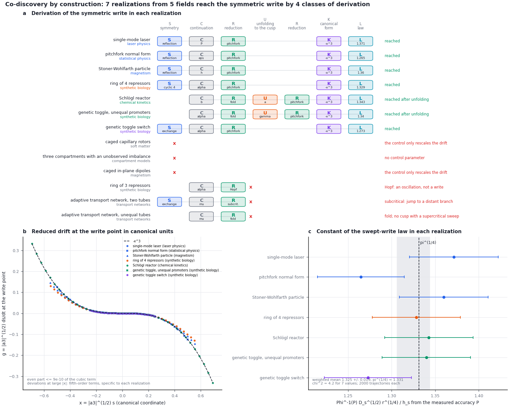

# Module 9. One mechanism derived in models from different fields

**Learning objectives.** After this module you can

1. describe the derivation of a mechanism as a chain of transformations, each acting on named components of a
   realization;
2. run `memory codiscover` and read the derivations of the symmetric write in models from five fields;
3. identify the step at which a model fails to reach the mechanism, and the property of the model responsible;
4. test whether two derivations end on the same mechanism with two invariants that do not depend on the field.

**Prerequisites.** Modules 1–5. **Time.** About 45 minutes.

## 1. Convergent derivations

The same mechanism is often derived independently in different fields. A standard example is the threshold of a
laser and a second-order phase transition. Both reduce to one equation for an order parameter,
$\dot s = \varepsilon s - s^3 + h$ (Graham and Haken, 1970; DeGiorgio and Scully, 1970), but the two derivations
have little in common. In the laser, the population inversion is eliminated and the field amplitude remains. In
Landau theory, the equation is the lowest-order expansion of a free energy that is even in the order parameter.
Such convergence is not directed: neither derivation was aimed at the other.

> **Note.** How often such convergence occurs was measured outside FieldBridge. An analysis of derivation chains
> extracted from arXiv papers with the V2.1 language compared pairs of chains from different fields that end on the
> same class of mechanism. In 98.6% of the 625,534 pairs the derivations differ. The number of pairs is 4.6% smaller
> than the 655,470 obtained when the field labels are permuted among papers of the same year ($z = -10$): the
> classes are more specific to fields than the permutation makes them, and the corpus shows no excess of convergence
> across fields. Neither count tests whether the end points are one mechanism; that is established by the normal
> form and its field-independent invariants, as in this module.

The constructor makes the convergence deliberate; the command is `memory codiscover` (co-discovery by
construction). It fixes a target mechanism and derives it in every model with transformations that it can verify.
For each model it records the derivation, names the step at which the derivation stops if it does, and tests two
invariants of the end point that do not depend on the field. This module derives the first target, the symmetric
write of Module 4. [Module 10](25_memory_threshold_write.md) derives the threshold write, a fold, and
[Module 11](26_memory_phase_locking.md) the locking of an oscillator to a periodic drive, with the same command.

## 2. The transformations

A derivation is a word in letters. Each letter acts on named components of the realization
$I_{\mathrm{real}} = ((\Omega,\Xi);\,C,\,R,\,P;\,A)$. The table describes the six letters of the symmetric write. A
seventh, W, and the forms of K and L for the threshold write are given in
[Module 10](25_memory_threshold_write.md).

| Letter | Transformation | Acts on | What is computed | The derivation stops if |
| --- | --- | --- | --- | --- |
| S | symmetry | $\Xi$, $\Omega$ | a permutation with signs $g$ that leaves the drift unchanged, $F(gq) = gF(q)$, and reverses the critical mode, $gv = -v$; it forbids even terms along $v$ | (not required; without S the target can still be reached through U) |
| C | continuation | $A$ | the value of the control at which the relaxation rate $\kappa$ of a stable state reaches zero | there is no control, or the control only rescales the drift |
| R | reduction | $\Xi$, $\Omega$ | the drift on the slow manifold along $v$, $a_0 + a_1 s + a_2 s^2 + a_3 s^3$; the other directions are eliminated | a complex pair crosses (Hopf), or $a_3 > 0$ (subcritical) |
| U | unfolding | $A$, $P$ | a second material parameter is set to the cusp, where $a_2 = 0$; the protocol sweeps through the cusp without a bias; R is applied again | no material parameter reaches a cusp with $a_3 < 0$ |
| K | canonical form | $\Xi$ | the coordinate is rescaled, $x = \lvert a_3\rvert^{1/2} s$, so that $\dot x = \varepsilon x - x^3 + h$ | — |
| L | write law | $P$, $R$ | a swept write of the full model is simulated, and the constant of the write law is estimated | — |

The class of a derivation keeps the letters, the kind of symmetry and the kind of the first reduction, and drops
the names of the variables. Two models from different fields that reach the target by the same kind of step have
the same class.

## 3. Running the constructor

```bash
python3 -B -m fieldbridge memory codiscover --trajectories 2000 --out-dir build/tut/m9_codiscover
```

Without arguments the command reads every specification in `examples/memory`; given files, it reads only those.
It writes `codiscover.json`, `codiscover.md` and `codiscover.png` and takes about two minutes on a laptop. With
`--no-law` it omits the simulation and takes about 20 s.

| Realization | Field | Derivation | Result | Write point | Law constant |
| --- | --- | --- | --- | --- | --- |
| single-mode laser | laser physics | SCRKL | reached | $P = 1$ | 1.363 ± 0.060 |
| pitchfork normal form | statistical physics | SCRKL | reached | $\varepsilon = 0$ | 1.430 ± 0.052 |
| ring of 4 repressors | synthetic biology | SCRKL | reached | $\alpha = 1.013$ | 1.301 ± 0.050 |
| genetic toggle switch | synthetic biology | SCRKL | reached | $\alpha = 2$ | 1.397 ± 0.058 |
| Stoner–Wohlfarth particle | magnetism | SCRKL | reached | $h = 1$ | 1.397 ± 0.051 |
| Schlögl reactor | chemical kinetics | CRURKL | reached after unfolding | cusp $a = 4.153$, $b = 2.654$ | 1.406 ± 0.052 |
| toggle, unequal promoters | synthetic biology | CRURKL | reached after unfolding | cusp $\gamma = 1.000$, $\alpha = 2.000$ | 1.463 ± 0.052 |
| ring of 3 repressors | synthetic biology | CR | stops at R: Hopf | — | — |
| two equal tubes | transport networks | SCR | stops at R: subcritical | — | — |
| two unequal tubes | transport networks | CR | stops at U: no supercritical cusp | — | — |
| caged capillary rotors | soft matter | — | stops at C: the control rescales the drift | — | — |
| caged in-plane dipoles | magnetism | — | stops at C: the control rescales the drift | — | — |
| three compartments | compartment models | — | stops at C: no control | — | — |

Seven realizations from five fields reach the target by four classes of derivation. Two of them simulate the same
equations: the toggle with unequal promoters, unfolded to equal promoters, is the genetic toggle switch. They are
six models, and the statistics below count the two as one. `codiscover.md` also lists every
derivation with its steps, for example for the laser

```text
S[reflection amp -> -amp] > C[P] > R[supercritical pitchfork; 1 direction eliminated] > K > L
```



*Figure 1. The symmetric write. (a) The derivation in each model: letters on the slots of a common chain. A thin line joins the steps
of one derivation; a red cross marks the step at which it stops, with the reason on the right. (b) The reduced
drift at the write point in the canonical coordinate, for the seven realizations that reach the target, against $-x^3$.
(c) The constant of the swept-write law estimated from the simulation of each model, against $\pi^{1/4}$; the grey
band is the weighted mean over models ± one standard error; an open circle simulates the equations of a
realization above it.*

## 4. Four classes of derivation

**By a reflection: the laser and Landau theory.** The laser model has a field amplitude $E$ (`amp`) and an
inversion $N$ (`inv`):

$$
\dot E = \tfrac12 (gN - \kappa)\,E, \qquad \dot N = P - \gamma N - g N E^2  \qquad (1)
$$

The reflection $E \to -E$ leaves Eq. (1) unchanged; it exchanges the two optical phases $0$ and $\pi$. The field
becomes unstable at the pump $P = \gamma\kappa/g$, which is 1 in the example. The inversion relaxes and is
eliminated, $N = P/(\gamma + gE^2)$, so that

$$
\dot E = \tfrac12\Bigl(\frac{gP}{\gamma} - \kappa\Bigr) E - \frac{g^2 P}{2\gamma^2}\, E^3 + O(E^5) \qquad (2)
$$

At threshold the cubic coefficient is $a_3 = -g\kappa/(2\gamma) = -0.5$; the constructor finds $-0.499$. The
pitchfork normal form has the same class: the class is fixed by the kind of symmetry, not by the field. So has the
Stoner–Wohlfarth particle in a field along its hard axis: with the magnetization angle $\varphi$ measured from the hard
axis, the reflection $\varphi \to -\varphi$ leaves its drift $\tfrac12\sin 2\varphi - h\sin\varphi$ unchanged, and the
two stored directions $\cos\varphi = h$ merge at $h = 1$.

**By an exchange: the toggle switch.** Exchanging the two repressors, $u \leftrightarrow v$, leaves the equations
of Module 1 unchanged and reverses the antisymmetric mode $(1, -1)$. With $n = 2$ the symmetric state $u = v = 1$
loses stability along this mode at $\alpha = 2$, and the symmetric combination $u + v$ is eliminated.

**By a cyclic permutation: the ring of four repressors.** Shifting every gene by one position leaves the ring
unchanged and maps the alternating mode $(1, -1, 1, -1)$ to its negative. Around the ring the Jacobian is
$-1 + c\,\omega$ with $\omega^4 = 1$ and $c < 0$; the alternating mode, $\omega = -1$, becomes unstable when
$\lvert c\rvert = 1$. For $n = 4$ this gives $u^4 = 1/3$ and $\alpha = \tfrac43\, 3^{-1/4} = 1.0131$. Three
directions are eliminated.

**By unfolding: the Schlögl reactor and the toggle with unequal promoters.** Neither model has a symmetry, and
the write along the control is a fold. The unfolding sets a second parameter to the cusp. For the Schlögl drift
$-x^3 + ax^2 - k_3 x + b$ the cusp is a triple root, $a = 3x_0$ and $b = x_0^3$ with $x_0 = (k_3/3)^{1/2}$; for
$k_3 = 5.75$ this is $a = 4.153$ and $b = 2.654$, the values found by the constructor. For the toggle with unequal
promoters the cusp lies at $\gamma = 1.000$: the unfolding recovers equal promoters. There the symmetry is a
result of the derivation, not an assumption.

## 5. Where a derivation stops

A derivation that stops is a result: it names the property of the model that differs from the target.

| Model | Stops at | Reason |
| --- | --- | --- |
| ring of 3 repressors | R | A complex pair crosses (Hopf). A cyclic symmetry of order 3 cannot reverse a real mode: if $gv = -v$, then $v = g^3 v = -v$. The model stores a phase instead (Module 6). |
| two equal tubes | R | The exchange symmetry forces a pitchfork, but not the sign of its cubic term. Here $a_3 > 0$, and the written state jumps to a distant branch. |
| two unequal tubes | U | The write is a fold, and its cusp, at equal lengths, is the subcritical pitchfork of the equal tubes. |
| capillary rotors, dipoles | C | The control multiplies the whole drift. It changes the depth of the landscape and not its shape, so a state is written by a field (Module 4). |
| three compartments | C | There is no control parameter. |

## 6. Two invariants of the end point

**The canonical form.** In the coordinate $x$ the reduced drift at the write point is $\sum_n c_n x^n$. The cubic
coefficient $c_3 = -1$ by the choice of units, so the check lies in the other coefficients. In every model that
reaches the target, the even part is below $10^{-9}$ of the cubic term at the edge of the fitted window,
and $c_3 < 0$. The fifth-order coefficient differs between the models: $c_5 = 1.8$ for the laser (2 from Eq. (2);
the remainder comes from seventh-order terms within the window), 1.26 for the toggle, 0.76 for the ring, 0.46 for
the Stoner–Wohlfarth particle (1/2 from the expansion of its energy) and 0 for the Schlögl reactor and Landau theory. It sets how far from the write point the models remain equivalent. It does
not enter the write law, because the choice is made in the linear stage.

**The constant of the write law.** For each model the constructor simulates the swept write of the full model
(Module 4). The control is swept through the write point so that $\varepsilon$ grows at the rate $r$, the noise
is set by $\Gamma = D_s\lvert a_3\rvert/r = 0.05$, and a bias $h_s$ is chosen for which the law predicts an
accuracy of 0.8. The measured accuracy $P$ gives the constant

$$
\pi^{1/4} \approx \frac{\Phi^{-1}(P)\, D_s^{1/2}\, r^{1/4}}{h_s}  \qquad (3)
$$

The trajectories of each realization are split into eight runs on independent random streams, and the error of a
constant is the larger of the scatter of the runs and the binomial error of the pooled accuracy. With 2000
trajectories per realization and the default seed, the six models have a weighted mean of $1.394 \pm 0.020$,
against $\pi^{1/4} = 1.331$, with $\chi^2 = 15.1$ for 6 values: this run lies three standard errors above the law.
Repeated with 16 other seeds, the accuracies scatter as their binomial errors predict, and the seeds 11 to 14 give
weighted means of 1.311, 1.298, 1.375 and 1.317. The default run is a fluctuation of that size, not a property of
the law; the record below is the precise test. The constant depends only on the canonical form. A derivation that
ended on another mechanism, such as a fold, would give an accuracy that does not follow Eq. (3).

The record of the [web page](https://synthetix-institute.github.io/fieldbridge/) uses 25,600 trajectories per
realization in eight runs of 3200, for which the error of one constant is 0.014 to 0.018. Eight realizations reach
the target; besides the two toggles, the normal form continued from below its write point simulates the equations of
the normal form, so they are six models. Their constants lie between 1.321 and 1.343, with a weighted mean of
$1.334 \pm 0.005$ and $\chi^2 = 1.9$ for 6 values: the scatter between models is that of the statistical error.
With 400 trajectories the Schlögl reactor gave $1.04 \pm 0.11$; with 25,600 it gives $1.336 \pm 0.016$, so that
value was a fluctuation. An earlier record drew all the trajectories of a constant from one stream, after the draws
of the derivation, and counted the replicates as separate models; it gave $\chi^2 = 20$ for 8 values.

## 7. A model from your field

1. Write the specification (Module 2) and add `"field": "<your field>"`.
2. Derive the target in your model together with models from other fields:

   ```bash
   python3 -B -m fieldbridge memory codiscover my_model.json examples/memory/laser.json \
     examples/memory/toggle.json --out-dir build/my_codiscover
   ```

3. Compare the class of your derivation with the others. If the derivation stops, the reason names the property
   to change; `memory design` (Module 5) solves for a setting of a material parameter.

The same command derives the threshold write (`--target threshold-write`, [Module 10](25_memory_threshold_write.md))
and phase locking (`--target phase-locking`, [Module 11](26_memory_phase_locking.md)). A new target mechanism is
added as a function with the signature of `derive_symmetric_write` in the dictionary `TARGETS` of
[`codiscovery.py`](../../fieldbridge/memory/codiscovery.py).

## 8. Exercises

1. The ring of four repressors reaches the target by a cyclic symmetry. Which cyclic rings can reach it this way?
2. Apply U to the two unequal tubes by hand: set $L_2 = L_1$. Which letter stops the derivation now?
3. A colleague sweeps the toggle with unequal promoters along $\alpha$ through its fold, without the unfolding, and
   measures the accuracy for a small bias of either sign. What is observed, and why is Eq. (3) not applicable?

<details><summary>Answers</summary>

1. Rings with an even number of genes. The shift by one gene has order $N$ and can reverse a real mode only if
   $(-1)^N = 1$; for even $N$ the reversed mode is the alternating one, and it is the first to become unstable. For
   odd $N$ no mode is reversed, and the ring goes through a Hopf bifurcation instead. The symmetry does not fix the
   sign of the cubic term, which R must still check (compare the two tubes).
2. R: with equal lengths the exchange symmetry is restored and S applies, but the cubic coefficient is positive,
   so the derivation stops at the subcritical pitchfork of Section 5.
3. At the fold a new pair of states appears away from the occupied state, which continues on its branch. The
   accuracy is close to 1 for a bias toward that branch and close to 0 for the opposite bias. The write is not a
   choice between two symmetric states, and Eq. (3) assumes one.

</details>

## Summary

- A derivation of a mechanism is a word of transformations, each acting on named components of the realization.
- The constructor derives the symmetric write in models from five fields by four classes of derivation: by a
  reflection, an exchange, a cyclic permutation, or an unfolding to a cusp.
- A derivation that stops names the responsible property: a Hopf bifurcation, a positive cubic term, a fold
  without a supercritical cusp, or a control that only rescales the drift.
- Two invariants test that the end points are the same mechanism: the canonical form $-x^3$ with no even part, and
  the constant of the write law, $1.334 \pm 0.005$ over six models in the record of the web page, against
  $\pi^{1/4} = 1.331$.

## Reference

| Result | Function | Test |
| --- | --- | --- |
| Derivation, classes, obstructions | [`codiscovery.derive_symmetric_write`](../../fieldbridge/memory/codiscovery.py), `derivation_class` | `test_models_from_different_fields_reach_the_symmetric_write_by_different_derivations` |
| Canonical form | `codiscovery.canonical_form` | the same test |
| Constant of the write law | `codiscovery.law_constant`, [`construct.swept_write_check`](../../fieldbridge/memory/construct.py) | `test_the_write_law_has_the_same_constant_in_a_laser_and_a_toggle` |
| Report and figure | [`cli.cmd_codiscover`](../../fieldbridge/memory/cli.py), [`visual.codiscovery_figure`](../../fieldbridge/memory/visual.py) | `test_codiscover_command_writes_report_and_figure` |

Sources: R. Graham and H. Haken, Z. Phys. 237, 31 (1970); V. DeGiorgio and M. O. Scully, Phys. Rev. A 2, 1170
(1970); H. Haken, Rev. Mod. Phys. 47, 67 (1975); F. Schlögl, Z. Phys. 253, 147 (1972); T. S. Gardner, C. R. Cantor
and J. J. Collins, Nature 403, 339 (2000); M. B. Elowitz and S. Leibler, Nature 403, 335 (2000); E. C. Stoner and
E. P. Wohlfarth, Phil. Trans. R. Soc. A 240, 599 (1948).

[Previous: Module 8](22_memory_time.md) · [Next: Module 10, the threshold write](25_memory_threshold_write.md) · [Tutorial index](index.md) · [Glossary](memory_glossary.md)
