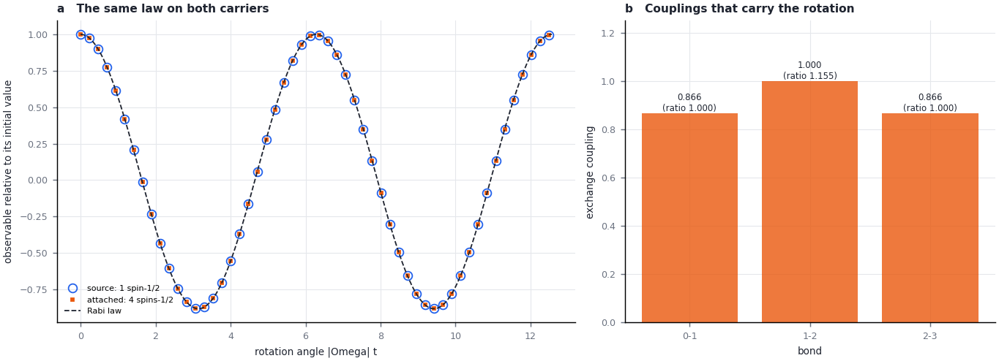
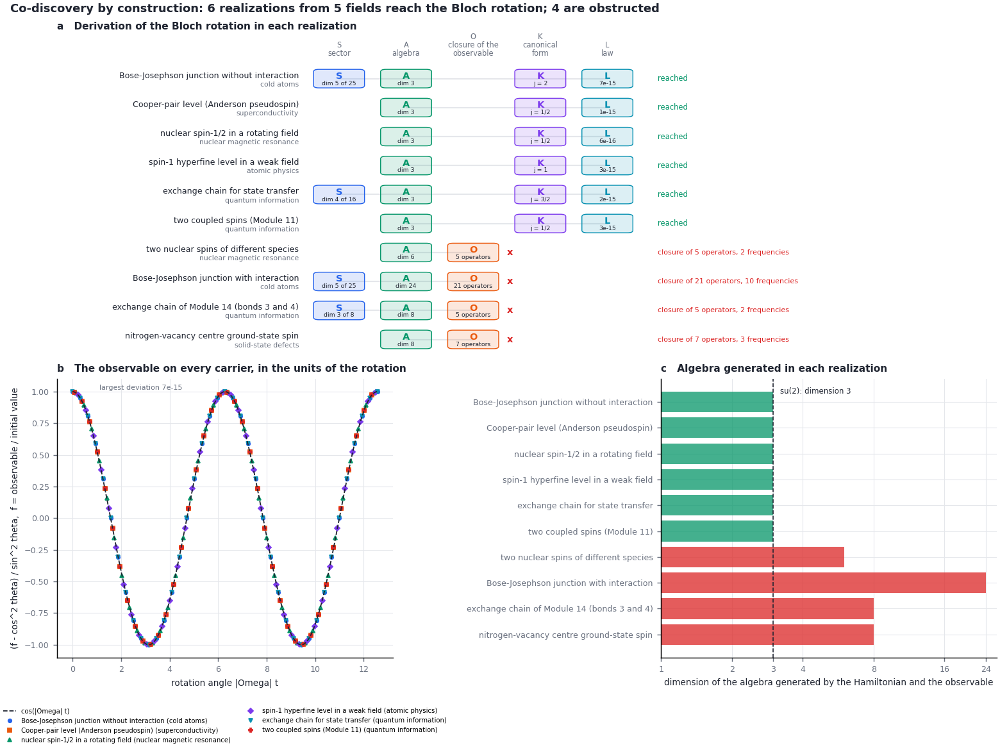

# The language of mechanisms, shown on spins

**Learning objectives.** After this chapter you can

1. write a quantum model as a realization and name its carrier, operation, closure, observable, protocol and
   parameters;
2. detach a mechanism from its carrier, and say which properties go with the mechanism and which stay with the
   carrier;
3. attach a detached mechanism to a carrier from another field and read the design this produces in that carrier's
   own operators;
4. derive one mechanism in models from different fields, and name the term responsible when a derivation stops.

**Prerequisites.** [Chapter 11](11_quantum_closure.md) (observable closure). [Chapter 14](14_inverse_construction.md)
helps for Sections 4 and 6. **Time.** About 60 minutes. The commands need `pip install -e '.[construction]'`; the
figures also need matplotlib.

## 1. The words of the language

A realization is written $I_{\mathrm{real}} = ((\Omega,\Xi);\,C,\,R,\,P;\,A)$. The table gives each component in
general and for the two spins of Chapter 11.

| Component | Meaning | The spins of Chapter 11 |
| --- | --- | --- |
| Carrier $\Xi$ | the states and the operators that act on them | two spins-1/2, operators $X_0, \ldots, Z_1$ |
| Operation $\Omega$ | the generator of the dynamics | $H = g\,Z_0 Z_1 + h\,X_0$ |
| Closure $C$ | what is specified or discarded to obtain closed equations: constitutive relations, admissible states and operator domains, boundaries, imposed conservation laws, eliminated degrees of freedom | closed unitary evolution, $\hbar = 1$ |
| Observable $R$ | what is measured | $X_0$ |
| Protocol $P$ | how the system is prepared and driven | the top eigenstate of $X_0$; $H$ acts from $t = 0$ |
| Parameters $A$ | the material or apparatus that implements the model, entered as parameter values | $g = 1$, $h = 0.5$ |

Four operations act on realizations.

- **Detach** removes the carrier and keeps the mechanism: the part of the dynamics that does not depend on how the
  states are represented.
- **Attach** writes a detached mechanism in the operators of another carrier and derives it there again.
- **Derive** transforms a realization step by step until a target form appears. Each step is a letter of a
  derivation word.
- **Co-discover** derives one target in realizations from different fields and compares their derivations and
  invariants.

The mechanism of this chapter is the Bloch rotation. Three Hermitian operators $J_1, J_2, J_3$ with

$$
[J_a, J_b] = i\,\varepsilon_{abc}\,J_c \qquad (1)
$$

form the Lie algebra su(2). If the Hamiltonian is $H = \boldsymbol\Omega\cdot\mathbf J$ and the observable is
$O = \mathbf n\cdot\mathbf J$, the expectation values $\mathbf m = \langle\mathbf J\rangle$ obey
$\dot{\mathbf m} = \boldsymbol\Omega\times\mathbf m$. From the top eigenstate of $O$ the observable follows

$$
f(t) = \frac{\langle O\rangle(t)}{\langle O\rangle(0)} = \cos^2\theta + \sin^2\theta\,\cos(|\boldsymbol\Omega|\,t) \qquad (2)
$$

where $\theta$ is the angle between $\boldsymbol\Omega$ and $\mathbf n$ (the Rabi law). Equation (2) contains no
property of the carrier. The dimension of the Hilbert space and the spin $j$ of the representation drop out.

## 2. Writing a realization

A realization is a JSON file of kind `fieldbridge-quantum/1`. The Chapter 11 model with a transverse field is
`examples/quantum/two_spins.json`:

```json
{"schema": "fieldbridge-quantum/1", "name": "two coupled spins (Module 11)", "field": "quantum information",
 "carrier": {"kind": "qubits", "n": 2},
 "parameters": {"g": 1.0, "h": 0.5},
 "hamiltonian": [{"coefficient": "g", "operator": "Z0 Z1"}, {"coefficient": "h", "operator": "X0"}],
 "observable": [{"coefficient": 1, "operator": "X0"}],
 "question": "...", "assumptions": ["..."], "provenance": {"...": "..."}}
```

An operator is a sum of products of the carrier's operators, applied in the written order. Coefficients are numbers
or expressions in the parameters.

| Carrier | Operators | Example |
| --- | --- | --- |
| `qubits` (1–6 spins-1/2) | `X0`, `Y0`, `Z0`, `X1`, ... | `"X0 X1 + Y0 Y1"`, an exchange bond |
| `spin` (one spin $j \leq 7/2$) | `Jx`, `Jy`, `Jz`, `Jp`, `Jm` | `"Jz Jz"`, a zero-field splitting |
| `bosons` (1–3 modes) | `a`, `ad` (creation), `na` (number), for every mode name | `"ad b"` with `"hc": true`, a tunnelling |
| `fermions` (1–4 modes) | `c0`, `cd0`, `n0`, ... (Jordan–Wigner) | `"cd0 cd1"` with `"hc": true`, a pairing field |

A product that is not Hermitian, such as $a^\dagger b$, is marked `"hc": true`, which adds its Hermitian conjugate.
An optional `sector` fixes a conserved quantity, for example the number of atoms or the number of flipped spins. The
realization then lives in that eigenspace.

## 3. Detaching the rotation from the spins of Chapter 11

```bash
python3 -B -m fieldbridge quantum detach examples/quantum/two_spins.json --out-dir build/tut/q_detach_two_spins
```

The derivation is AKL. **A** (algebra) forms commutators of the Hamiltonian and the observable until their span
closes. The operators that close are $X_0$, $Y_0Z_1$ and $Z_0Z_1$:

$$
[X_0, Y_0Z_1] = 2i\,Z_0Z_1,\qquad [Y_0Z_1, Z_0Z_1] = 2i\,X_0,\qquad [Z_0Z_1, X_0] = 2i\,Y_0Z_1 .
$$

Divided by 2 they satisfy Eq. (1). They form a spin-1/2 made of one magnetization and two correlations. This is why
Chapter 11 needed the correlation $Y_0Z_1$ to predict $X_0$. **K** (canonical form) writes the model in this basis:
$H = 2h\,J_1 + 2g\,J_3$ and $O = 2J_1$, with $J_1 = X_0/2$, $J_2 = Y_0Z_1/2$ and $J_3 = Z_0Z_1/2$. The report gives the
basis in a frame whose third axis lies along $\boldsymbol\Omega$. **L** (law) evolves the state exactly and compares
it with Eq. (2).

| Detached (independent of the carrier) | Value | Left with the carrier | Value |
| --- | --- | --- | --- |
| algebra | su(2) | carrier | two spins-1/2 |
| rotation rate $\lvert\boldsymbol\Omega\rvert = 2\sqrt{g^2+h^2}$ | 2.236 | Hilbert space dimension | 4 |
| weight of the observable $\lvert\mathbf n\rvert$ | 2 | representation | two copies of $j = 1/2$ |
| angle $\theta = \arctan(g/h)$ | 63.4° | operators that realize $\mathbf J$ | $X_0$, $Y_0Z_1$, $Z_0Z_1$ (each divided by 2) |
| law | Eq. (2); exact evolution deviates by $3 \times 10^{-15}$ | | |

The representation contains two copies because $Z_1$ commutes with all three operators. The Hilbert space splits
into $Z_1 = +1$ and $Z_1 = -1$, and each half carries one spin-1/2. Without the transverse field ($h = 0$) the angle
is 90°, and Eq. (2) becomes $\cos(2gt)$. This is the Chapter 11 result $x(t) = x(0)\cos(2gt)$ for a preparation with
$c(0) = 0$.

## 4. Attaching the rotation to the exchange chain of Chapter 14

The rotation of a nuclear spin-1/2 in a radio-frequency field (`examples/quantum/nmr_spin.json`: Rabi frequency 2,
detuning 0.5) is attached to a chain of four spins with exchange bonds, the carrier of Chapter 14:

```bash
python3 -B -m fieldbridge quantum attach --from examples/quantum/nmr_spin.json --to chain --size 4 \
  --out-dir build/tut/q_attach_chain
```

On the chain the rotating vector is carried by one flipped spin in a polarized chain. The sector fixes the
magnetization, $\sum_j Z_j = N - 2$. Writing the components of $\mathbf J$ as $J_x, J_y, J_z$ (to keep $J_j$ for the
exchange bonds, as in Chapter 14): $J_z$ is the position of the flipped spin,
$\sum_j (j - \tfrac{N-1}{2})(1 - Z_j)/2$, and $J_x$ is the hopping produced by the bonds $J_j(X_jX_{j+1} + Y_jY_{j+1})$.
Equation (1) holds only if the bonds match the matrix elements of $J_x$ for spin $(N-1)/2$:

$$
J_j \propto \sqrt{(j+1)(N-1-j)}, \qquad j = 0, \ldots, N-2  \qquad (3)
$$

The attachment therefore returns a design: bonds 0.866, 1.000 and 0.866 (ratio $\sqrt3 : 2 : \sqrt3$) and site fields
0.375, 0.125, −0.125 and −0.375, which carry the detuning. The derivation on the chain is SAKL. **S** restricts the
16 states of four spins to the 4 states with one flipped spin.

| Property | Nuclear spin | Chain of four spins |
| --- | --- | --- |
| rotation rate | 2.0616 | 2.0616 |
| angle | 75.96° | 75.96° |
| law, deviation of exact evolution | $6 \times 10^{-16}$ | $3 \times 10^{-13}$ |
| space the rotation acts on | 2 states | 4 states (one flipped spin among 16) |
| representation | $j = 1/2$ | $j = 3/2$ |



*Figure 1. (a) The observable of the nuclear spin (open circles) and of the chain (squares), relative to its initial
value, against the rotation angle, with Eq. (2). (b) The exchange couplings that the attachment writes on the chain.*

At resonance ($\theta = 90°$) Eq. (2) gives $f = -1$ at $t = \pi/\lvert\boldsymbol\Omega\rvert$. The flipped spin
then arrives at the other end of the chain: this is perfect state transfer (Christandl et al., 2004), and
`examples/quantum/state_transfer_chain.json` is such a chain. For three spins Eq. (3) requires equal bonds. The
chain of Chapter 14, with bonds 3 and 4, does not carry the rotation (Section 6).

The same rotation attaches to other carriers. `fieldbridge quantum carriers` lists them.

| Carrier (`--to`) | Written in its own operators | Representation |
| --- | --- | --- |
| `qubit` | Rabi frequency 2, detuning 0.5 | $j = 1/2$ |
| `bosons --size 4` | tunnelling 1.0 between two wells, energy difference 0.5 | $j = 2$ |
| `fermion-pair` | pairing amplitude 1.0, single-particle energy 0.25 | $j = 1/2$ and two states with $j = 0$ |
| `correlated-pair` | Ising coupling $g = 1.0$, transverse field $h = 0.25$ (the form of Chapter 11) | two copies of $j = 1/2$ |
| `spin --size 3` | fields 2 and 0.5 on a spin 3/2 | $j = 3/2$ |

In every case the rotation rate and the angle are those of the nuclear spin, and Eq. (2) holds to $10^{-12}$ or
better. What changes is the carrier, the operators that realize $\mathbf J$ and the representation.

## 5. Co-discovery: one rotation in five fields

```bash
python3 -B -m fieldbridge quantum codiscover --out-dir build/tut/q_codiscover
```

The command derives the rotation in every file of `examples/quantum`.

| Realization | Field | Derivation | Representation | Rate | Angle |
| --- | --- | --- | --- | --- | --- |
| nuclear spin-1/2 in a rotating field | nuclear magnetic resonance | AKL | $1/2$ | 2.062 | 76.0° |
| two coupled spins (Chapter 11) | quantum information | AKL | $2 \times 1/2$ | 2.236 | 63.4° |
| exchange chain for state transfer | quantum information | SAKL | $3/2$ | 2.000 | 90.0° |
| Bose–Josephson junction without interaction | cold atoms | SAKL | $2$ | 2.040 | 78.7° |
| Cooper-pair level | superconductivity | AKL | $1/2 + 2 \times 0$ | 2.088 | 73.3° |
| spin-1 hyperfine level in a weak field | atomic physics | AKL | $1$ | 1.530 | 78.7° |
| Bose–Josephson junction with interaction | cold atoms | SA | stops: su(5) | — | — |
| nitrogen-vacancy centre spin | solid-state defects | A | stops: su(3) | — | — |
| exchange chain of Chapter 14 (bonds 3, 4) | quantum information | SA | stops: su(3) | — | — |
| two nuclear spins of different species | nuclear magnetic resonance | A | stops: dimension 6 | — | — |



*Figure 2. (a) The derivation in each realization: S sector, A algebra, K canonical form, L law. (b) The observable of
the six realizations that reach the rotation, rescaled by its own angle, against the rotation angle; every
realization lies on $\cos(\lvert\boldsymbol\Omega\rvert t)$ to $7 \times 10^{-15}$. (c) The dimension of the algebra
that the Hamiltonian and the observable generate.*

Six realizations from five fields reach the rotation by two classes of derivation. With a sector (SAKL), a conserved
quantity first selects the states on which the rotation acts: the atom number in the junction, or the number of
flipped spins in the chain. Without one (AKL), the algebra is found directly. In the Cooper-pair level the pairing
field rotates the pseudospin of Anderson (1958) on the empty and doubly occupied states. The two singly occupied
states are left unchanged, so they appear as $j = 0$. The convergence is historical: Bloch's equations for nuclear
induction (1946), the representation of two-level masers as spins (Feynman, Vernon and Hellwarth, 1957) and
Anderson's pseudospin arrived at the same algebra from different problems. The constructor reaches it by derivation
and checks it with Eq. (1) and Eq. (2).

## 6. Obstructions

A derivation stops at A when the algebra is larger than su(2). The constructor then removes one Hamiltonian term at
a time. If a single term's removal leaves su(2), it names that term.

| Realization | Algebra | Term named | Physical reading |
| --- | --- | --- | --- |
| junction with interaction | su(5), dimension 24 | $\tfrac{U}{2}(n_a^2 + n_b^2)$ | In the $N$-atom sector this is $U J_z^2$ plus a constant: one-axis twisting (Kitagawa and Ueda, 1993) |
| nitrogen-vacancy centre | su(3), dimension 8 | $D J_z^2$ | the zero-field splitting, also quadratic in $J_z$ |
| chain of Chapter 14 | su(3), dimension 8 | none | the bonds 3 and 4 violate Eq. (3), which requires equal bonds for three spins |
| heteronuclear spins | dimension 6 | none | two spins that rotate at different Larmor frequencies: two rotations, not one |

A term quadratic in $\mathbf J$ is the typical obstruction. The collective Ising interaction of Chapter 14,
$Q = \tfrac{\lambda}{2}(M^2 - N)$ with $M = \sum_j Z_j = 2J_z$, is of this kind: $Q = 2\lambda J_z^2 - \lambda N/2$. On
three spins driven together (the `collective` carrier) it enlarges the algebra from dimension 3 to 19. Within a
sector of fixed $M$, however, $Q$ is a constant and has no effect. A sector can therefore remove an obstruction, and
this is why the exchange chain and $Q$ could be combined in Chapter 14.

## 7. The same language in the memory modules

| | This chapter (spins) | Memory ([Modules 5 and 9](19_memory_transfer_and_design.md)) |
| --- | --- | --- |
| carrier | a Hilbert space, or one sector of it | the states of a material: concentrations, angles, conductances |
| mechanism detached | su(2), rate, angle | the memory signature: kind of write, retention law, symmetries |
| attach | write $\mathbf J$ in the carrier's operators; returns couplings, tunnelling or pairing | `memory attach` and `memory design`; returns a parameter setting |
| letters | S sector, A algebra, K canonical form, L law | S symmetry, C continuation, W write field, R reduction, U unfolding, K canonical form, L law |
| invariants | Eq. (1) and Eq. (2) | the canonical normal form and the constant of the write law |
| obstruction | a term that enlarges the algebra | a term that changes the normal form: a quadratic term, a positive cubic term, a Hopf crossing |

In both cases a derivation records how a model from one field reaches a mechanism. An obstruction names what
prevents it. Attachment carries the mechanism to a carrier where it has not yet been written.

## 8. Exercises

1. Move the transverse field of Section 3 to the second spin, $H = g\,Z_0Z_1 + h\,X_1$, and run `quantum detach`. Does
   the rotation survive?
2. Attach the rotation of the nuclear spin to five atoms in two wells. What is $j$, and what tunnelling does the
   attachment write?
3. The Ising term $Q$ of Chapter 14 does not change the dynamics within a sector of fixed magnetization. Why does it
   nevertheless change the signal $\langle X_0\rangle$ computed in Chapter 14?
4. A spin-1 atom reaches the rotation and the nitrogen-vacancy centre does not, although both are spin-1 systems.
   Which term makes the difference, and which small term does the atomic model neglect?

<details><summary>Answers</summary>

1. No. The algebra grows to dimension 6: the operators $X_0$, $X_1$, $Y_0Y_1$, $Y_0Z_1$, $Z_0Y_1$ and $Z_0Z_1$
   close, and the constructor names $h\,X_1$ as the obstruction. A field on the second spin does not commute with the
   correlation $Z_0Z_1$ of the first spin with the second.
2. $j = 5/2$. The tunnelling is 1.0 and the energy difference 0.5, as for four atoms. The rate and the angle do not
   depend on the number of atoms, and only the representation changes.
3. $X_0$ flips the first spin and changes $M$ by $\pm 2$. It connects sectors in which $Q$ has different values, so
   the signal acquires the relative phase, averaged over the other spins. This is the factor
   $\cos^{N-1}(2\lambda t)$ of Chapter 14.
4. The zero-field splitting $D J_z^2$ is quadratic in $\mathbf J$ and generates su(3). In the atom the corresponding
   quadratic Zeeman shift is neglected in the linear regime. When it is kept, the atom is obstructed in the same way.

</details>

## Summary

- A realization names its carrier, operation, closure, observable, protocol and parameters. Detachment keeps the
  mechanism and leaves the carrier.
- The two spins of Chapter 11 carry a spin-1/2 formed by $X_0$, $Y_0Z_1$ and $Z_0Z_1$. The correlation needed in
  Chapter 11 is one component of this spin.
- Attaching the rotation of a nuclear spin to an exchange chain returns the couplings of Eq. (3), $\sqrt3 : 2 : \sqrt3$
  for four spins; at resonance they give perfect state transfer.
- Six realizations from five fields reach the rotation; four are obstructed, two with the responsible term named.
  The rate, the angle and Eq. (2) are the same on every carrier; the representation is not.

## Reference

| Result | Function | Test |
| --- | --- | --- |
| Carriers and operators | [`quantum.carriers.make`](../../fieldbridge/quantum/carriers.py) | `test_carrier_operators_obey_their_algebras` |
| Derivation S, A, K, L | [`quantum.language.derive_bloch_rotation`](../../fieldbridge/quantum/language.py), `lie_closure`, `canonical_su2`, `rabi_law` | `test_the_module_11_spins_carry_a_spin_made_of_correlations`, `test_one_rotation_on_carriers_from_five_fields` |
| Obstructions | `language._single_term_cause` | `test_obstructions_name_the_term_that_breaks_the_rotation` |
| Detach and attach | `language.detach`, `attach`, `attached_spec` | `test_attaching_the_rotation_designs_the_transfer_chain`, `test_the_detached_rotation_attaches_to_every_carrier` |
| Commands | [`quantum.cli`](../../fieldbridge/quantum/cli.py) | `test_quantum_commands_write_reports` |

Sources: F. Bloch, Phys. Rev. 70, 460 (1946); R. P. Feynman, F. L. Vernon and R. W. Hellwarth, J. Appl. Phys. 28, 49
(1957); P. W. Anderson, Phys. Rev. 112, 1900 (1958); M. Christandl, N. Datta, A. Ekert and A. J. Landahl, Phys. Rev.
Lett. 92, 187902 (2004); M. Kitagawa and M. Ueda, Phys. Rev. A 47, 5138 (1993); G. J. Milburn, J. Corney, E. M.
Wright and D. F. Walls, Phys. Rev. A 55, 4318 (1997).

[Chapter 11](11_quantum_closure.md) · [Chapter 14](14_inverse_construction.md) · [Memory Module 9](23_memory_codiscovery.md) · [Tutorial index](index.md)
