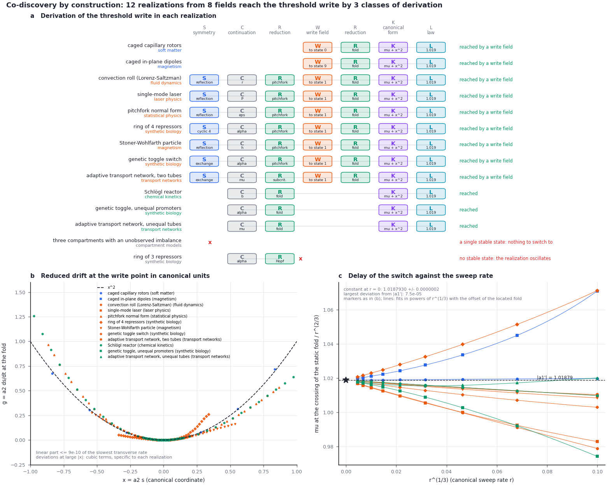

# Module 10. The threshold write in models from seven fields

**Learning objectives.** After this module you can

1. derive the threshold write, a fold, along the control or by a write field, and read the three classes of its
   derivation;
2. explain why a symmetry that permits the symmetric write forbids a threshold along the same parameter, and why
   the threshold write is reached in more models;
3. state the delay law of a swept fold, and read how its constant and the uncertainty of that constant are
   estimated.

**Prerequisites.** [Module 9](23_memory_codiscovery.md). **Time.** About 35 minutes.

## 1. The target

The target of this module is the fold,

$$
\dot s = \mu + s^2  \qquad (1)
$$

at which the occupied state meets an unstable state and disappears, and the material switches to another stored
state. A threshold write needs no symmetry, and a symmetry is its obstruction: a symmetry that reverses the critical
mode forbids the quadratic term. The constructor therefore first follows the control (C, R). If the write point
along the control is a pitchfork or a Hopf bifurcation, or if the control only rescales the drift, it applies a
bounded field toward another stored state (W, acting on the protocol $P$) and raises it until the occupied state
disappears; this value is the coercive field. In the coordinate $x = a_2 s$, with $\mu = a_2 b\,(p - p_f)$ and $b$
the push of the parameter $p$ along the critical mode, the reduced drift is $\mu + x^2$ (K).

The letters S, C and R act as in Module 9. Three letters are new or take another form:

| Letter | Transformation | Acts on | What is computed | The derivation stops if |
| --- | --- | --- | --- | --- |
| W | write field | $P$ | a bounded field toward another stored state is raised until the occupied state disappears | the field leaves the occupied state an equilibrium, or there is no second state |
| K | canonical form | $\Xi$ | the coordinate is rescaled, $x = a_2 s$, so that $\dot x = \mu + x^2$ | — |
| L | delay law | $P$, $R$ | the full model is swept through the fold without noise, and the constant of the delay law is estimated | — |

## 2. Running the constructor

```bash
python3 -B -m fieldbridge memory codiscover --target threshold-write --out-dir build/tut/m9_threshold
```

The command takes about one minute.

| Realization | Field | Derivation | Threshold | $c_3$ | Delay constant |
| --- | --- | --- | --- | --- | --- |
| Schlögl reactor | chemical kinetics | CRKL | $b = 1.4901$ | −0.333 | 1.0187930 ± 0.0000005 |
| toggle, unequal promoters | synthetic biology | CRKL | $\alpha = 3.2731$ | −0.006 | 1.018792 ± 0.000010 |
| two unequal tubes | transport networks | CRKL | $\mu = 1.2128$ | −0.535 | 1.01877 ± 0.00029 |
| single-mode laser | laser physics | SCRWRKL | $h = 0.05877$ | 0.889 | 1.018792 ± 0.000008 |
| pitchfork normal form | statistical physics | SCRWRKL | $h = 0.3849$ | −0.333 | 1.0187930 ± 0.0000005 |
| genetic toggle switch | synthetic biology | SCRWRKL | $h = 0.2134$ | 0.437 | 1.0187925 ± 0.0000035 |
| Stoner–Wohlfarth particle | magnetism | SCRWRKL | $h = 0.1847$ | −0.438 | 1.0187929 ± 0.0000007 |
| ring of 4 repressors | synthetic biology | SCRWRKL | $h = 1.5988$ | 2.975 | 1.018793 ± 0.000014 |
| two equal tubes | transport networks | SCRWRKL | $h = 0.06396$ | 0.163 | 1.0187929 ± 0.0000009 |
| caged capillary rotors | soft matter | WRKL | $h = 1.6335$ | 0.037 | 1.0187929 ± 0.0000005 |
| caged in-plane dipoles | magnetism | WRKL | $h = 0.06189$ | 0.016 | 1.018794 ± 0.000012 |
| ring of 3 repressors | synthetic biology | CR | stops: no stable state | — | — |
| three compartments | compartment models | — | stops: a single stable state | — | — |

Eleven models from seven fields reach the target by three classes of derivation: by the control, C R(fold) K L; by a
field after a symmetric write point, S C R(pitchfork) W R(fold) K L; and by a field where the control only rescales
the drift, W R(fold) K L. In the second class the symmetry that forces a pitchfork along the control also forbids a
threshold there. A field toward one of the two states breaks the symmetry, and the occupied state disappears at the
coercive field; for the Landau model, $\dot x = x - x^3 - h$, this is $h_c = 2/(3\sqrt3) = 0.3849$. The cubic
coefficient $c_3$ of the canonical form, the leading correction to Eq. (1), differs between the models.



*Figure 1. The threshold write. (a) The derivation in each model; W is the write field. (b) The reduced drift at the
fold in the canonical coordinate, against $x^2$. (c) The value of $\mu$ at which the state crosses the position of
the static fold, divided by $r^{2/3}$, against $r^{1/3}$ for sweeps at canonical rates $r = 10^{-3}$ to $10^{-7}$;
the lines are the fits of Section 3, and the star marks $\lvert a_1'\rvert = 1.01879$.*

Two results deserve a remark. First, with $a = 4.5$ and $k_3 = 5.75$ the Schlögl drift in $y = x - 3/2$ is
$-y^3 + y + (b - 15/8)$: the reactor is the Landau model in the field $h = 15/8 - b$. The constructor gives the same
threshold, the same $c_3 = -1/3$ and the same delay at every rate for both, so this co-discovery is exact. Second, for
two of the six pairs of stored states of the capillary rotors, the field toward one state exerts no torque on the
other: each rotor is aligned with the target orientation or at 90° to it, and a rotor of period $\pi$ feels no torque
there. The
occupied state then remains an equilibrium at every field strength and is lost by an exchange of stability, not by
a fold. The constructor tries pairs of states in the order of the force that the field exerts on the occupied state.

## 3. The delay law

Under a sweep $\mu = rt$, Eq. (1) in the canonical coordinate is the Riccati equation
$\dot x = rt + x^2$. The occupied state does not leave at $\mu = 0$ but later:

$$
x = r^{1/3}\,\frac{\mathrm{Ai}'(-\tau)}{\mathrm{Ai}(-\tau)}, \qquad \tau = r^{1/3} t  \qquad (2)
$$

so the state crosses the position of the static fold, $x = 0$, at $\mu = \lvert a_1'\rvert\, r^{2/3}$, where
$a_1' = -1.01879$ is the first zero of $\mathrm{Ai}'$. The switch lags behind the static threshold by an amount
proportional to $r^{2/3}$; this is the scaling of dynamic hysteresis measured in a bistable semiconductor laser (Jung,
Gray, Roy and Mandel, 1990). The terms of the full drift beyond $\mu + x^2$ add corrections in powers of $r^{1/3}$.

<details><summary>Derivation of Eq. (2)</summary>

With $x = -\dot u/u$ the Riccati equation becomes $\ddot u + rt\,u = 0$, and with $\tau = r^{1/3}t$ the Airy
equation $u'' + \tau u = 0$. The solution that follows the occupied state, $x \to -(-\mu)^{1/2}$ as
$t \to -\infty$, is $u = \mathrm{Ai}(-\tau)$, since $\mathrm{Ai}'(z)/\mathrm{Ai}(z) \to -z^{1/2}$ for large $z$. It
gives Eq. (2). The state runs away where $\mathrm{Ai}(-\tau) = 0$, at $\mu = 2.33811\, r^{2/3}$ (Haberman, 1979).

</details>

**The estimate of the constant.** The constructor sweeps each full model without noise at nine canonical rates from
$10^{-3}$ to $10^{-7}$ and records when the state crosses $s = 0$ (Figure 1c). The values $\mu/r^{2/3}$ are fitted
by a polynomial of fourth order in $r^{1/3}$ together with a term $\delta\,r^{-2/3}$. This term is the delay caused
by an error $\delta$ of the located fold, in canonical units: it moves every crossing by the same $\mu$, so its
share of $\mu/r^{2/3}$ grows at slow rates and is $4.6 \times 10^{4}\,\delta$ at $r = 10^{-7}$. The fold is located
by a root search, and the error that the search leaves depends on the model and on the rounding of the machine. In
the computations of the capillary rotors $\delta$ ranged from $3 \times 10^{-13}$ to $1.2 \times 10^{-10}$; the
larger value adds $6 \times 10^{-6}$ to the slowest sweep. A search that stops before it converges leaves more: one
gave $\delta = 9 \times 10^{-9}$ for the capillary rotors, the slowest sweep alone then lay $4 \times 10^{-4}$ above
the limit, and an extrapolation without the term gave $1.0195$. The search is therefore restarted until it
converges, and the fit contains the term
(`test_a_root_search_for_the_fold_that_stops_early_is_restarted`,
`test_the_delay_fit_recovers_the_constant_when_the_fold_is_mislocated`,
`test_a_fold_shifted_by_hand_appears_as_the_offset_of_the_delay_law`). The uncertainty of the constant is the
largest of three numbers: the change when the fourth-order term is left out, the largest change when one rate is
left out, and $5 \times 10^{-7}$, the accuracy of the canonical scale $a_2 b$ and of the integration.

In ten of the eleven models the constant lies within $1.2 \times 10^{-6}$ of $\lvert a_1'\rvert$, and the weighted
mean is $1.0187929 \pm 0.0000003$. The slopes of the corrections differ, from $-0.45$ for the laser to $+0.40$ for
the ring of four, as the fifth-order coefficients did for the symmetric write (Module 9, Section 6). For the unequal
tubes the corrections are large and alternate in sign: the sweep at $r = 10^{-3}$ lies above the limit, the sweep
at $r = 3 \times 10^{-5}$ 0.32% below it, and the slowest one still 0.1% below. Their constant,
$1.01877 \pm 0.00029$, is the least certain and lies $2 \times 10^{-5}$ from $\lvert a_1'\rvert$.

The law holds in the limit of small noise. In the variables of Eq. (2) the noise intensity is $a_2^2 D_s/r$, so the
deterministic delay is observed for sweeps faster than the rate $a_2^2 D_s$ given in the report; slower sweeps
switch earlier, by activation over the vanishing barrier. At the noise of the specifications this rate is
$2 \times 10^{-3}$ for the laser and 800 for the capillary rotors, whose switch is therefore always activated.

## 4. The two write targets compared

| Model | Field | Symmetric write | Threshold write |
| --- | --- | --- | --- |
| single-mode laser | laser physics | S C R K L | S C R W R K L |
| pitchfork normal form | statistical physics | S C R K L | S C R W R K L |
| genetic toggle switch | synthetic biology | S C R K L | S C R W R K L |
| ring of 4 repressors | synthetic biology | S C R K L | S C R W R K L |
| Stoner–Wohlfarth particle | magnetism | S C R K L | S C R W R K L |
| Schlögl reactor | chemical kinetics | C R U R K L | C R K L |
| toggle, unequal promoters | synthetic biology | C R U R K L | C R K L |
| two equal tubes | transport networks | stops at R (subcritical) | S C R W R K L |
| two unequal tubes | transport networks | stops at U | C R K L |
| capillary rotors, dipoles | soft matter, magnetism | stop at C | W R K L |
| ring of 3 repressors | synthetic biology | stops at R (Hopf) | stops: no stable state |
| three compartments | compartment models | stops at C | stops: a single stable state |

The two targets are complementary. A symmetry makes the symmetric write possible and the threshold write impossible
along the same parameter; a field that breaks the symmetry restores the threshold. Without a symmetry the write
along the control is a fold, and the symmetric write needs a second parameter tuned to the cusp, where two folds
merge into a pitchfork. A fold is the generic way for a state to disappear, whereas a pitchfork requires a symmetry
or a tuned parameter; the threshold write is therefore reached in eleven models and the symmetric write in seven.

## 5. A model from your field

Run the command of Section 2 on your specification together with models from other fields,

```bash
python3 -B -m fieldbridge memory codiscover --target threshold-write my_model.json \
  examples/memory/schlogl.json examples/memory/toggle.json --out-dir build/my_threshold
```

to find where your material switches, by which class of derivation, and how the switch lags behind a sweep. The
report gives the rate $a_2^2 D_s$ above which the deterministic delay is observed at the noise of your
specification.

## 6. Exercises

1. The toggle switch reaches the symmetric write through S but the threshold write only through W. Why does the
   control $\alpha$ give no threshold, and what does the write field change?
2. For the Landau model the fit of Section 3 begins $\mu/r^{2/3} = 1.01879 - 0.093\,r^{1/3} + 0.041\,r^{2/3}$. At which
   canonical sweep rate is the measured delay 1% below its limit, and why must the unequal tubes be swept more
   slowly to reach the same accuracy?

<details><summary>Answers</summary>

1. Along $\alpha$ the exchange of the two repressors reverses the critical mode and forbids the quadratic term, so
   the write point is a pitchfork. A field toward one state breaks the exchange symmetry; the occupied state then
   disappears at the coercive field through a fold.
2. The deviation $0.093\,r^{1/3} - 0.041\,r^{2/3}$ reaches $0.0102$ at $r^{1/3} \approx 0.115$, that is
   $r \approx 1.5 \times 10^{-3}$ (the sweep at $r = 10^{-3}$ lies 0.9% below). For the unequal tubes the fit begins
   $1.01877 - 0.23\,r^{1/3} + 5.0\,r^{2/3} - 36\,r$: the higher terms are large and alternate in sign, so the values
   lie above the limit at $r = 10^{-3}$, fall 0.32% below it at $r = 3 \times 10^{-5}$, and approach it from below
   only for $r \lesssim 10^{-5}$, where the linear term dominates. The fit needs those sweeps.

</details>

## Summary

- The threshold write, a fold, is reached in eleven models from seven fields by three classes of derivation: by the
  control, or by a write field where a symmetry or a scale control prevents a threshold along the control.
- The switch lags behind a sweep by $\mu = \lvert a_1'\rvert r^{2/3}$; the constant $\lvert a_1'\rvert = 1.0187930$,
  the first zero of $\mathrm{Ai}'$, is recovered to $1.2 \times 10^{-6}$ in ten models and to $2 \times 10^{-5}$ in the
  eleventh, within its uncertainty in each.
- An error of the located fold adds a term $\delta\,r^{-2/3}$ to the measured constant; the fit contains it.
- The Schlögl reactor with the parameters of the example is exactly the Landau model in a field.
- A symmetry makes the symmetric write possible and the threshold write impossible along the same parameter; a
  fold needs neither a symmetry nor a tuned parameter, and is reached in more models.

## Reference

| Result | Function | Test |
| --- | --- | --- |
| Threshold write: derivation, fold, canonical form | `codiscovery.derive_threshold_write`, `refine_fold`, `canonical_fold` | `test_threshold_write_by_the_control_by_a_field_and_its_obstruction`, `test_a_root_search_for_the_fold_that_stops_early_is_restarted` |
| Delay of the switch | `codiscovery.fold_delay_law`, `delay_constant` | `test_a_field_writes_the_landau_model_at_the_coercive_field_with_the_airy_delay`, `test_the_delay_constant_is_the_first_zero_of_the_airy_derivative`, `test_the_delay_fit_recovers_the_constant_when_the_fold_is_mislocated`, `test_a_fold_shifted_by_hand_appears_as_the_offset_of_the_delay_law` |
| Report and figure | [`cli.cmd_codiscover`](../../fieldbridge/memory/cli.py), [`visual.codiscovery_figure`](../../fieldbridge/memory/visual.py) | `test_codiscover_command_writes_report_and_figure` |

Sources: R. Haberman, SIAM J. Appl. Math. 37, 69 (1979); P. Jung, G. Gray, R. Roy and P. Mandel, Phys. Rev. Lett.
65, 1873 (1990); F. Schlögl, Z. Phys. 253, 147 (1972); E. C. Stoner and E. P. Wohlfarth, Phil. Trans. R. Soc. A
240, 599 (1948).

[Previous: Module 9](23_memory_codiscovery.md) · [Next: Module 11, phase locking](26_memory_phase_locking.md) · [Tutorial index](index.md) · [Glossary](memory_glossary.md)
