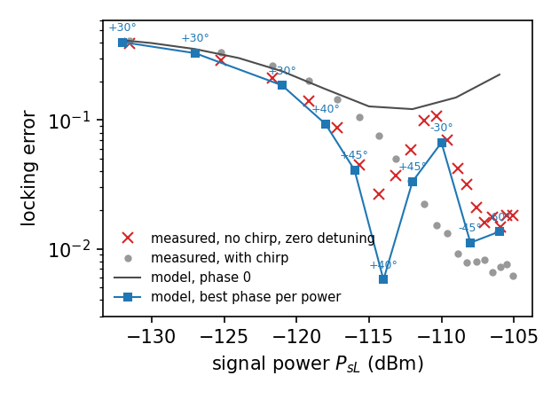

# Quantum write: a parametric oscillator swept through its threshold

**Objectives.** Write a parametric oscillator as an open realization, one bosonic mode with a Kerr term, a two-photon
drive, a one-photon bias and a loss; derive the probability with which a sweep of the drive through the threshold
writes the favoured state; see where the probability follows the classical write law with the noise fixed by the
vacuum, and where it leaves that law for the balance of two shallow wells.

**Prerequisites.** [The language, shown on spins](24_spin_language.md) for the realization and the letters;
[Module 4](18_memory_writing_and_retention.md) and [Module 9](23_memory_codiscovery.md) for the symmetric write and
its law, P = Φ(π1/4 h / (D1/2 r1/4)). Python 3.10 or newer with numpy and scipy.

**Command.** `fieldbridge quantum write [SPEC ...] --out-dir OUT` derives the quantum write in every specification of
`examples/quantum/open` and writes `write.json` and `write.md` with the hashes of the inputs and the implementation.

## 1. The question

A parametric oscillator above its threshold has two stored states of opposite phase. When the two-photon drive is
swept through the threshold while a weak one-photon drive favours one state, the oscillator writes a bit: it ends in
the favoured state with a probability that depends on the bias, the sweep rate and the noise. For a classical
oscillator the noise is a parameter of the model. For a quantum oscillator it is not: the seed of the choice is the
vacuum and the thermal occupation of the loss channel. Which probability does a given oscillator write, and does the
classical law survive when the stored states hold only a few photons?

## 2. The mechanism

The realization ((Ω, Ξ); C, R, P; A) is written in the schema `fieldbridge-quantum-open/1`.

| Component | In the specification |
| --- | --- |
| Ξ, the carrier | one bosonic mode, truncated at `max_quanta` quanta |
| Ω, the operation | the Lindbladian: H = −K a†2a2 + (iε2(t)/2)(a†2 − a2) + ih(a† − a) and the loss κ(n̄ + 1)D[a] + κn̄D[a†], as `hamiltonian` and `dissipators` |
| C, the closure | the frame rotating at half the pump frequency; the truncation, checked by the population of the top levels |
| R, the observable | the sign of the quadrature x = (a + a†)/2 at the end, `observable.sign_of` |
| P, the protocol | the sweep of ε2 from `from` to `to` at the rate r, a hold, and the bias h, which may switch off at `off_at` |
| A, the parameters | K, κ, n̄, in units of the loss rate |

The derivation has three letters. **G**, the Gaussian stage: while the amplitude is small the Kerr term is negligible,
the generator is quadratic with linear loss, and the Wigner function of a Gaussian state obeys exactly the classical
Fokker–Planck equation of the amplified quadrature,

    ẋ = (ε₂(t) − κ/2) x + h + √(2D) ξ(t),      2D = κ(2n̄ + 1)/4.

G also checks that the sweep crosses the threshold ε2 = κ/2, that the amplified quadrature is the measured one
and that the bias pushes it. **K**, the canonical form: the equation above with the gain, the push of the bias and
the noise read from the generator along the protocol. **L**, the law: with ε2 = rt from a thermal state of
variance σ02 = (2n̄0 + 1)/4, the mean and the width of x are amplified by the same factor, so

    P = Φ( h I₁ / √(σ₀² + 2D I₂) ),    I_k = ∫ e^{−k φ(s)} ds,    φ(s) = ∫ (ε₂ − κ/2) ds,

integrated over the ramp and the hold. For κ ≫ √r the loss renews the seed during the sweep and the law is the
classical one, Φ(π1/4 h /(D1/2 r1/4)) with D = κ(2n̄ + 1)/8; for κ → 0 the seed is the
preparation and P = Φ(h √(2π/r)), the rate entering with the exponent −1/2. The derivation evolves the density
operator exactly over the protocol and compares the Born probability of x > 0 with the law. The law is exact for a
quadratic generator, so this comparison is a calibration of the simulation and the physical content of the letter is
the absence of a free noise parameter. The same structure, for a step of the gain instead of a ramp, is the
bias–probability relation of Gu et al. (2025) measured by Roques-Carmes et al. (2023); the ramp law is that of
Kondepudi and Nelson (1985) with the noise fixed.

Where L fails, the derivation computes the biased steady state of the Lindbladian at the final drive and the smallest
nonzero decay rate, the switching gap. If the probability equals the selection of that steady state, the class is the
**equilibrium write**: the two wells are shallow, switch faster than the sweep passes, and the write is decided by
their balance, not by the linear stage. Otherwise the choice is made in the **nonlinear stage** of the growth: the
law is exact without the nonlinear terms, so they act on the choice, and the report says whether the wells exchange
population over the protocol. In the two measured devices of Section 6 they do not.

## 3. The worked example

`examples/quantum/open/kerr_parametric_oscillator.json`: K = 0.02, κ = 1, n̄ = 0, ε2 swept from 0 to 1.2 at
r = 0.1, held for 10, bias h = 0.10691, the value for which the law predicts 0.75. The stored states hold 27 photons.

    python3 -B -m fieldbridge quantum write examples/quantum/open/kerr_parametric_oscillator.json --out-dir out/write

The derivation reaches GKL. The exact probability is 0.75045 against the law's 0.75047, with the truncation at 1e−5
and the top five levels below 1e−8. The letters, from `write.md`:

- **G** quadratic generator with loss κ = 1; threshold at ε2 = 0.5; the amplified quadrature is the measured
  one; the bias pushes it with 1 per unit of h; nonlinear term −K a†2a2.
- **K** ẋ = (ε₂(t) − κ/2)x + h(t) + √(2D)ξ; the growth rate crosses zero at t = 5 with slope r = 0.1; h = 0.10691; 2D = 0.25.
- **L** Pexact = 0.75045 against the law 0.75047: the linear-stage write.

## 4. The results

The crossover between the two limits, at 27 photons, from the research runs behind this module (κ = 1, K = 0.02,
h chosen for the asymptotic law's 0.75 at each rate):

| r | κ/√r | exact | law along the protocol | ramp continued | closed limit |
| ---: | ---: | ---: | ---: | ---: | ---: |
| 0.01 | 10 | 0.74938 | 0.75000 | 0.75000 | 0.922 |
| 0.1 | 3.2 | 0.75046 | 0.75047 | 0.75000 | 0.802 |
| 1 | 1.0 | 0.80052 | 0.80054 | 0.75000 | 0.762 |
| 10 | 0.32 | 0.97511 | 0.97505 | 0.75000 | 0.753 |

The exact probability follows the law along the protocol to 6 × 10−5 at every rate, while the law for a
ramp continued for ever and the closed law each differ from it by up to 0.22: the crossover is the function of
κ/√r that the two integrals I1 and I2 encode. At r = 0.01 the exact value lies 6 × 10−4
below the law; this deficit grows as K2 and is the first sign of the Kerr term.

The thermal control, `thermal_control.json`, changes only the bath, n̄ = 0.6: the noise of the seed rises by
2n̄ + 1 = 2.2 and the law predicts 0.67571 for the same bias; the exact probability is 0.67582. Temperature enters the
write only through 2n̄ + 1.

## 5. The control calculation

`few_photon_oscillator.json` changes only the Kerr coefficient, K = 1, so that the stored states hold half a photon.
The derivation stops at L: the exact probability is 0.684 against the law's 0.750, and equals the selection of the
biased steady state, 0.686; the switching gap just above threshold is 0.20, not small against the sweep scale
√r = 0.32, so the wells equilibrate during the passage. The class is the equilibrium write. In the research runs at
1.5 and 2.4 stored photons the same happens for every slow sweep, and a scan of the rate shows the crossover: below a
rate of the order of the switching gap the probability is independent of the rate and equals the biased steady
state, above it the law is recovered. One reduction covers both regimes, the relaxation of the slowest mode of the
Lindbladian toward the biased steady state,

    dp/dt = Γ(ε₂(t)) [P_eq(ε₂(t)) − p],

with Γ the gap and Peq the selection, both computed from the generator; it reproduces the exact probability
within 0.01 over two decades of rate.

## 6. Measured oscillators

Two specifications with published parameters are kept apart from the pinned examples, in
`examples/quantum/open/devices/`, because each evolution takes minutes:

    python3 -B -m fieldbridge quantum write examples/quantum/open/devices/yamaji2025_jpo.json examples/quantum/open/devices/grimm2020_kerr_cat.json --out-dir out/devices

**The Josephson parametric oscillator of Yamaji et al. (2025)**, `yamaji2025_jpo.json`: K/κ = 5.9, a pump rising as
t5 over 100 ns to about twelve stored photons, a one-photon bias rising linearly with it and switched off
100 ns after the ramp, pure dephasing of 6.8 kHz, zero detuning. At a signal power of −120 dBm the bias reaches
h = 4κ at the top of the sweep; the exact probability is 0.781 against the law's 0.822. Once formed, the stored states
do not exchange population (switching gap 1.0 × 10−3 κ over a protocol of 2.7/κ), so the balance of the
wells plays no part and the derivation stops at L with the diagnosis that the choice is made in the nonlinear stage.
The research runs behind this module repeat the calculation over the paper's ten signal powers: the exact evolution
reproduces the measured locking error within 0.04 once the signal phase is chosen at each power, as the experiment
itself does; the law holds within 0.01 at the weakest biases and the deficit below it grows with the bias power. The
digitized measurement and the comparison script are in the research module of KnowledgeParser
(`modules/quantum_write/realizations/`); the figure is reproduced here.

**The Kerr-cat resonator of Grimm et al. (2020)**, `grimm2020_kerr_cat.json`: K/κ = 653, a tanh ramp of the
squeezing drive over 320 ns to 2.6 stored photons, n̄ = 0.04. The paper prepares the wells by parity and applies no
bias during the ramp; the specification adds a hypothetical one-photon drive of 50κ during the ramp, below the
paper's cat-Rabi drives, to ask which well a bias would select. The ramp lasts 0.02/κ, so the seed is the thermal
state of the preparation rather than the loss. The exact probability is 0.759 against the law's 0.794; the wells are
frozen (gap 0.040κ over 0.12/κ) and the biased steady state would select 0.516, so again the nonlinear stage decides.

Both devices leave the law by 0.04 with frozen wells, a different route from the equilibration of the control
calculation. The research module's scan of the Kerr coefficient found the deficit growing as K2 at large
photon numbers for a slow ramp; the two devices show it for fast ramps, κ/√r = 0.29 and 0.045. Its mechanism is
open, and the dependence on the signal phase measured by Yamaji et al. belongs to the same stage.

## 7. Exercises

1. Halve the sweep rate of the 27-photon oscillator and predict the probability from the law before running it; then
   compare the exact value. At which rate does the deficit below the law reach 1e−3?
2. Switch the bias off at `off_at` = 2, before the threshold at t = 5. The law and the exact value both fall to 0.53:
   explain why the bias before the threshold is almost entirely forgotten.
3. Give the few-photon oscillator a sweep ten times faster. Does the class return to the linear-stage write? Compare
   the switching gap with √r.
4. Write a bias on the squeezed quadrature, h(a + a†) instead of ih(a† − a). The derivation stops
   at G: say what the page's reason means in terms of the amplified quadrature.

## Summary

An open realization writes a bit when its two-photon drive is swept through the threshold with a bias. In the linear
stage the amplified quadrature obeys the classical write equation with the noise fixed by the loss and the
temperature, and the probability follows a law with no free parameter, exact to the truncation of the Fock space.
At a few stored photons the two wells exchange population faster than the sweep passes and the probability relaxes
to the selection of the biased steady state, below the law. The letters G, K and L record which case a realization
is, and the obstructions name what is missing: a threshold, the right quadrature, a bias that pushes it; where the law
fails without the wells equilibrating, the report names the nonlinear stage of the growth.

## Reference

| Item | Where |
| --- | --- |
| Schema and loader | `fieldbridge/quantum/open.py`: `SCHEMA`, `load`, `SpecError` |
| Derivation | `derive_quantum_write`, `law_along_protocol`, `evolve`, `prob_positive`, `equilibrium` |
| Command | `fieldbridge quantum write` (`fieldbridge/quantum/cli.py`, `cmd_write`) |
| Examples | `examples/quantum/open/` (pinned, read by the page) and `examples/quantum/open/devices/` (published parameters, run on request) |
| Tests | `tests/test_quantum_open.py`: the limits of the law, exactness for a quadratic generator, parity, refusals, the classes of the examples, the device specifications reach K, the command |
| Sources | Kondepudi and Nelson 1985; Gu et al. 2025; Roques-Carmes et al. 2023; Marthaler and Dykman 2006; Frattini et al. 2024; Yamaji et al. 2025; Grimm et al. 2020, listed in [docs/mechanisms.md](../mechanisms.md) |
