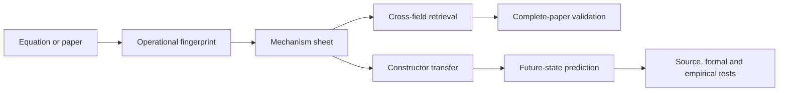

# Tutorial: FieldBridge

FieldBridge turns equations and scientific prose into **operational mechanism
records**. Instead of asking only whether two papers use similar words, it asks
which operation is performed, what carries it, how it is closed, what is read
out, and which procedure makes the mechanism usable.

This tutorial follows the codebase-knowledge structure developed by
[PocketFlow Tutorial Codebase Knowledge](https://github.com/The-Pocket/PocketFlow-Tutorial-Codebase-Knowledge):
identify the central abstractions, show how they interact, and introduce them
in dependency order through runnable examples and concrete source references.



## What You Will Learn

0. [Map the codebase and its core abstractions](00_system_map.md)
1. [Read an operational fingerprint](01_operational_fingerprints.md)
2. [Extract a modular mechanism identity](02_mechanism_sheets.md)
3. [Find a mechanism in another field](03_cross_field_retrieval.md)
4. [Construct a controlled transfer](04_constructor_transfers.md)
5. [Validate retrieval with complete-paper holdout](05_complete_paper_validation.md)
6. [Predict the next move and future mechanism state](06_future_state_prediction.md)
7. [Build a field adapter from a PDF folder](07_pdf_field_adapter.md)
8. [Follow one transfer end to end](08_end_to_end_walkthrough.md)

## Install

```bash
git clone https://github.com/synthetix-institute/fieldbridge.git
cd fieldbridge
python3 -m venv .venv
source .venv/bin/activate
python3 -m pip install -e .
```

PDF input is optional:

```bash
python3 -m pip install -e '.[pdf]'
```

Check the installation:

```bash
fieldbridge fields
fieldbridge fingerprint examples/brownian_probability_flow.tex
```

FieldBridge does not require an LLM for these public workflows. Continue with
the [system map](00_system_map.md) to see how the commands resolve into modules,
data contracts, and functions.
