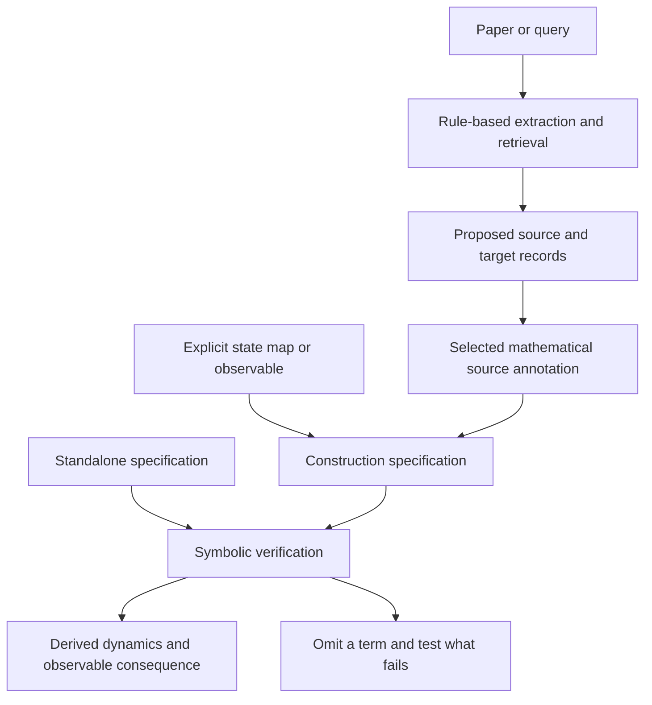

# FieldBridge tutorial

Suppose a detector measures the square of a fluctuating coordinate. Does the
equation for that signal follow the ordinary chain rule, or does it require
another term? Suppose a spin has zero transverse magnetization at preparation.
Does that determine its later signal when it interacts with a second spin?

These questions lead to the two calculations in this tutorial. In the first,
a change of variables determines an additional drift. In the second, repeated
commutators determine a missing correlation. Both start with specified
equations and end with independently checkable predictions.

FieldBridge also finds source equations through retrieval. We introduce that
machinery after the first calculation, so the meaning of a calculated result
is clear before a similarity score enters the discussion.

## Start here

Use Python 3.10 or newer. Run commands from the FieldBridge repository root.

```bash
python3 -m venv .venv
source .venv/bin/activate
python3 -m pip install -e '.[construction]'
python3 -B -m fieldbridge --help
```

[Run the worked example](08_end_to_end_walkthrough.md) first. It creates a
report, shows the expected fields, and explains why a rejected candidate can
be the intended outcome of a successful calculation.

## Choose a reading path

| Your purpose | Read in this order |
| --- | --- |
| Understand the physical construction | [First run](08_end_to_end_walkthrough.md) → [Equations and assumptions](09_equations_and_assumptions.md) → [Stochastic map](10_stochastic_construction.md) → [Quantum closure](11_quantum_closure.md) |
| Connect equations recovered from papers | [Fingerprint](01_operational_fingerprints.md) → [Mechanism sheet](02_mechanism_sheets.md) → [Retrieval](03_cross_field_retrieval.md) → [Proposal](04_constructor_transfers.md) → [Calculated source](13_retrieval_to_calculation.md) |
| Bring another field into the workbench | [Paper folder](07_pdf_field_adapter.md) → [Calculated source](13_retrieval_to_calculation.md) → [New question](12_reproduction_and_discovery.md) |
| Develop or evaluate the code | [System map](00_system_map.md) → [Retrieval evaluation](05_complete_paper_validation.md) → [Continuation evaluation](06_future_state_prediction.md) → [Extensions](12_reproduction_and_discovery.md) |
| Solve for a new physical construction | [Quantum closure](11_quantum_closure.md) → [Inverse interaction design](14_inverse_construction.md) → [Discovery requirements](12_reproduction_and_discovery.md) |

Chapter filenames retain their existing numbers so previous links remain
valid. The paths above are the recommended reading order.

## Follow the mathematical input


```mermaid
flowchart TD
    A["Paper or query"] --> B["Rule-based extraction and retrieval"]
    B --> C["Proposed source and target records"]
    C --> D["Selected mathematical source annotation"]
    M["Explicit state map or observable"] --> E["Construction specification"]
    D --> E
    S["Standalone specification"] --> V["Symbolic verification"]
    E --> V
    V --> R["Derived dynamics and observable consequence"]
    V --> N["Omit a term and test what fails"]
```

A query finds candidates. An annotation supplies the equation to calculate.
A map or observable defines the question asked of that equation. The target
answer is derived from these inputs rather than taken from a retrieved example.

The tutorial writes reports and input records under `build/`. It needs no paid
API, model download or cluster. PDF ingestion is optional and uses
`pip install -e '.[pdf]'`. See
[troubleshooting](08_end_to_end_walkthrough.md#troubleshooting) for installation,
output directories and refused calculations.

The [MorphWiki tutorial](https://github.com/synthetix-institute/morphwiki/blob/main/docs/tutorial/index.md)
connects the quantum calculation to an explanatory field book.

[Chapter 14](14_inverse_construction.md) adds a different question: instead of
supplying a complete Hamiltonian and finding its observable closure, specify
an interaction family and solve for the coefficients that meet a physical
requirement. It includes a runnable design and an infeasible restricted case.
