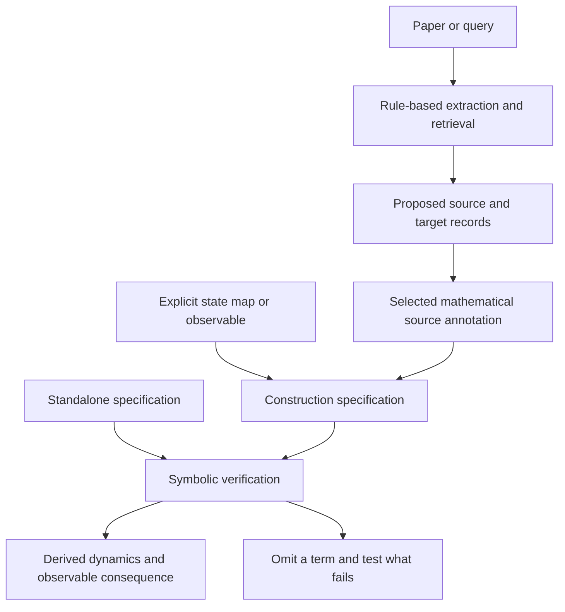

# FieldBridge tutorial

The tutorial has three entry points. Each is a calculation with a physical question, a result to compare with, a
control that must change the prediction, and the test responsible for it.

- **The language of mechanisms.** [Quantum closure](11_quantum_closure.md) asks whether the transverse magnetization
  of a spin at preparation determines its later signal when it interacts with a second spin.
  [The language, shown on spins](24_spin_language.md) then writes this model as a realization, detaches its rotation
  and attaches it to an exchange chain, atoms in two wells and a Cooper-pair level.
- **Memory in materials.** [A first memory card](15_memory_first_card.md) asks which states a genetic toggle switch
  stores and how a state is written. It is Module 1 of [twelve modules](#memory-in-materials-twelve-modules).
- **Regulation.** [Return to a set point](28_regulation_set_point.md) asks whether the output of a cell, a machine or
  a material returns exactly after a step of its input, and through which variable.

Two further parts follow. [Construction from specified equations](#construction-from-specified-equations) derives a
prediction from equations that are given: an additional drift in a stochastic change of variables, a missing
correlation between two spins, an interaction designed to meet a requirement.
[Retrieval from papers](#retrieval-from-papers) finds candidate source equations in a collection of papers. A
retrieved candidate is a proposal and not a calculation, so this part comes last.

## Start here

Use Python 3.10 or newer. Run commands from the FieldBridge repository root.

```bash
python3 -m venv .venv
source .venv/bin/activate
python3 -m pip install -e '.[memory]'
python3 -B -m fieldbridge --help
```

The `memory` extra covers every chapter except PDF ingestion, which uses `pip install -e '.[pdf]'`. The tutorial
writes reports and input records under `build/` and needs no paid API, model download or cluster.
`python3 -B -m fieldbridge demo --out-dir build/site` builds the [web page](https://synthetix-institute.github.io/fieldbridge/),
on which the realizations of the examples are joined by changes of one component.
[Mechanisms: definitions, derivations and original publications](../mechanisms.md) names, for every mechanism and law
of the page, the section of this tutorial that defines it, the section that derives it, and the publications in which
it was first found.

## Choose a reading path

| Your purpose | Read in this order |
| --- | --- |
| Learn the language of mechanisms (detach, attach, co-discover) | [Quantum closure](11_quantum_closure.md) → [The language, shown on spins](24_spin_language.md) → [Inverse interaction design](14_inverse_construction.md); for memory, [Modules 5](19_memory_transfer_and_design.md) and [9 to 11](23_memory_codiscovery.md) |
| Analyse memory in a material from any field | [Modules 1–12 on memory](#memory-in-materials-twelve-modules), starting with [a first memory card](15_memory_first_card.md) |
| Understand the physical construction | [First run](08_end_to_end_walkthrough.md) → [Equations and assumptions](09_equations_and_assumptions.md) → [Stochastic map](10_stochastic_construction.md) → [Quantum closure](11_quantum_closure.md) |
| Solve for a new physical construction | [Quantum closure](11_quantum_closure.md) → [Inverse interaction design](14_inverse_construction.md) → [Discovery requirements](12_reproduction_and_discovery.md) |
| Connect equations recovered from papers | [Fingerprint](01_operational_fingerprints.md) → [Mechanism sheet](02_mechanism_sheets.md) → [Retrieval](03_cross_field_retrieval.md) → [Proposal](04_constructor_transfers.md) → [Calculated source](13_retrieval_to_calculation.md) |
| Bring another field into the workbench | [Paper folder](07_pdf_field_adapter.md) → [Calculated source](13_retrieval_to_calculation.md) → [New question](12_reproduction_and_discovery.md) |
| Develop or evaluate the code | [System map](00_system_map.md) → [Retrieval evaluation](05_complete_paper_validation.md) → [Continuation evaluation](06_future_state_prediction.md) → [Extensions](12_reproduction_and_discovery.md) |

Chapter filenames retain their numbers so that previous links remain valid. The paths above are the recommended
reading order.

## Regulation

| Module | Chapter | Question | Command |
| --- | --- | --- | --- |
| 1 | [Return to a set point](28_regulation_set_point.md) | Does the output return exactly after a step of the input, through which variable, and is the result checkable without repeating the search? | `regulation card`, `survey`, `check` |

## Memory in materials: twelve modules

Chapters 15–23 and 25–27 treat memory. A material is described
once, as a realization: an operation on a carrier, with its closure,
observable, protocol and parameters. From the structure alone, the program
states which behaviours are excluded and which are possible: whether the
material can store states, oscillate or be frustrated, and of what kind a
write point would be. The calculation then decides what occurs: the stable
states, write points, retention laws and writing protocols. Finally, the
program transfers a known memory mechanism to another carrier, or derives one
mechanism in models from different fields. The modules need
`pip install -e '.[memory]'`, run on a laptop, and define their terms in the
[glossary](memory_glossary.md); the original publications of each mechanism are listed in
[mechanisms](../mechanisms.md). The [catalog of materials](../materials.md)
lists the material specifications in the repository, and
[CONTRIBUTING.md](../../CONTRIBUTING.md) describes how a material from another
field is added (`memory new`, `memory check`).

| Module | Chapter | Question | Command |
| --- | --- | --- | --- |
| 1 | [A first memory card](15_memory_first_card.md) | Which states does a genetic toggle switch store, and how is a state written? | `memory card` |
| 2 | [Describing a material](16_memory_specification.md) | How is a material written as a realization? | `memory predict` |
| 3 | [Predictions from structure](17_memory_predictions.md) | What follows from loop signs, symmetries and bond transports alone? | `memory predict`, `loops`, `networks` |
| 4 | [Writing and retention](18_memory_writing_and_retention.md) | Where is a state written, how is it lost, and how do retention and writing times relate? | `memory card` |
| 5 | [Transfer and design](19_memory_transfer_and_design.md) | Which properties of a known memory does another carrier keep, and how is a one-sided write made symmetric? | `memory attach`, `design` |
| 6 | [Memory in a phase](20_memory_phase.md) | How does an oscillator without stable states retain the time of a pulse? | `memory phase` |
| 7 | [A material from your own field](21_memory_new_material.md) | How are the analyses applied to a new material, and how do mechanisms compare across fields? | `memory gallery` |
| 8 | [Time](22_memory_time.md) | What are the roles of time, and how do conservation and dimension set the loss of a written field? | `memory regimes`, `field` |
| 9 | [One mechanism from different fields](23_memory_codiscovery.md) | How do models from different fields reach the same mechanism, a symmetric write, where does a derivation stop, and which invariants show that the end points agree? | `memory codiscover` |
| 10 | [The threshold write](25_memory_threshold_write.md) | How is a state lost at a fold, by the control or by a field, and by how much does the switch lag behind a sweep? | `memory codiscover --target threshold-write` |
| 11 | [Phase locking](26_memory_phase_locking.md) | At which ratio and over which range does a periodic drive fix the phase of an oscillator? | `memory codiscover --target phase-locking` |
| 12 | [Return to a turning point](27_memory_return_point.md) | When do interacting hysterons return exactly to their state at a turning point of a slow drive? | `memory hysterons` |

Modules 1–4 form the core and should be read in order. Modules 5, 6 and 8 each build on Module 4 and can be read in
any order. Module 7 draws on all of them. Module 9 builds on Modules 4 and 5, Module 10 on Module 9, Module 11 on
Modules 6 and 9, and Module 12 on Modules 3 and 4. The figures of the modules are produced from the saved results by
[`figures/memory/make_figures.py`](figures/memory/make_figures.py).

## Construction from specified equations

Suppose a detector measures the square of a fluctuating coordinate. Does the equation for that signal follow the
ordinary chain rule, or does it require another term? Suppose a spin has zero transverse magnetization at
preparation. Does that determine its later signal when it interacts with a second spin? In the first calculation a
change of variables determines an additional drift. In the second, repeated commutators determine a missing
correlation. Both start from specified equations and end with predictions that can be checked independently.

[Run the worked example](08_end_to_end_walkthrough.md) first. It creates a report, shows the expected fields, and
explains why a rejected candidate can be the intended outcome of a successful calculation. See
[troubleshooting](08_end_to_end_walkthrough.md#troubleshooting) for installation, output directories and refused
calculations.

[Chapter 14](14_inverse_construction.md) adds a different question: instead of
supplying a complete Hamiltonian and finding its observable closure, specify
an interaction family and solve for the coefficients that meet a physical
requirement. It includes a runnable design and an infeasible restricted case.

The [MorphWiki tutorial](https://github.com/synthetix-institute/morphwiki/blob/main/docs/tutorial/index.md)
connects the quantum calculation to an explanatory field book.

## Retrieval from papers

FieldBridge also finds source equations through retrieval, by rules applied to the text and equations of papers.
The chapters of this part describe the fingerprint of an equation, the mechanism sheet, the retrieval across
fields and its evaluation, and the step from a retrieved source to a calculation.

The word *construct* has three meanings in the commands:

- `construct` **proposes**. It retrieves source mechanisms for a target field
  and returns candidates, which are not calculations
  ([Proposal](04_constructor_transfers.md)).
- `construct --calculate` and `verify-construction` **verify**. Given source
  equations and an explicit map or observable, they derive the target dynamics
  and test what fails when a term is omitted
  ([First run](08_end_to_end_walkthrough.md),
  [Equations and assumptions](09_equations_and_assumptions.md),
  [Calculated source](13_retrieval_to_calculation.md)).
- `design-spin-cancellation` **solves**. Given a family of interactions and a
  physical requirement, it finds coefficients that meet the requirement, or
  shows that none exist ([Inverse interaction design](14_inverse_construction.md)).


```mermaid
flowchart TD
    A["Paper or query"] --> B["Rule-based extraction and retrieval"]
    B --> C["Proposed source and target records"]
    C --> D["Selected mathematical source annotation"]
    M["Explicit state map or observable"] --> E["Construction specification"]
    D --> E
    S["Standalone specification"] --> V["Symbolic verification"]
    E --> V
    V --> R["Derived dynamics and observable consequence"]
    V --> N["Omit a term and test what fails"]
```

A query finds candidates. An annotation supplies the equation to calculate.
A map or observable defines the question asked of that equation. The target
answer is derived from these inputs rather than taken from a retrieved example.
